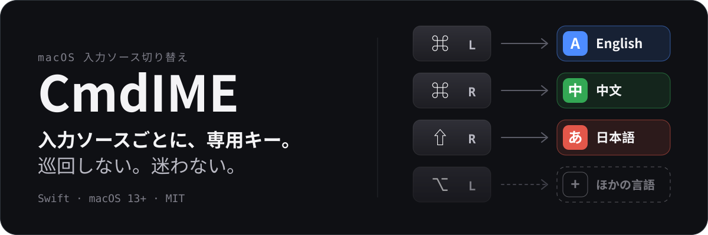
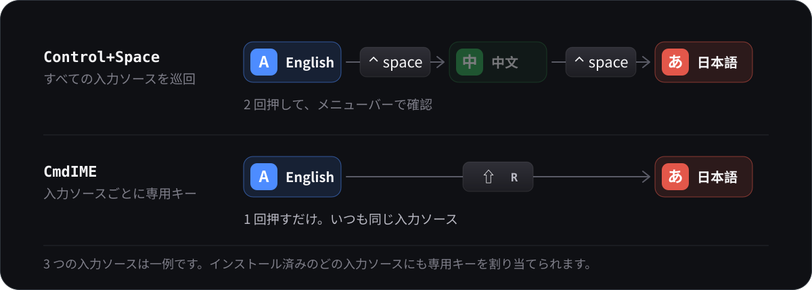
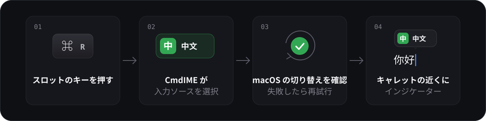

<p align="center">
  
</p>

<p align="center">
  
</p>

<p align="center">
  <a href="README.md">English</a> · <a href="README.zh-CN.md">简体中文</a> · <strong>日本語</strong>
  <br>
  <a href="https://shunmeicho.github.io/cmd-ime/?lang=ja">公式サイトとライブデモ</a>
</p>

<p align="center">
  <a href="https://github.com/ShunmeiCho/cmd-ime/actions/workflows/swift.yml"></a>
  <a href="https://github.com/ShunmeiCho/cmd-ime/releases"></a>
  <a href="LICENSE"></a>
</p>

CmdIME は、Mac の入力ソースそれぞれに専用のキーを割り当てます。左 Command をタップ
すれば英語、右 Command なら中国語、右 Shift なら日本語。CmdIME はその入力ソースを
直接選択し、macOS が実際に切り替えたことを確認して、キャレットの近くに小さな
インジケーターを表示します。キーは自由に選べ、スロットはお使いの Mac に
インストールされている入力ソースに合わせて作られます。

[](demo-videos/renders/cmdime-promo.mp4)

デモには Switcher、Glass、Liquid Glass の 3 つのインジケーターテーマが登場します。
[デモ動画の全編を開く](demo-videos/renders/cmdime-promo.mp4)。

## Control+Space との違い

<p align="center">
  
</p>

- **巡回式だから。** 入力ソースが 3 つ以上あると、どこに切り替わったかをメニューバーで
  確認する必要があります。CmdIME なら、各キーは常に同じ入力ソースに切り替わります。
- **入力ソースが 2 つでも、交互に切り替わるだけだから。** Control+Space は「もう一方」に
  切り替えるので、押す前に今どちらなのかを知っておく必要があります。CmdIME のキーは
  いつも同じ入力ソースを指します。左 Command を押せば、直前がどちらでも英語になります。
- **同時押しではなく、親指 1 本で済むから。** 左右の Command は親指の下にあり、軽く
  叩くだけです。Control+Space は 2 つのキーの同時押しです。
- **押しても何も起きないように見えることがあるから。** CmdIME は macOS が切り替えを
  適用したことを確認し、適用されなかった場合は再試行します。
- **タップとショートカットを区別するから。** Command+C、Command+Tab などのショートカットが
  Command のタップとして扱われることはないので、普段使っているキーはそのまま使えます。

## 切り替えのしくみ

<p align="center">
  
</p>

## インストール

```sh
curl -fsSL https://raw.githubusercontent.com/ShunmeiCho/cmd-ime/main/script/install.sh | bash
```

インストーラーは最新のリリースをダウンロードし、公開されている SHA-256 と照合して
検証したうえで、`CmdIME.app` を `/Applications` にインストールし、`keyboardctl` を
リンクしてアプリを開きます。そのあと、システム設定 > プライバシーとセキュリティで
**Accessibility**(アクセシビリティ)と **Input Monitoring**(入力監視)を許可して
ください。アプリ内の Setup guide(セットアップガイド)が、この 2 つの許可と最初の
切り替えまでを案内します。

macOS 13 以降が必要です。以降のアップデートは、アプリ内の **Update Now**(今すぐ
アップデート)からインストールできます。

> [!NOTE]
> CmdIME はプレビュービルドです。署名済みですが、公証(notarize)はされていません。
> 1 行のインストーラーを使うのがスムーズです。ブラウザーでダウンロードした zip は、
> 初回に Gatekeeper によって「壊れている」と表示され、止められます。[トラブルシューティング](#トラブルシューティング)を参照してください。

[](demo-videos/renders/cmdime-install-permissions-demo.mp4)

<details>
<summary><strong>バージョンを固定する、またはソースからビルドする</strong></summary>

バージョンとチェックサムを固定するには、次のようにします(どちらもリリースノートから
コピーしてください)。

```sh
curl -fsSL https://raw.githubusercontent.com/ShunmeiCho/cmd-ime/main/script/install.sh | \
  CMDIME_VERSION=0.8.0 CMDIME_SHA256=85923f4f534be8411b67de352f7dae308afbf621ae870d936a7e11aaccf817f8 bash
```

ソースからビルドするには:

```sh
git clone https://github.com/ShunmeiCho/cmd-ime.git
cd cmd-ime
swift test
./script/build_and_run.sh
```

ローカルでビルドしたアプリでも、グローバルなキーボード監視が機能するには同じ 2 つの
権限が必要です。

</details>

## できること

- **スロットボード。** 左側にインストール済みの入力ソース、右側にスロットが並びます。
  入力ソースをドラッグしてスロットを追加し、ハンドルをドラッグして並べ替え、スロットの
  名前変更、色の設定、削除ができ、削除は取り消せます。入力ソースを追加または削除すると、
  一覧はシステム設定に追従します。
- **スロットごとに任意の 3 つのトリガー。** 8 つの修飾キーのいずれかのシングルタップ
  またはダブルタップ、そして Option+J のようなショートカットです。どれを設定しても
  かまわず、設定したどのトリガーでもそのスロットに切り替わります。

<p align="center">
  
</p>

<p align="center"><sub>ダーク外観のスロットボード。ここでは 3 つですが、使う入力ソースの数だけ追加できます。</sub></p>

- **キャレットの近くに表示される切り替えインジケーター。** Glass、macOS 26 以降の
  Liquid Glass、paper 系のスタイル、すべてのスロットを表示する switcher、それを
  グリフだけに縮めた badge、切り替えた入力ソースだけを残す mark など 16 の組み込み
  テーマに加え、独自のテーマやフォントも使えます。

<p align="center">
  
</p>

<p align="center"><sub>設定画面に並ぶ組み込みテーマのうち 10 種類。</sub></p>

- **アプリ内からのアップデート。** 既定では 6 時間ごとに確認し、**Update Now** の横に
  変更点の概要を表示し、権限を保ったままその場でインストールします。
- **ライトとダークに追従する設定ウィンドウ。** どちらかに固定することもできます。

<p align="center">
  
</p>

<p align="center"><sub>ライト外観の General：外観、アップデートの確認と通知。</sub></p>

- **`keyboardctl`。** スキャン、バインド、切り替え、診断のためのコマンドラインツールです。

## リファレンス

<details>
<summary><strong>スロットとデフォルトのトリガー</strong></summary>

CmdIME は、特定のキーボードレイアウトを固定で組み込むのではなく、macOS にすでに
インストールされている入力ソースをスキャンします。初回セットアップ時には、主要言語
ごとに 1 つのスロットを作成し、その言語についてシステムの並び順で最初の選択可能な
入力ソースを使います。主要言語を持たない入力ソースはスキップされます。各スロットは、
"Not matched"(一致なし)と表示されているスロットも含めて、そのカードからインストール
済みの任意の入力ソースに向けることができます。

| Detected slot | Default trigger |
| --- | --- |
| First | Left Command |
| Second | Right Command |
| Third | Left Option |
| Fourth | Right Option |
| Fifth | Left Control |
| Sixth and later | No trigger (assign manually) |

既存の設定とそのトリガーは変更されません。使用可能な主要言語を持つ選択可能な入力
ソースが 1 つもない場合、初期化には従来のデフォルトが使われます。英語は Left Command、
中国語は Right Command、日本語は **Option+J** です。

ボードでは:

- "..." メニューには Move Up、Move Down、Rename、Color、Remove Slot があり、同じ操作は
  キーボードと VoiceOver からも行えます。Esc でドラッグをキャンセルできます。削除した
  スロットは、次にスロットを変更するまで **Undo**(取り消す)で復元できます。
- スロットのバッジをクリックすると、そのスロットに色を 1 つ設定できます。入力ソース
  一覧、Live keys、切り替えインジケーターはその色に従います。
- "Current"(現在)は、どの方法で選択されたかにかかわらず、macOS が現在選択している
  入力ソースを示します。**Switch**(切り替え)はスロットの入力ソースを直接選択する
  もので、トリガーのテストは行いません。
- "Duplicate"(重複)は、2 つのスロットが同じ入力ソースを指していることを示します。
  "Source missing"(入力ソースなし)は、スロットの入力ソースがインストールされて
  おらず、別の入力ソースにフォールバックしていることを示します。
- ボードの下にある Live keys は小さなキーボードで、現在のスロットに割り当てられて
  いるキーが点灯します。

</details>

<details>
<summary><strong>トリガーの詳細</strong></summary>

- `Single tap`(シングルタップ): 8 つの物理修飾キー(左右の Command、Option、
  Control、Shift)のいずれか。
- `Double tap`(ダブルタップ): 同じキーを 2 回タップ。
- `Shortcut`(ショートカット): **Record…**(記録)をクリックし、`option+j` のように
  修飾キーとキーを一緒に押してから、Save をクリックします。Esc でキャンセルできます。
  記録中はタップのトリガーが一時停止します。

同じジェスチャーで別のスロットがすでに使っているキー、またはキーのリマップに使われて
いるキーは、使用中として表示され、選択できません。同じキーを、あるスロットでは
シングルタップ、別のスロットではダブルタップとして使うことはできます。多くの中国語
入力メソッドは中国語と英語の切り替えに Shift を使うため、CmdIME が Shift を自動で
割り当てることはありません。

単一の修飾キーによるバインディングとキーボードショートカットは、意図的に分けてあります。
そのため、`Command+C`、`Command+V`、`Command+Tab` や複数の修飾キーを使うショートカット
が、単発の Command タップとして扱われることはありません。シングルタップは即座に
切り替わります。CmdIME がわずかに待機するのは、同じ修飾キーにダブルタップの
バインディングもある場合だけです。

設定ウィンドウは、`control+space` や `control+option+space` といった macOS の入力ソース用
ショートカットを受け付けません。これは、CmdIME がシステムの入力ソース選択機能を誤って
奪ってしまわないようにするためです。

</details>

<details>
<summary><strong>切り替えインジケーターとテーマ</strong></summary>

CmdIME はプログラムから入力ソースを切り替えるため、macOS の非公開の入力ソース選択
パネルは呼び出しません。`Show switch indicator` を有効にすると、切り替え後に CmdIME
独自の軽量な確認用バブルが表示されます。

設定画面では、インジケーターを無効にする、組み込みテーマのいずれか(glass、macOS 26
以降の Liquid Glass、1 色または 2 色のインクを使う paper、テキストのみ、タイルのみ、
1 行表示、すべてのスロットを表示する switcher、それをグリフだけに縮めた badge)を
適用する、1 本のスライダー(パーセントが実際に描かれるサイズです)でサイズを変更する、
アイコン表示とテキスト表示を切り替える、各スロット自身の
色、システムのアクセントカラー、モノクロのいずれかで色を付ける、といったことができます。
フォントファミリー、ウェイト、文字サイズはテーマに属しており、組み込みテーマを編集すると
コピーが作成されます。

カスタムテーマは `~/.config/cmd-ime/themes` に JSON ファイルとして、読み込んだフォントは
`~/.config/cmd-ime/fonts` に保存されます(どちらも設定ファイルと同じ場所です)。フォントは
CmdIME 専用に登録され、システム全体には何もインストールされません。テーマファイルの
名前は自由に付けられます。設定画面でテーマを削除すると、そのファイルはゴミ箱に移動します。

インジケーターはほかのアプリの上に表示されるため、テーマ側でトーンを固定していない限り、
テーマは設定ウィンドウではなく macOS の外観に従います。

</details>

<details>
<summary><strong>切り替え後もラテン文字のままになる入力メソッド</strong></summary>

バックグラウンドから入力ソースを選択すると、入力メソッドがフォーカス中のアプリに接続
されないことがあります。メニューバーには新しい入力ソースが表示されているのに、入力
されるのはラテン文字のままです。Google 日本語入力は、ABC で文字を入力したあとにこの状態に
なります。この入力メソッドに対しては、CmdIME はまず「かな」キーを押してシステム自身の
経路で日本語に入り、60 ミリ秒後にスロットの入力ソースを選択します。それ以外の入力
メソッドは従来どおり直接選択され、遅延は増えません。

ほかの日本語入力メソッドで同じ症状が出る場合は、
`~/.config/cmd-ime/activation-recipes.json` にアクティベーションレシピを追加し、設定画面で
Refresh を押してください。

```json
{ "recipes": [
  { "sourceIDPrefix": "com.example.inputmethod", "strategy": "kanaThenSelect", "delayMs": 60 }
] }
```

入力ソース ID は `keyboardctl scan` で確認できます。ユーザーのレシピは組み込みのレシピより
優先されるため、`"strategy": "select"` と書けば組み込みのレシピを無効にできます。
`kanaThenSelect` は日本語の入力ソースにのみ適用され、`delayMs` は 0〜500 に制限されます。
読み取れない項目はスキップされ、ステータスバーに表示されます。うまくいったレシピは、
組み込みに加えられるよう issue で教えてください。

日本語に切り替えたときに、ひらがなではなくかなパレットが開いてしまう場合は、入力ソースを
更新するか、CmdIME 0.1.10 以降にアップデートしてください。macOS は
`com.apple.50onPaletteIM` を選択可能な日本語の入力ソースとして公開していますが、これは
補助的なかなパレットであり、通常のひらがな入力メソッドではありません。

</details>

<details>
<summary><strong>設定ウィンドウ、外観、終了</strong></summary>

CmdIME はバックグラウンドで動作するエージェントです。設定ウィンドウは操作パネルにすぎず、
ウィンドウを閉じてもキーボードの監視は止まりません。設定ウィンドウが開いている間、CmdIME は
Dock とアプリスイッチャーに表示されます。ウィンドウを閉じた後もバックグラウンドで動き続け、
メニューバーアイコンはありません。設定が必要になったら、`CmdIME.app` をもう一度開いてください。

新規インストールでは、設定画面の上部に 3 ステップの **Setup guide**(セットアップガイド)が
表示されます。キーボードへのアクセスを許可し、検出されたスロットを確認し、実際に切り替えを
試す、という流れです。スキップすることもでき、**General > Show Setup Guide** で再表示
できます。以前のバージョンから更新したユーザーには、代わりに新機能についての 1 行の
お知らせが表示されます。

設定ウィンドウは macOS の外観に従います。**General > Appearance** で **Light** または
**Dark** に固定することも、**System** に戻すこともできます。ウィンドウはシステムの
マテリアルの上に配置され、ステータスバーとアップデートバーは macOS 26 以降で Liquid Glass
を使います。「透明度を下げる」がオンの場合は、すべて不透明になります。

バックグラウンドエージェントを停止するには、**General > Quit CmdIME** を使うか、次を
実行します。

```sh
keyboardctl quit
```

CLI がまだリンクされていない場合は、`pkill -x CmdIME` を使います。

</details>

<details>
<summary><strong>アップデート</strong></summary>

CmdIME はほとんどの時間ウィンドウを表示しないため、新しいリリースを自分で確認します。
既定では 6 時間ごとに GitHub に最新のリリースを問い合わせ(それ以外の情報は送信しません)、
新しいバージョンがあれば、そのバージョンについてシステム通知を 1 回だけ表示します。設定
ウィンドウの上部にも同じアップデートが表示され、そのリリースの冒頭の一文と各変更の
タイトルが添えられます。

**General** には、手動確認用の **Check**、**Check automatically** スイッチ、
**Every 6 hours / Daily / Weekly** の頻度の選択、そして **Notify me about updates** が
あります。これをオフにすると通知は表示されなくなりますが、ウィンドウ内のアップデート表示は
そのままです。通知の許可を求めるのは、知らせるアップデートがあるとき、またはこのスイッチを
オンにしたときだけで、初回起動時には求めません。macOS ではアプリが自分の通知の許可を変更
することはできないため、通知がブロックされている場合は General にその旨が表示され、
**Open Notification Settings…** が用意されます。

**Update Now** はその場でアップデートをインストールします。リリースの zip をダウンロード
し、公開されている `.sha256` と照合し、新しいアプリが有効なコード署名を持ち、実行中の
アプリと同じ開発者チームのものであることを検証したうえで、アプリバンドルを置き換えて
CmdIME を開き直します。署名の ID が変わらないため、Accessibility と Input Monitoring の
許可は引き継がれます。**Release Notes** は GitHub のリリースページを開き、**Skip** は
そのバージョンの通知を止めます。Homebrew でインストールした場合は、これまでどおり
`brew upgrade` を使えます。その場でアップデートすると、次の `brew upgrade` まで Homebrew
側のバージョン記録は古いままになります。

</details>

<details>
<summary><strong>コマンドライン: keyboardctl</strong></summary>

スロット ID は、検出された入力ソースによって変わります。以下の例では、`english`、
`chinese`、`japanese` という名前のスロットを想定しています。実際の ID は
`keyboardctl slots` を実行して確認してください。

```sh
swift run keyboardctl scan
swift run keyboardctl init
swift run keyboardctl slots
swift run keyboardctl slot add
swift run keyboardctl slot add 1 --name Korean
swift run keyboardctl slot remove japanese
swift run keyboardctl switch english
swift run keyboardctl diagnose
swift run keyboardctl diagnose --json
swift run keyboardctl bind left-command english
swift run keyboardctl bind right-command chinese
swift run keyboardctl bind option+j japanese
swift run keyboardctl bind double-left-command english
swift run keyboardctl remap right-control escape
swift run keyboardctl quit
swift run keyboardctl listen
```

- `keyboardctl init`: GUI の初回起動時と同じ検出方法で、入力ソースから検出したデフォルトを
  作成します。既存の設定は、`--force` を指定しない限り変更されません。`--force` を指定
  すると、設定全体が検出されたデフォルトに置き換えられます。強制リセットの前に、カスタム
  設定をバックアップしてください。このコマンドは GUI のリセット前バックアップを作成しません
  (後述の従来形式からの移行バックアップは引き続き適用されます)。
- `keyboardctl switch <slot>`: スロットに一致した入力ソースを選択し、macOS が切り替えを
  適用したことを確認します。macOS が選択を適用しなかった場合は、`stderr` にエラー
  メッセージを出力し、0 以外の終了コードで終了します。
- `keyboardctl diagnose [--json]`: 各スロットに設定された優先条件(`preferredIDs`、
  `languagePrefixes`、`nameContains`)、一致した入力ソース、一致の理由(`preferredID`、
  `fallbackLanguage`、`languagePrefix`、`nameContains`、または `none`)を出力します。
  `--json` を指定すると、構造化された JSON で出力されます。`slots` の各項目は `slot` の
  ID を保持し、`name` と `duplicateSlots`(該当がない場合は空の配列)を含みます。
- `keyboardctl slots`: スロットの ID、名前、トリガー、一致結果を順番どおりに一覧表示し、
  フォールバックによる一致には印を付けます。
- `keyboardctl slot add [<number|source-id>] [--name N]`: 入力ソースを指定しない場合は、
  未割り当ての入力ソースを番号付きで一覧表示します。指定した場合は、スロットを追加し、
  Left Command、Right Command、Left Option、Right Option、Left Control の中から最初に
  空いているトリガーを割り当てます。すべて使用中の場合、スロットにはトリガーが付きません。
  `bind` を使って割り当ててください。多くの中国語入力ソースは英語と中国語の切り替えに
  Shift のタップを使うため、Shift が自動で割り当てられることはありません。Right Control
  も、ノート型のキーボードには存在しないため、手動でのみ割り当てられます。
- `keyboardctl slot remove <slot>`: そのスロットのバインディング、優先条件、カスタム
  カラーを削除します。最後の 1 つのスロットは削除できません。
- スロットの指定では、まず完全一致の ID が、次に大文字と小文字を区別しない一意の ID
  または名前が受け付けられます。削除済みまたは不明なスロットは終了コード 1 で失敗し、
  別のスロットに読み替えられることはありません。`bind <trigger> <slot>` は、トリガーを
  奪う従来の動作を維持しており、以前のスロットにトリガーがなくなった場合はその旨を
  報告します。

新しいスロットは、選択した入力ソースを優先し、その**主要**言語によってフォールバック
します。1 つの入力ソースを 2 つのスロットの第 1 優先ソースとして割り当てることは
できませんが、フォールバックや従来のルールによって、複数のスロットが同じ入力ソースに
解決されることはあります。その場合もどちらのスロットも動作し、`diagnose` は
`duplicate with: <ids>` と報告します。既存の一致ルールは変更されません。初回起動時に
スロットが検出されるのは、設定ファイルが存在しない場合だけです。入力ソースを更新しても、
既存のスロットやトリガーが置き換えられることはありません。

</details>

<details>
<summary><strong>設定ファイル、リセット、アップグレードとダウングレード</strong></summary>

設定ファイルは `~/.config/cmd-ime/config.json` にあります。CLI で編集する前に GUI を
終了し、編集後に開き直してください。実行中の GUI はファイルを監視していないため、CLI に
よる変更を上書きしてしまう可能性があります。

設定画面の **Reset to Detected**(検出結果にリセット)は、すべてのスロットとトリガーを
検出されたデフォルトに置き換える前に、確認を求めます。インジケーターの一般設定など、
関係のない設定は保持されます。保存の前に、GUI は元のファイルを設定ファイルと同じ場所の
`config.json.before-reset.bak` にバックアップします。2 回目以降のリセットでは、以前の
バックアップを上書きせず、重複しないバックアップ名が使われます。バックアップまたは保存に
失敗した場合、リセットは適用されません。

バージョン 2 では、固定の ID、名前、色合いを持つ、順序付きの `slots` コレクションが保存
されます。古い設定は、読み込み時にメモリ上で移行されます。`show`、`slots`、`diagnose`、
`switch`、`listen` は、移行結果を保存せず、アップグレードの通知も出力しません。書き込みが
成功するたびに(`bind`、`remap`、`slot add`、`slot remove`、または `init --force`)、
`slots` を含まないファイルは同じ場所の `config.json.v1.bak` にバックアップされ、その後
stderr に通知が出力されます。これは、古いバイナリによって `slots` キーが失われた
バージョン 2 のファイルにも当てはまります。バックアップがすでに存在する場合は、新しい
`config.json.v1.bak.<uuid>` が作成されます。以前のバックアップが再利用されたり上書き
されたりすることはありません。通知には新しいバックアップのパスが記載されます。
バックアップに失敗した場合、保存は行われません。従来の ID とバインディングは、移行時に
保持されます。

ダウングレードする前に、CmdIME を終了し、最新の移行通知に記載されたバックアップを
`config.json` に復元してください(バージョン 2 の設定は別にコピーを保管しておいて
ください)。アップグレードを繰り返したあとでは、そのバックアップに UUID の接尾辞が付いて
いることがあります。元の `config.json.v1.bak` には、最初の移行時の設定がそのまま残って
います。古いバイナリはカスタムのスロット ID をデコードできず、その設定を
`.corrupt.<uuid>` に移動してリセットすることがあります。従来の ID しかない場合でも、
古いバイナリは保存時に `slots` を削除するため、名前や色合いが失われ、次回のアップグレード
時に削除済みの従来のスロットが復活する可能性があります。

</details>

## エディターとスクリプト

Vim、Neovim、Emacs、Helix では、挿入モードを抜けたら英語に戻すために `im-select` や `macism` で
入力ソースを切り替えるのが一般的です。`keyboardctl source` はその置き換えとして使え、アプリ自身が
切り替えに使っているのと同じコードです。

```vim
" Neovim: 挿入モードを抜けたら英語へ、戻るときに元のソースへ。
let g:cmdime = '/Applications/CmdIME.app/Contents/Resources/keyboardctl'
augroup cmdime
  autocmd!
  autocmd InsertLeave * let b:cmdime_source = trim(system(g:cmdime . ' source'))
        \ | call system(g:cmdime . ' source com.apple.keylayout.ABC')
  autocmd InsertEnter * if exists('b:cmdime_source')
        \ | call system(g:cmdime . ' source ' . b:cmdime_source) | endif
augroup END
```

お使いの Mac での入力ソース ID は `keyboardctl scan` で確認できます。

**約束できること、できないこと。** 選択が効かなかったとき `keyboardctl source` は非ゼロで終了し、
理由を stderr に書きます。ただし広く使われているエディタープラグインはそのどちらも読まないので、
**エディターがそれを知ることはありません**。何も分からないままになる — それがこの領域の現状であり、
`keyboardctl lab` がある理由です。あなたの Mac とあなたの入力ソースで切り替えが本当に効くのかを
知る方法は、実際に打って読み返すことだけです。

```sh
keyboardctl lab --attempts 30
```

実行中はキーボードを占有し、TextEdit に入力します。試行ごとに 1 文字を出力するので、失敗が散って
いるのか固まっているのかが見て分かります。

実験的なピンイン復帰キーもありますが、**非推奨となり、今後のバージョンで段階的に削除します**。
TextEdit と微信輸入法の組み合わせでしか動きません。詳しくは [docs/recovery-beta.md](docs/recovery-beta.md)。

## トラブルシューティング

<details>
<summary><strong>"CmdIME is damaged" または "Apple cannot check it for malicious software" と表示される</strong></summary>

アプリは壊れていません。プレビュービルドは署名済みですが公証されておらず、ブラウザーで
ダウンロードした zip には隔離（quarantine）属性が付くため、Gatekeeper が初回起動を止めます。
「壊れている」というメッセージでは、通常 **Open Anyway**（このまま開く）は表示されません。
次のどちらかで開けます。

1. ダウンロードした zip とアプリを削除し、1 行のインストーラーで入れ直します。ブラウザーの
   隔離の仕組みを通りません。

   ```sh
   curl -fsSL https://raw.githubusercontent.com/ShunmeiCho/cmd-ime/main/script/install.sh | bash
   ```

2. ダウンロードしたアプリを使う場合は、`CmdIME.app` を「アプリケーション」
   （`/Applications`）に移してから、隔離属性を削除します。

   ```sh
   xattr -dr com.apple.quarantine /Applications/CmdIME.app
   ```

"Apple cannot check it for malicious software" と表示された場合は、システム設定 >
プライバシーとセキュリティに **Open Anyway** が出ることがあります。上の方法で属性を
削除しても開けます。確認の仕組みについては、Apple の [Gatekeeper](https://support.apple.com/guide/security/gatekeeper-and-runtime-protection-sec5599b66df/web) と [Developer ID](https://developer.apple.com/developer-id/) のドキュメントで説明されています。

</details>

<details>
<summary><strong>macOS が何度も権限を求める</strong></summary>

macOS は Accessibility と Input Monitoring の許可をアプリのコード ID に対して保存する
ため、ビルドし直した `CmdIME.app` の 1 つを許可したあとで、`dist/`、`dist/release/`、
`/Applications` にある別のコピーを実行すると、macOS が再度許可を求めることがあります。
アプリの場所は 1 か所に固定してください。リセットするには:

1. CmdIME を終了します。
2. システム設定 > プライバシーとセキュリティ > Accessibility と Input Monitoring から、
   古い `CmdIME.app` の項目を削除します。
3. `/Applications/CmdIME.app` など、実際に使用する場所にアプリをインストールまたは
   コピーします。
4. そのアプリ自体を開き、両方の権限を付与します。
5. CmdIME を終了して開き直します。

</details>

## 開発

<details>
<summary><strong>ビルド、パッケージ、リリース</strong></summary>

```sh
swift test
./script/build_and_run.sh
```

`script/build_and_run.sh` は、生成したアプリバンドルを配置したあとで署名します。ローカルで
最初に見つかった Apple Development または Developer ID の署名 ID を使い、見つからない場合は
ad-hoc 署名にフォールバックします。特定の ID を選ぶには、`CODESIGN_IDENTITY` を設定します。

```sh
CODESIGN_IDENTITY="Apple Development: Your Name (TEAMID)" ./script/build_and_run.sh
```

リリースをパッケージするには:

```sh
CMDIME_ALLOW_UNNOTARIZED=1 ./script/package_app.sh 0.8.0
shasum -a 256 dist/CmdIME-0.8.0.zip
```

公証付きのパッケージを作成するには、`Developer ID Application` の署名 ID が必要です。
公証されていないことを明記したプレビューの場合は、`CMDIME_ALLOW_UNNOTARIZED=1` を設定
します。公証の初回セットアップ(一度だけ):

```sh
security find-identity -p codesigning -v
xcrun notarytool store-credentials "cmd-ime-notary" \
  --apple-id "YOUR_APPLE_ID" \
  --team-id "YOUR_TEAM_ID" \
  --password "APP_SPECIFIC_PASSWORD"
```

パッケージスクリプトは、Developer ID で署名し、zip を Apple の公証サービスに提出し、
チケットを `CmdIME.app` にステープルし、配布用の zip を作り直して、SHA-256 を出力します。
キーチェーンのプロファイル名が `cmd-ime-notary` でない場合は、`CMDIME_NOTARY_PROFILE` を
使ってください。

Homebrew cask を公開する前に、`Casks/cmd-ime.rb` をリリース zip の SHA-256 で更新して
ください。cask は `Contents/Resources` 経由で `keyboardctl` をリンクします。これは、
`Contents/MacOS` にある署名済みヘルパーへの互換用シンボリックリンクです。

配布されるアプリはネイティブの SwiftUI と AppKit のままです。グローバルなキーボード監視、
Accessibility と Input Monitoring、ログイン項目、入力ソースの切り替えは、いずれも macOS の
API に依存しています。Mac App Store での配布には、サンドボックス化された別のビルドが必要
です。[docs/app-store.md](docs/app-store.md) を参照してください。

</details>

<details>
<summary><strong>プロジェクト構成</strong></summary>

- `Sources/KeyboardSwitcherCore`: 設定、ショートカットの解析、入力ソースのスキャン、
  マッチング、切り替え、グローバルなイベントタップ
- `Sources/CmdIME`: SwiftUI の設定ウィンドウを備えた AppKit のバックグラウンドアプリ
- `Sources/keyboardctl`: スキャン、設定、切り替え、リスナーモードのための CLI
- `script`: ローカル実行、インストール、リリース用のスクリプト
- `Casks`: Homebrew cask のテンプレート

</details>

## コントリビュート

プルリクエストを歓迎します。[CONTRIBUTING.md](CONTRIBUTING.md) をご覧ください。最初のプル
リクエストには [CLA.md](CLA.md) に同意する 1 行が必要です。著作権はあなたが保持したまま、
将来ライセンスを変更する際に過去の貢献者全員を探し直さずに済むようにするためのものです。

**Windows:** 要望はありますが、まだ存在しません。誰かが書き始める前に、先に答える価値のある問いが
あります。このプロジェクトが対象としている不具合 — 切り替えが成功したと報告されるのに、打つと前の
言語のままになる — は Windows にもあるのか。誰も測っていません。
[Issue #5](https://github.com/ShunmeiCho/cmd-ime/issues/5) に、どんな協力が役に立つかを書いています。

## サポート

CmdIME がキーボード操作の手間を少しでも減らせたなら、
[コーヒーをおごる](https://buymeacoffee.com/shunmeicor7)か、
[リポジトリにスターを付ける](https://github.com/ShunmeiCho/cmd-ime)ことで応援していただけます。
