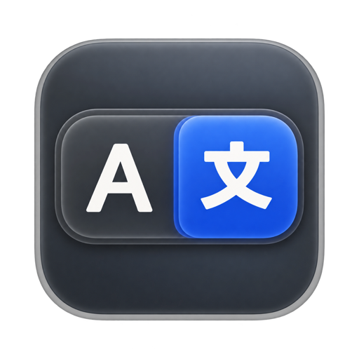

<div align="center">
  
  <h1>CmdIME</h1>
  <p><strong>多言語入力のための、確実な macOS 入力ソース切り替え。</strong></p>
  <p><a href="README.md">English</a> · <a href="README.zh-CN.md">简体中文</a> · <strong>日本語</strong></p>

  <p>
    <a href="https://github.com/ShunmeiCho/cmd-ime/actions/workflows/swift.yml"></a>
    <a href="https://github.com/ShunmeiCho/cmd-ime/releases"></a>
    <a href="LICENSE"></a>
  </p>
</div>

CmdIME は、設定可能な切り替えスロットと、目的の入力ソースへの直接切り替えを
中心に作られた macOS 用の入力ソース切り替えツールです。入力ソースを順番に
巡回するのではなく、使いたいスロットのキーを押すと、CmdIME が対応する macOS の
入力ソースを選択します。

標準の `Control+Space` ではなぜ不十分なのでしょうか。標準のショートカットは
巡回式なので、入力ソースが 3 つ以上あると、どこに切り替わったかを目で確認する
必要があります。また、キーを押しても反応が遅れたり、何も起きていないように
見えたりすることがある、と感じるユーザーも少なくありません。CmdIME は入力ソース
ごとに専用のキーを割り当て、macOS が実際に切り替えを行ったことを確認し
(行われなかった場合は再試行し)、キャレットの近くに小さなインジケーターを表示
するので、メニューバーを見なくても現在の状態が分かります。

## できること

CmdIME は、特定のキーボードレイアウトを固定で組み込むのではなく、macOS に
すでにインストールされている入力ソースをスキャンします。初回セットアップ時には、
主要言語ごとに 1 つのスロットを作成し、その言語についてシステムの並び順で最初の
選択可能な入力ソースを使います。主要言語を持たない入力ソースはスキップされます。
各スロットは、"Not matched"(一致なし)と表示されているスロットも含めて、
そのカードからインストール済みの任意の入力ソースに向けることができます。

設定画面はスロットボードになっています。左側にインストール済みの入力ソース、
右側にスロットが並びます。

- 入力ソースをスロット一覧にドラッグするか、**Add Slot**(スロットを追加)を
  使うと、スロットが作成されます。スロットのハンドルをドラッグすると並べ替え
  られ、Esc でドラッグをキャンセルできます。"..." メニューには Move Up、
  Move Down、Rename、Color、Remove Slot があり、同じ操作はキーボードと
  VoiceOver からも行えます。削除したスロットは、次にスロットを変更するまで
  **Undo**(取り消す)で復元できます。
- スロットのバッジをクリックすると、そのスロットに色を 1 つ設定できます。
  入力ソース一覧、Live keys、切り替えインジケーターはその色に従います。
- 入力ソース一覧はシステム設定に追従します。入力ソースを追加または削除すると、
  再起動なしで一覧が更新されます。Refresh ボタンも常に用意されています。
- "Current"(現在)は、どの方法で選択されたかにかかわらず、macOS が現在選択
  している入力ソースを示します。**Switch**(切り替え)はスロットの入力ソースを
  直接選択するもので、トリガーのテストは行いません。
- ボードの下にある Live keys は小さなキーボードで、現在のスロットに割り当て
  られているキーが点灯します。

| Detected slot | Default trigger |
| --- | --- |
| First | Left Command |
| Second | Right Command |
| Third | Left Option |
| Fourth | Right Option |
| Fifth | Left Control |
| Sixth and later | No trigger (assign manually) |

既存の設定とそのトリガーは変更されません。使用可能な主要言語を持つ選択可能な
入力ソースが 1 つもない場合、初期化には従来のデフォルトが使われます。
英語は Left Command、中国語は Right Command、日本語は **Option+J** です。

以下のデモは設定の一例です（左 Command で英語、右 Command で中国語、右 Shift で
日本語）。スロットは、お使いの Mac にインストールされている入力ソースに合わせて
作成されます。デモには Switcher、Glass、Liquid Glass の 3 つのインジケーター
テーマが登場します。

[](demo-videos/renders/cmdime-promo.mp4)

[デモ動画の全編を開く](demo-videos/renders/cmdime-promo.mp4)

## 配布状況

CmdIME は現在、**公証(notarize)されていないプレビュービルド**として配布
されています。

Mac App Store では配布されておらず、現在のプレビュービルドは、リリースに明記
されている場合を除き、Developer ID 証明書で署名されていません。macOS が初回
起動時にアプリをブロックしたり、システム設定で手動で許可するよう求めたりする
ことがあります。

CmdIME を許可し、必要な権限を付与したあとは、通常どおり動作します。この
プレビュー配布の方法は、技術に詳しいユーザーとアーリーアダプターを対象と
しています。

Apple の Gatekeeper のドキュメントでは、App Store 以外からダウンロードした
アプリについて、確認済みの開発元による署名、公証、改変の有無が検査されると
説明されています。より広く一般に配布するには、Developer ID 署名と公証のほうが
スムーズな方法です。

- [Gatekeeper and runtime protection in macOS](https://support.apple.com/guide/security/gatekeeper-and-runtime-protection-sec5599b66df/web)
- [Signing Mac Software with Developer ID](https://developer.apple.com/developer-id/)

## インストール

### 推奨のプレビューインストール

```sh
curl -fsSL https://raw.githubusercontent.com/ShunmeiCho/cmd-ime/main/script/install.sh | bash
```

インストーラーは最新のリリースを特定して zip をダウンロードし、リリースと
一緒に公開されている `.sha256` ファイルと照合して検証します。そのうえで
`CmdIME.app` を `/Applications` にインストールし、`keyboardctl` をリンクし、
macOS が権限を要求できるようにアプリを開きます。

バージョンとチェックサムを自分で固定するには、次のようにします(どちらも
リリースノートからコピーしてください)。

```sh
curl -fsSL https://raw.githubusercontent.com/ShunmeiCho/cmd-ime/main/script/install.sh | \
  CMDIME_VERSION=0.6.4 CMDIME_SHA256=825e446dd3abfbdb4fd80b3b5cb99633f2ba0274e22b5f8d9d6eae35e42cd789 bash
```

インストール後、CmdIME を開き、システム設定 > プライバシーとセキュリティで
**Accessibility**(アクセシビリティ)と **Input Monitoring**(入力監視)の両方の
権限を付与してください。

[](demo-videos/renders/cmdime-install-permissions-demo.mp4)

[インストールと権限のデモの全編を開く](demo-videos/renders/cmdime-install-permissions-demo.mp4)

### ソースからビルド

```sh
git clone https://github.com/ShunmeiCho/cmd-ime.git
cd cmd-ime
swift test
./script/build_and_run.sh
```

ローカルでビルドしたアプリでも、グローバルなキーボード監視が機能するには
Accessibility と Input Monitoring の権限が必要です。

## 初回起動と権限

新規インストールでは、設定画面の上部に 3 ステップの **Setup guide**
(セットアップガイド)が表示されます。キーボードへのアクセスを許可し、検出された
スロットを確認し、実際に切り替えを試す、という流れです。スキップすることもでき、
**General > Show Setup Guide** で再表示できます。以前のバージョンから更新した
ユーザーには、代わりに 1 行の "New in 0.4" というお知らせが表示されます。

CmdIME には、次の 2 つの macOS 権限が両方とも必要です。

- Accessibility
- Input Monitoring

権限を付与するときは、アプリの場所を 1 か所に固定してください。macOS は
アプリのコード ID に対して許可を保存するため、ビルドし直した `CmdIME.app` の
1 つを許可したあとで、`dist/`、`dist/release/`、`/Applications` にある別の
コピーを実行すると、macOS が再度許可を求めることがあります。

権限をリセットする際の推奨手順:

1. CmdIME を終了します。
2. システム設定 > プライバシーとセキュリティ > Accessibility と
   Input Monitoring から、古い `CmdIME.app` の項目を削除します。
3. `/Applications/CmdIME.app` など、実際に使用する場所にアプリをインストール
   またはコピーします。
4. そのアプリ自体を開き、両方の権限を付与します。
5. CmdIME を終了して開き直します。

## Gatekeeper のトラブルシューティング

現在のプレビュービルドは公証されていないため、ブラウザーでダウンロードした
zip を開くと、macOS が "CmdIME is damaged" や "Apple cannot check it for
malicious software" といった警告を表示することがあります。

ダウンロードしたリリースを信頼できる場合は、CmdIME を一度開こうとしてから、
システム設定 > プライバシーとセキュリティに移動し、**Open Anyway**(このまま開く)
を選択してください。

必要に応じて、ブラウザーが付与した quarantine 属性を削除することもできます。

```sh
xattr -dr com.apple.quarantine /Applications/CmdIME.app
```

可能であれば、バージョンを固定したインストーラーの方法を優先してください。
この方法では、ブラウザーによる quarantine の流れを避けられます。

## アプリの動作

CmdIME はバックグラウンドで動作する入力ソースエージェントです。設定ウィンドウは
操作パネルにすぎず、ウィンドウを閉じてもキーボードの監視は止まりません。
リリースビルドは `LSUIElement` 付きでパッケージされているため、アプリは Dock
にもアプリスイッチャーにも表示されません。

設定が必要になったら、`CmdIME.app` をもう一度開いてください。バックグラウンド
エージェントを停止するには、設定画面上部のステータスバーにある
**General > Quit CmdIME** を使うか、次を実行します。

```sh
keyboardctl quit
```

CLI がまだリンクされていない場合は、次を使います。

```sh
pkill -x CmdIME
```

## バインディング

各スロットには、任意で設定できるトリガーが 3 つあります。設定したどのトリガー
でもそのスロットに切り替わり、組み合わせて使うこともできます(たとえば、普段は
シングルタップを使い、予備としてショートカットも設定する、など)。使わないものは
空のままにしておきます。

- `Single tap`(シングルタップ): 8 つの物理修飾キー(左右の Command、Option、
  Control、Shift)の中から 1 つをメニューで選びます。
- `Double tap`(ダブルタップ): 同じメニューで、ダブルタップ用に選びます。
- `Shortcut`(ショートカット): **Record…**(記録)をクリックし、`option+j` の
  ように修飾キーとキーを一緒に押してから、Save をクリックします。Esc で
  キャンセルできます。記録中はタップのトリガーが一時停止します。

同じジェスチャーで別のスロットがすでに使っているキー、またはキーのリマップに
使われているキーは、使用中として表示され、選択できません。同じキーを、ある
スロットではシングルタップ、別のスロットではダブルタップとして使うことは
できます。多くの中国語入力メソッドは中国語と英語の切り替えに Shift を使うため、
CmdIME が Shift を自動で割り当てることはありません。

単一の修飾キーによるバインディングとキーボードショートカットは、意図的に
分けてあります。これにより、`Command+C`、`Command+V`、`Command+Tab` などの
よく使うショートカットや、複数の修飾キーを使うコードが、単発の Command タップ
として扱われることはありません。シングルタップの修飾キーバインディングは
即座に切り替わります。CmdIME がわずかに待機するのは、同じ修飾キーに CmdIME の
ダブルタップのバインディングもある場合だけです。

設定 UI は、`control+space` や `control+option+space` といった macOS の
入力ソース用ショートカットを受け付けません。これは、CmdIME がシステムの
入力ソース選択機能を誤って奪ってしまわないようにするためです。

CmdIME はプログラムから入力ソースを切り替えるため、macOS の非公開の入力ソース
選択パネルは呼び出しません。`Show switch indicator` を有効にすると、切り替え後に
CmdIME 独自の軽量な確認用バブルが表示されます。設定画面では、インジケーターを
無効にする、組み込みテーマのいずれか(glass、macOS 26 以降の Liquid Glass、
1 色または 2 色のインクを使う paper、テキストのみ、タイルのみ、1 行表示、
すべてのスロットを表示する switcher)を適用する、プリセットと拡大率スライダーで
サイズを変更する、アイコン表示とテキスト表示を切り替える、各スロット自身の色、
システムのアクセントカラー、モノクロのいずれかで色を付ける、といったことが
できます。フォントファミリー、ウェイト、文字サイズはテーマに属しており、
組み込みテーマを編集するとコピーが作成されます。カスタムテーマは
`~/.config/cmd-ime/themes` に JSON ファイルとして、読み込んだフォントは
`~/.config/cmd-ime/fonts` に保存されます(どちらも設定ファイルと同じ場所です)。
フォントは CmdIME 専用に登録され、システム全体には何もインストールされません。
テーマファイルの名前は自由に付けられます。設定画面でテーマを削除すると、
そのファイルはゴミ箱に移動します。

日本語に切り替えたときに、ひらがなではなくかなパレットが開いてしまう場合は、
入力ソースを更新するか、CmdIME 0.1.10 以降にアップデートしてください。macOS は
`com.apple.50onPaletteIM` を選択可能な日本語の入力ソースとして公開して
いますが、これは補助的なかなパレットであり、通常のひらがな入力メソッドでは
ありません。

### 切り替え後もラテン文字のままになる入力メソッド

バックグラウンドから入力ソースを選択すると、入力メソッドがフォーカス中のアプリに
接続されないことがあります。メニューバーには新しい入力ソースが表示されているのに、
入力されるのはラテン文字のままです。Google 日本語入力は、ABC で文字を入力したあとに
この状態になります。この入力メソッドに対しては、CmdIME はまず「かな」キーを押して
システム自身の経路で日本語に入り、60 ミリ秒後にスロットの入力ソースを選択します。
それ以外の入力メソッドは従来どおり直接選択され、遅延は増えません。

ほかの日本語入力メソッドで同じ症状が出る場合は、
`~/.config/cmd-ime/activation-recipes.json` にアクティベーションレシピを追加し、
設定画面で Refresh を押してください。

```json
{ "recipes": [
  { "sourceIDPrefix": "com.example.inputmethod", "strategy": "kanaThenSelect", "delayMs": 60 }
] }
```

入力ソース ID は `keyboardctl scan` で確認できます。ユーザーのレシピは組み込みの
レシピより優先されるため、`"strategy": "select"` と書けば組み込みのレシピを無効に
できます。`kanaThenSelect` は日本語の入力ソースにのみ適用され、`delayMs` は 0〜500 に
制限されます。読み取れない項目はスキップされ、ステータスバーに表示されます。
うまくいったレシピは、組み込みに加えられるよう issue で教えてください。

## CLI

スロット ID は、検出された入力ソースによって変わります。以下の例では、
`english`、`chinese`、`japanese` という名前のスロットを想定しています。実際の
ID は `keyboardctl slots` を実行して確認してください。

```sh
swift run keyboardctl scan
swift run keyboardctl init
swift run keyboardctl slots
swift run keyboardctl slot add
swift run keyboardctl slot add 1 --name Korean
swift run keyboardctl slot remove japanese
swift run keyboardctl switch english
swift run keyboardctl diagnose
swift run keyboardctl diagnose --json
swift run keyboardctl bind left-command english
swift run keyboardctl bind right-command chinese
swift run keyboardctl bind option+j japanese
swift run keyboardctl bind double-left-command english
swift run keyboardctl remap right-control escape
swift run keyboardctl quit
swift run keyboardctl listen
```

- `keyboardctl init`: GUI の初回起動時と同じ検出方法で、入力ソースから検出した
  デフォルトを作成します。既存の設定は、`--force` を指定しない限り変更
  されません。`--force` を指定すると、設定全体が検出されたデフォルトに置き換え
  られます。強制リセットの前に、カスタム設定をバックアップしてください。
  このコマンドは GUI のリセット前バックアップを作成しません(後述の従来形式からの
  移行バックアップは引き続き適用されます)。
- `keyboardctl switch <slot>`: スロットに一致した入力ソースを選択し、macOS が
  切り替えを適用したことを確認します。macOS が選択を適用しなかった場合は、
  `stderr` にエラーメッセージを出力し、0 以外の終了コードで終了します。
- `keyboardctl diagnose [--json]`: 各スロットに設定された優先条件
  (`preferredIDs`、`languagePrefixes`、`nameContains`)、一致した入力ソース、
  一致の理由(`preferredID`、`fallbackLanguage`、`languagePrefix`、`nameContains`、または `none`)を出力します。
  `--json` を指定すると、構造化された JSON で出力されます。`slots` の各項目は
  `slot` の ID を保持し、`name` と `duplicateSlots`(該当がない場合は空の配列)を含みます。
- `keyboardctl slots`: スロットの ID、名前、トリガー、一致結果を順番どおりに
  一覧表示し、フォールバックによる一致には印を付けます。
- `keyboardctl slot add [<number|source-id>] [--name N]`: 入力ソースを指定
  しない場合は、未割り当ての入力ソースを番号付きで一覧表示します。指定した
  場合は、スロットを追加し、Left Command、Right Command、Left Option、
  Right Option、Left Control の中から最初に空いているトリガーを割り当てます。
  すべて使用中の場合、スロットにはトリガーが付きません。`bind` を使って
  割り当ててください。多くの中国語入力ソースは英語と中国語の切り替えに Shift の
  タップを使うため、Shift が自動で割り当てられることはありません。Right Control
  も、ノート型のキーボードには存在しないため、手動でのみ割り当てられます。
- `keyboardctl slot remove <slot>`: そのスロットのバインディング、優先条件、
  カスタムカラーを削除します。最後の 1 つのスロットは削除できません。
- スロットの指定では、まず完全一致の ID が、次に大文字と小文字を区別しない
  一意の ID または名前が受け付けられます。削除済みまたは不明なスロットは終了
  コード 1 で失敗し、別のスロットに読み替えられることはありません。
  `bind <trigger> <slot>` は、トリガーを奪う従来の動作を維持しており、以前の
  スロットにトリガーがなくなった場合はその旨を報告します。

新しいスロットは、選択した入力ソースを優先し、その**主要**言語によって
フォールバックします。1 つの入力ソースを 2 つのスロットの第 1 優先ソースとして
割り当てることはできませんが、フォールバックや従来のルールによって、複数の
スロットが同じ入力ソースに解決されることはあります。その場合もどちらのスロットも
動作し、`diagnose` は `duplicate with: <ids>` と報告します。既存の一致ルールは
変更されません。初回起動時にスロットが検出されるのは、設定ファイルが存在しない
場合だけです。入力ソースを更新しても、既存のスロットやトリガーが置き換えられる
ことはありません。

設定画面の **Reset to Detected**(検出結果にリセット)は、すべてのスロットと
トリガーを検出されたデフォルトに置き換える前に、確認を求めます。インジケーターの
一般設定など、関係のない設定は保持されます。保存の前に、GUI は元のファイルを
設定ファイルと同じ場所の `config.json.before-reset.bak` にバックアップします。
2 回目以降のリセットでは、以前のバックアップを上書きせず、重複しない
バックアップ名が使われます。バックアップまたは保存に失敗した場合、リセットは
適用されません。

CLI で設定を編集する前に GUI を終了し、編集後に開き直してください。実行中の
GUI はファイルを監視していないため、CLI による変更を上書きしてしまう可能性が
あります。

設定ファイルの場所:

```text
~/.config/cmd-ime/config.json
```

### 設定のアップグレードとダウングレード

バージョン 2 では、固定の ID、名前、色合いを持つ、順序付きの `slots`
コレクションが保存されます。古い設定は、読み込み時にメモリ上で移行されます。
`show`、`slots`、`diagnose`、`switch`、`listen` は、移行結果を保存せず、
アップグレードの通知も出力しません。書き込みが成功するたびに(`bind`、`remap`、
`slot add`、`slot remove`、または `init --force`)、`slots` を含まないファイルは
同じ場所の `config.json.v1.bak` にバックアップされ、その後 stderr に通知が
出力されます。これは、古いバイナリによって `slots` キーが失われたバージョン 2 の
ファイルにも当てはまります。バックアップがすでに存在する場合は、新しい
`config.json.v1.bak.<uuid>` が作成されます。以前のバックアップが再利用されたり
上書きされたりすることはありません。通知には新しいバックアップのパスが記載
されます。バックアップに失敗した場合、保存は行われません。
従来の ID とバインディングは、移行時に保持されます。

ダウングレードする前に、CmdIME を終了し、最新の移行通知に記載された
バックアップを `config.json` に復元してください(バージョン 2 の設定は別に
コピーを保管しておいてください)。アップグレードを繰り返したあとでは、その
バックアップに UUID の接尾辞が付いていることがあります。元の
`config.json.v1.bak` には、最初の移行時の設定がそのまま残っています。古い
バイナリはカスタムのスロット ID をデコードできず、その設定を `.corrupt.<uuid>`
に移動してリセットすることがあります。従来の ID しかない場合でも、古い
バイナリは保存時に `slots` を削除するため、名前や色合いが失われ、次回の
アップグレード時に削除済みの従来のスロットが復活する可能性があります。

## ビルド

```sh
swift test
./script/build_and_run.sh
```

ローカル開発では、`script/build_and_run.sh` が、生成したアプリバンドルを配置
したあとで署名します。ローカルで最初に見つかった Apple Development または
Developer ID の署名 ID を使い、見つからない場合は ad-hoc 署名にフォールバック
します。特定の ID を選ぶには、`CODESIGN_IDENTITY` を設定します。

```sh
CODESIGN_IDENTITY="Apple Development: Your Name (TEAMID)" ./script/build_and_run.sh
```

配布されるアプリは、今後もネイティブの SwiftUI/AppKit のままです。React は
Web のプロトタイプや、将来の任意の設定画面には役立ちますが、グローバルな
キーボード監視、Accessibility/Input Monitoring の権限、ログイン項目、入力ソースの
切り替えのために CmdIME が依存している macOS の API を置き換えるものでは
ありません。

Mac App Store での配布には、サンドボックス化された別の App Store 用ビルドが
必要です。[docs/app-store.md](docs/app-store.md) を参照してください。

## パッケージとリリース

```sh
CMDIME_ALLOW_UNNOTARIZED=1 ./script/package_app.sh 0.6.4
shasum -a 256 dist/CmdIME-0.6.4.zip
```

公証付きのリリースパッケージを作成するには、`Developer ID Application` の
署名 ID が必要です。公証されていないことを明記したプレビューの場合は、
`CMDIME_ALLOW_UNNOTARIZED=1` を設定します。

公証の初回セットアップ(一度だけ):

```sh
security find-identity -p codesigning -v
xcrun notarytool store-credentials "cmd-ime-notary" \
  --apple-id "YOUR_APPLE_ID" \
  --team-id "YOUR_TEAM_ID" \
  --password "APP_SPECIFIC_PASSWORD"
```

パッケージスクリプトは、Developer ID で署名し、zip を Apple の公証サービスに
提出し、チケットを `CmdIME.app` にステープルし、配布用の zip を作り直して、
SHA-256 を出力します。キーチェーンのプロファイル名が `cmd-ime-notary` でない
場合は、`CMDIME_NOTARY_PROFILE` を使ってください。

Homebrew cask を公開する前に、`Casks/cmd-ime.rb` をリリース zip の SHA-256 で
更新してください。cask は `Contents/Resources` 経由で `keyboardctl` をリンク
します。これは、`Contents/MacOS` にある署名済みヘルパーへの互換用シンボリック
リンクです。

### アップデート

CmdIME はほとんどの時間ウインドウを表示しないため、新しいリリースを自分で確認します。
既定では 6 時間ごとに GitHub に最新のリリースを問い合わせ（それ以外の情報は送信しません）、
新しいバージョンがあれば、そのバージョンについてシステム通知を 1 回だけ表示します。
設定ウインドウの上部にも同じアップデートが表示され、そのリリースの概要と各変更の
タイトルが添えられるので、ブラウザーを開かなくても内容が分かります。

**General** には、手動確認用の **Check**、**Check automatically** スイッチ、
**Every 6 hours / Daily / Weekly** の頻度の選択、そして **Notify me about updates** が
あります。これをオフにすると通知は表示されなくなりますが、ウインドウ内のアップデート
表示はそのままです。通知の許可を求めるのは、知らせるアップデートがあるとき、または
このスイッチをオンにしたときだけで、初回起動時には求めません。macOS ではアプリが
自分の通知の許可を変更することはできないため、通知がシステム側でオフになっている場合は
General にその旨が表示され、**Open Notification Settings…** からシステム設定を開けます。

**Update Now** はその場でアップデートをインストールします。リリースの zip を
ダウンロードし、公開されている `.sha256` と照合し、新しいアプリが有効なコード署名を
持ち、実行中のアプリと同じ開発者チームのものであることを検証したうえで、アプリ
バンドルを置き換えて CmdIME を開き直します。署名の ID が変わらないため、
Accessibility と Input Monitoring の許可は引き継がれます。**Release Notes** は
GitHub のリリースページを開き、**Skip** はそのバージョンの通知を止めます。
Homebrew でインストールした場合は、これまでどおり `brew upgrade` を使えます。
その場でアップデートすると、次の `brew upgrade` まで Homebrew 側のバージョン記録は
古いままになります。

## プロジェクト構成

- `Sources/KeyboardSwitcherCore`: 設定、ショートカットの解析、入力ソースの
  スキャン、マッチング、切り替え、グローバルなイベントタップのロジック
- `Sources/CmdIME`: SwiftUI の設定ウィンドウを備えた AppKit のバックグラウンドアプリ
- `Sources/keyboardctl`: スキャン、設定、切り替え、リスナーモードのための CLI
- `script`: ローカル実行用とリリースパッケージ用のスクリプト
- `Casks`: Homebrew cask のテンプレート

## サポート

CmdIME がキーボード操作の手間を少しでも減らせたなら、
[buymeacoffee.com/shunmeicor7](https://buymeacoffee.com/shunmeicor7) で
プロジェクトを支援できます。

リポジトリにスターを付けることもできます:
[github.com/ShunmeiCho/cmd-ime](https://github.com/ShunmeiCho/cmd-ime)。
