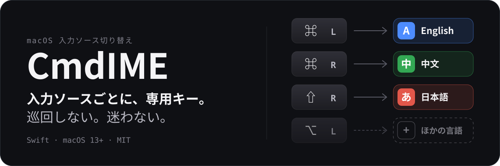
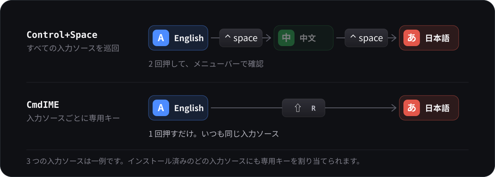
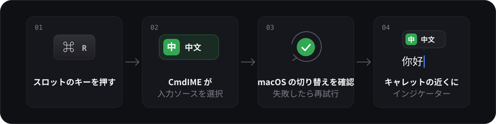

<p align="center">
  
</p>

<p align="center">
  
</p>

<p align="center">
  <a href="README.md">English</a> · <a href="README.zh-CN.md">简体中文</a> · <strong>日本語</strong>
  <br>
  <a href="https://shunmeicho.github.io/cmd-ime/ja/">公式サイトとライブデモ</a>
</p>

<p align="center">
  <a href="https://github.com/ShunmeiCho/cmd-ime/actions/workflows/swift.yml"></a>
  <a href="https://github.com/ShunmeiCho/cmd-ime/releases"></a>
  <a href="LICENSE"></a>
</p>

CmdIME は、Mac の入力ソースそれぞれに専用のキーを割り当てます。左 Command をタップ
すれば英語、右 Command なら中国語、右 Shift なら日本語。CmdIME はその入力ソースを
直接選択し、macOS が実際に切り替えたことを確認して、キャレットの近くに小さな
インジケーターを表示します。キーは自由に選べ、スロットはお使いの Mac に
インストールされている入力ソースに合わせて作られます。

[](demo-videos/renders/cmdime-promo.mp4)

デモには Switcher、Glass、Liquid Glass の 3 つのインジケーターテーマが登場します。
[デモ動画の全編を開く](demo-videos/renders/cmdime-promo.mp4)。

## Control+Space との違い

<p align="center">
  
</p>

- **巡回式だから。** 入力ソースが 3 つ以上あると、どこに切り替わったかをメニューバーで
  確認する必要があります。CmdIME なら、各キーは常に同じ入力ソースに切り替わります。
- **入力ソースが 2 つでも、交互に切り替わるだけだから。** Control+Space は「もう一方」に
  切り替えるので、押す前に今どちらなのかを知っておく必要があります。CmdIME のキーは
  いつも同じ入力ソースを指します。左 Command を押せば、直前がどちらでも英語になります。
- **同時押しではなく、親指 1 本で済むから。** 左右の Command は親指の下にあり、軽く
  叩くだけです。Control+Space は 2 つのキーの同時押しです。
- **押しても何も起きないように見えることがあるから。** CmdIME は macOS が切り替えを
  適用したことを確認し、適用されなかった場合は再試行します。
- **タップとショートカットを区別するから。** Command+C、Command+Tab などのショートカットが
  Command のタップとして扱われることはないので、普段使っているキーはそのまま使えます。

## 切り替えのしくみ

<p align="center">
  
</p>

## インストール

```sh
curl -fsSL https://raw.githubusercontent.com/ShunmeiCho/cmd-ime/main/script/install.sh | bash
```

インストーラーは最新のリリースをダウンロードし、公開されている SHA-256 と照合して
検証したうえで、`CmdIME.app` を `/Applications` にインストールし、`keyboardctl` を
リンクしてアプリを開きます。そのあと、システム設定 > プライバシーとセキュリティで
**Accessibility**(アクセシビリティ)と **Input Monitoring**(入力監視)を許可して
ください。アプリ内の Setup guide(セットアップガイド)が、この 2 つの許可と最初の
切り替えまでを案内します。

macOS 13 以降の Apple シリコン搭載 Mac が必要です(Intel Mac には未対応)。以降のアップデートは、アプリ内の **Update Now**(今すぐ
アップデート)からインストールできます。

> [!NOTE]
> CmdIME はプレビュービルドです。署名済みですが、公証(notarize)はされていません。
> 1 行のインストーラーを使うのがスムーズです。ブラウザーでダウンロードした zip は、
> 初回に Gatekeeper によって「壊れている」と表示され、止められます。[トラブルシューティング](#トラブルシューティング)を参照してください。

[](demo-videos/renders/cmdime-install-permissions-demo.mp4)

<details>
<summary><strong>バージョンを固定する、またはソースからビルドする</strong></summary>

バージョンとチェックサムを固定するには、次のようにします(どちらもリリースノートから
コピーしてください)。

```sh
curl -fsSL https://raw.githubusercontent.com/ShunmeiCho/cmd-ime/main/script/install.sh | \
  CMDIME_VERSION=0.12.0 CMDIME_SHA256=97933e7f28a0663a38191ce4b1ee6f21c5ce5646064614cec53c8aeea29c3a08 bash
```

ソースからビルドするには:

```sh
git clone https://github.com/ShunmeiCho/cmd-ime.git
cd cmd-ime
swift test
./script/build_and_run.sh
```

`build_and_run.sh` は最初に、`/Applications` のコピーも含めて実行中の CmdIME を終了させる
ため、そのあと動いているのはローカルでビルドしたものだけになります(ビルドに失敗すると
何も動いていない状態になります)。ローカルでビルドしたアプリでも、グローバルな
キーボード監視が機能するには同じ 2 つの権限が必要です。

</details>

## できること

- **Slots ページのスロットボード。** 左側にインストール済みの入力ソース、右側にスロットが
  並びます。入力ソースをドラッグしてスロットを追加し、ハンドルをドラッグして並べ替え、
  スロットの名前変更、色の設定、削除ができ、削除は取り消せます。入力ソースを追加または
  削除すると一覧はシステム設定に追従し、macOS が 2 回列挙する入力ソースは 1 つだけ表示
  します。
- **スロットごとに任意の 3 つのトリガー。** 8 つの修飾キーのいずれかのシングルタップ
  またはダブルタップ、そして Option+J のようなショートカットです。どれを設定しても
  かまわず、設定したどのトリガーでもそのスロットに切り替わります。

<p align="center">
  
</p>

<p align="center"><sub>Slots ページ。ここでは 3 つですが、使う入力ソースの数だけ追加できます。</sub></p>

- **キャレットの近くに表示される切り替えインジケーター。** Glass、macOS 26 以降の
  Liquid Glass、paper 系のスタイル、すべてのスロットを表示する switcher、それを
  グリフだけに縮めた badge、切り替えた入力ソースだけを残す mark、そして 1 回の切り替えでは
  mark を表示し、表示中にもう一度切り替えたときや Peek したときは badge の列に広がる 2 つの
  Adaptive テーマなど 18 の組み込みテーマに加え、独自のテーマやフォントも使えます。

<p align="center">
  
</p>

<p align="center"><sub>設定画面に並ぶ組み込みテーマ全 18 種類。</sub></p>

<p align="center">
  
</p>

<p align="center"><sub>Adaptive：1 回の切り替えではマークだけ、表示中にもう一度切り替えると一列に広がります。</sub></p>

- **スロットごとの色は自由に決められます。** プリセットから選ぶことも、システムの
  カラーピッカーで好きな色を選ぶこともできます。インジケーターの Color を Slot にすると
  その色で表示されるので、文字を読む前に今どこにいるかが分かります。

<p align="center">
  
</p>

<p align="center"><sub>3 つのスロットに、自分で選んだ 3 つの色。</sub></p>

- **アプリごとの入力ソース。** Apps ページで、一覧、Finder、Dock からアプリをスロットに
  ドラッグすると、そのアプリは前面に来るたびにそのスロットになります。**Keep as is**
  (そのまま)にドラッグすれば、CmdIME はそのアプリでは何もしません。各アプリで最後に
  使った入力ソースを CmdIME に覚えさせることもできます(初期状態はオフ、メモリ上だけに
  保持)。それ以外のアプリ全体にスロットを 1 つ割り当てることも、パスワード欄のあとに元の
  入力ソースへ戻すこともできます(初期状態はオン。macOS はパスワード欄のあと ABC のままに
  します)。押したトリガーは常に優先されます。

<p align="center">
  
</p>

<p align="center"><sub>App Rules：Code は英語、Chat は中国語。クリックするだけで切り替わります。</sub></p>

<p align="center">
  
</p>

<p align="center"><sub>アプリをスロットにドラッグすると、そのスロットが割り当てられます。</sub></p>

<p align="center">
  
</p>

<p align="center"><sub>パスワード欄のあと、元の入力ソースが戻ります。</sub></p>

- **CmdIME 以外の切り替えにもインジケーター。** Control+Space、地球儀キー、メニューバーで
  切り替えたときもバブルが出ます。アプリの切り替え後に出すこともできます。特定のアプリでは
  隠せますし、表示時間も選べます。**Peek** トリガーは切り替えずに今の入力ソースを表示し、
  オンにすれば Caps Lock のオン・オフでもバブルが出ます。

<p align="center">
  
</p>

<p align="center"><sub>Control+Space は CmdIME のトリガーではありませんが、バブルは出ます。</sub></p>

- **持ち運べる設定。** スロット、トリガー、App Rules、テーマ、フォント、アクティベーション
  レシピをフォルダーに書き出し、別の Mac で読み込めます。`keyboardctl` やエディターによる
  設定の変更は、CmdIME の実行中にそのまま反映されます。About の **Copy Diagnostics** で、
  不具合報告に必要な情報をまとめてコピーできます。
- **アプリ内からのアップデート。** 既定では 6 時間ごとに確認し、**Update Now** の横に
  変更点の概要を表示し、権限を保ったままその場でインストールします。
- **ライトとダークに追従する設定ウィンドウ。** どちらかに固定することもできます。

<p align="center">
  
</p>

<p align="center"><sub>General：外観、アップデート、設定の書き出しと読み込み。</sub></p>

- **`keyboardctl`。** スキャン、バインド、切り替え、App Rules、設定の移行、診断のための
  コマンドラインツールです。実機で確かめる Reliability Lab(信頼性チェック)も備えています。

## リファレンス

<details>
<summary><strong>スロットとデフォルトのトリガー</strong></summary>

CmdIME は、特定のキーボードレイアウトを固定で組み込むのではなく、macOS にすでに
インストールされている入力ソースをスキャンします。初回セットアップ時には、主要言語
ごとに 1 つのスロットを作成し、その言語についてシステムの並び順で最初の選択可能な
入力ソースを使います。主要言語を持たない入力ソースはスキップされます。各スロットは、
"Not matched"(一致なし)と表示されているスロットも含めて、そのカードからインストール
済みの任意の入力ソースに向けることができます。

| 検出されたスロット | デフォルトのトリガー |
| --- | --- |
| 1 つ目 | 左 Command |
| 2 つ目 | 右 Command |
| 3 つ目 | 左 Option |
| 4 つ目 | 右 Option |
| 5 つ目 | 左 Control |
| 6 つ目以降 | トリガーなし(手動で割り当て) |

既存の設定とそのトリガーは変更されません。使用可能な主要言語を持つ選択可能な入力
ソースが 1 つもない場合、初期化には従来のデフォルトが使われます。英語は左 Command、
中国語は右 Command、日本語は **Option+J** です。

ボードでは:

- "..." メニューには Move Up、Move Down、Rename、Color、Remove Slot があり、同じ操作は
  キーボードと VoiceOver からも行えます。Esc でドラッグをキャンセルできます。削除した
  スロットは、次にスロットを変更するまで **Undo**(取り消す)で復元できます。
- スロットのバッジをクリックすると、そのスロットに色を 1 つ設定できます。入力ソース
  一覧、Live keys、切り替えインジケーターはその色に従います。
- "Current"(現在)は、どの方法で選択されたかにかかわらず、macOS が現在選択している
  入力ソースを示します。**Switch**(切り替え)はスロットの入力ソースを直接選択する
  もので、トリガーのテストは行いません。
- "Duplicate"(重複)は、2 つのスロットが同じ入力ソースを指していることを示します。
  "Source missing"(入力ソースなし)は、スロットの入力ソースがインストールされて
  おらず、別の入力ソースにフォールバックしていることを示します。
- ボードの下にある Live keys は小さなキーボードで、現在のスロットに割り当てられて
  いるキーが点灯します。

</details>

<details>
<summary><strong>トリガーの詳細</strong></summary>

- `Single tap`(シングルタップ): 8 つの物理修飾キー(左右の Command、Option、
  Control、Shift)のいずれか。
- `Double tap`(ダブルタップ): 同じキーを 2 回タップ。
- `Shortcut`(ショートカット): **Record…**(記録)をクリックし、`option+j` のように
  修飾キーとキーを一緒に押してから、Save をクリックします。Esc でキャンセルできます。
  記録中はタップのトリガーが一時停止します。

同じジェスチャーで別のスロットがすでに使っているキー、キーのリマップに使われている
キー、Peek トリガー("Show Current Input Source")に使われているキーは、使用中として
表示され、選択できません。同じキーを、あるスロットではシングルタップ、別のスロットでは
ダブルタップとして使うことはできます。多くの中国語入力メソッドは中国語と英語の切り替えに
Shift を使うため、CmdIME が Shift を自動で割り当てることはありません。

単一の修飾キーによるバインディングとキーボードショートカットは、意図的に分けてあります。
そのため、`Command+C`、`Command+V`、`Command+Tab` や複数の修飾キーを使うショートカット
が、単発の Command タップとして扱われることはありません。シングルタップは即座に
切り替わります。CmdIME がわずかに待機するのは、同じ修飾キーにダブルタップの
バインディングもある場合だけです。

修飾キーを 0.8 秒より長く押し続けた場合はタップになりません。押している間にクリックや
スクロールをした場合も取り消されるため、Command を押しながらクリックやスクロールをしても
切り替わりません。ダブルタップだけが割り当てられたキーは 2 回目を最大 0.35 秒待ちます。
シングルタップも割り当てられたキーは 0.22 秒なので、シングルタップの速さは変わりません。

設定ウィンドウは、`control+space` や `control+option+space` といった macOS の入力ソース用
ショートカットを受け付けません。これは、CmdIME がシステムの入力ソース選択機能を誤って
奪ってしまわないようにするためです。

</details>

<details>
<summary><strong>切り替えインジケーターとテーマ</strong></summary>

CmdIME はプログラムから入力ソースを切り替えるため、macOS の非公開の入力ソース選択
パネルは呼び出しません。切り替えインジケーターをオンにすると(**Indicator > Switch
indicator > Enabled**)、切り替え後に CmdIME 独自の軽量な確認用バブルが表示されます。

macOS 14 以降では、入力ソースが変わるたびに、システム自身の小さなバッジもテキストカーソルの
下に表示されます。CmdIME による切り替えも例外ではないため、2 つが同時に見えることがあります。
CmdIME が切り替えのときにこのバッジだけを出さないようにすることはできません。現在の
ユーザーのすべての app で非表示にするには、**Indicator > macOS indicator > Hide the input source badge macOS shows
under the cursor** をオンにするか、
`defaults write kCFPreferencesAnyApplication TSMLanguageIndicatorEnabled -bool false` を
実行します。各 app は開き直すと反映され、ログアウトして再ログインするとすべてに反映されます。
非表示にすると、Control+Space では画面中央に以前の形式の一覧が表示されます。元に戻すには
チェックを外すか、`defaults delete kCFPreferencesAnyApplication TSMLanguageIndicatorEnabled`
を実行します。

Indicator ページでは、インジケーターを無効にする、18 の組み込みテーマのいずれか(すべての
スロットを表示する switcher、それをグリフだけに縮めた badge、切り替えたスロットだけを
表示する mark、2 つの adaptive、glass、macOS 26 以降の Liquid Glass、classic、1 色・
2 色・スロットの色のインクを使う paper、テキストのみ、タイルのみ、1 行表示)を適用する、
1 本のスライダー(パーセントが実際に描かれるサイズです)でサイズを変更する、テーマが
対応していればアイコンとテキスト、アイコンのみ、テキストのみから表示を選ぶ、各スロット
自身の色、システムのアクセントカラー、モノクロのいずれかで色を付ける、といったことが
できます。フォントファミリー、ウェイト、文字サイズはテーマに属しており、組み込みテーマを
編集するとコピーが作成されます。

**Adaptive** と **Adaptive, Slot Color** は、操作に合わせて形を変えます。1 回だけ切り替えた
ときは、切り替えたスロットだけの Mark を表示します。バブルがまだ出ている間に次の切り替えが
来ると、バブルはその場で広がり、すべてのスロットを並べた Badge の列になります。Control を
押したままスペースを押している間に macOS が出す一覧に近い動きです。Peek では常に Badge の
列を表示します。ほかのテーマは形が変わりません。テーマエディターの **Expand while
switching** をオンにすると、自作の Mark テーマでも同じ動きになります。

カスタムテーマは `~/.config/cmd-ime/themes` に JSON ファイルとして、読み込んだフォントは
`~/.config/cmd-ime/fonts` に保存されます(どちらも設定ファイルと同じ場所です)。フォントは
CmdIME 専用に登録され、システム全体には何もインストールされません。テーマファイルの
名前は自由に付けられます。設定画面でテーマを削除すると、そのファイルはゴミ箱に移動します。

インジケーターはほかのアプリの上に表示されるため、テーマ側でトーンを固定していない限り、
テーマは設定ウィンドウではなく macOS の外観に従います。

Indicator ページの **When it shows**(表示するとき):

- **Other switches**(ほかの切り替え、初期状態はオン): Control+Space、地球儀キー、
  メニューバー、ほかのアプリなど、CmdIME を通さずに入力ソースが変わったときもバブルを
  出します。ターミナルやエディターから実行した `keyboardctl switch` や `keyboardctl source`
  も含みます。
- **App switch**(アプリの切り替え、初期状態はオフ): アプリを切り替えたあと、新しいアプリが
  落ち着いた時点で入力ソースが切り替え前と違い、まだほかのバブルがその変化を示していなければ
  出します。
- **Hidden in**(非表示にするアプリ): ここにあるアプリでは、CmdIME 自身の切り替えも含めて、
  切り替えのバブルも Caps Lock のバブルも出しません。Peek は自分で呼び出すものなので、
  ここでも出ます。
- **Stays**(表示時間): Peek と Caps Lock を含むすべてのバブルの表示時間です。
  **Automatic**(テーマ自身の時間)か、0.5、1、1.5、2、3、5 秒から選びます。config.json に
  直接書いた値は 0.3〜10 秒の範囲に収められます。

追加されたこの 2 種類のバブルは、キーボード操作が有効なときに、いずれかのスロットに属する
入力ソースに対してだけ出ます。切り替えインジケーターがオフの間、上の項目はグレー表示に
なります。

**More bubbles**(そのほかのバブル):

- **Peek**: 修飾キーのシングルタップまたはダブルタップで、切り替えずに今の入力ソースの
  バブルを出します。切り替えインジケーターをオフにしていても、**Hidden in** のアプリでも
  出ます。adaptive テーマでは常にすべてのスロットの列を表示します。スロットやキーの
  リマップがすでに使っているキーは使用中として表示されます。Option+P のような
  ショートカットにするには `keyboardctl bind option+p peek` を実行します。**None** を選ぶと、
  コマンドラインで設定したショートカットも含めて Peek トリガーが外れます。どのスロットにも
  属さない入力ソースではバブルは出ません。
- **Caps Lock**(初期状態はオフ): Caps Lock のオン・オフで "A" または "a" のバブルを、
  使っているテーマで出します。スロットごとに色を付けるテーマで Color が Slot なら、
  現在のスロットの色になります(今の入力ソースがどのスロットにも属さないときは最初の
  スロット)。Switcher ではタイル 1 つ、Badge では mark として表示されます。
  切り替えインジケーターをオフにしていても出ます。

Peek と Caps Lock のバブルも、キーボード操作が有効なときにだけ出ます。

</details>

<details>
<summary><strong>アプリごとの入力ソース</strong></summary>

<p align="center">
  
</p>

<p align="center"><sub>Apps ページ：App Rules、App Memory、その他のアプリのスロット、パスワード欄のスイッチ。</sub></p>

Apps ページは、アプリが前面に来たときに何をするかを決めます。ここでの切り替えはすべて
トリガーと同じ経路を通るため、アプリを切り替えた直後に押したトリガーは常に優先されます。

- **App Rules**(アプリのルール): スロットボードと同じようなボードです。左の一覧には
  実行中のアプリが並び、検索欄に入力すると、インストール済みのアプリを名前か bundle id で
  探せます。右側にはスロットごとのレーンと、**Keep as is**(そのまま)のレーンがあります。
  一覧のアプリ、または Finder や Dock のアプリをレーンにドラッグすると、そのルールが付き
  ます。チップを別のレーンにドラッグすればルールが変わり、一覧に戻せばルールが外れます。
  ドラッグしなくても操作できます。アプリの右クリックメニューには各レーンへの **Add to**
  があり、チップのメニュー(矢印ボタンまたは右クリック)には **Move To**、**Remember**、
  **Remove Rule** があります。チップの × でもルールを外せます。ボードの下にある
  **Add App**(実行中のアプリ、または **Choose App…**)は、アプリを最初のスロットに加え
  ます。変更のたびに、何が起きたか、またはドロップを受け付けなかった理由が、ボードの下の
  1 行に表示されます。

  スロットのルールは、アプリが前面に来るたびにそのスロットを選びます。**Keep as is** は
  切り替えず、そのアプリを App Memory の対象から外します。リモートデスクトップ、仮想
  マシン、ゲームに向いています。**Remember**(記憶。スロットのルールだけに付けられ、時計の
  マークが付きます)は、そのアプリで最後に使った入力ソースを戻し、ルールのスロットは最初の
  1 回だけ使います。App Memory がオフでも同じです。チップを別のスロットに移しても残り、
  **Keep as is** に移すと外れます。スロットを削除すると、そのアプリは **Slot deleted** の
  レーンに残ります。このレーンには新しいアプリを入れられず、別のレーンに移すまで、これらの
  ルールはどのスロットも選びません。ボードは CmdIME 自身を受け付けず、コマンドラインから
  書いたルールも適用されません。アンインストールしたアプリのルールは残り、
  **Not installed** と表示されます。
- **App Memory**(アプリごとの記憶、初期状態はオフ): アプリに戻ると、そこで最後に使った
  入力ソースを選びます。トリガー、Control+Space、メニューバー、地球儀キーのどれで選んだ
  ものでも対象です。メモリ上だけに保持され、CmdIME を終了すると消えます。キーボード操作を
  一時停止したときも消えます。覚えているアプリはそれぞれの入力ソースとともに一覧に表示され、
  **Forget** で 1 つずつ、**Forget All** ですべて忘れさせられます。
  パスワード欄で macOS が強制的に切り替えた入力ソースと、CmdIME 自身の設定ウィンドウは
  記憶しません。
- **Other apps**(ほかのアプリ): ルールも記憶もないアプリに使うスロット、または
  **Keep as is**(初期値)。App Memory がオンのときは、アプリが初めて前面に来たときだけ
  使います。
- **Password fields**(パスワード欄、初期状態はオン): パスワード欄では macOS が ABC などの
  ASCII 入力ソースに切り替え、そのあともそのままにします。パスワード欄が終わり、同じアプリが
  前面にあれば、CmdIME が元の入力ソースに戻します。先にアプリを切り替えた場合は戻しません。**Keep as is** のルールがあるアプリでも戻しません。

優先順位: ルールは App Memory より優先されます(ルールで **Remember** を選んだ場合を除く)。
Other apps のスロットは、どちらもないアプリにだけ使われます。前面に来た時点ですでに正しい
入力ソースになっているアプリには何もしません。ここでの切り替えは、パスワード欄のあとの
復元も含めて、スロットに属する入力ソースであれば、トリガーと同じように切り替え
インジケーターを表示します。キーボード操作を一時停止している間は何も起きません。

macOS の「書類ごとに入力ソースを自動的に切り替える」(キーボード > 入力ソース)がオンの
場合、App Memory が警告を出します。macOS がウインドウを切り替えるたびに自分の覚えた入力
ソースを選ぶため、アプリごとの切り替えと競合するからです。Spotlight、Raycast、Alfred
などのランチャーはアプリとして認識されず、メニューバーのアプリやシステムのアラートも
同様です。そこで行った切り替えは背後のアプリのものとして扱われ、それらに付けたルールは
適用されません。

コマンドラインでは:

```sh
keyboardctl app-rule list
keyboardctl app-rule set com.microsoft.VSCode english
keyboardctl app-rule set --frontmost keep
keyboardctl app-rule set com.tinyspeck.slackmacgap chinese --remember
keyboardctl app-rule remove com.microsoft.VSCode
```

</details>

<details>
<summary><strong>切り替え後もラテン文字のままになる入力メソッド</strong></summary>

バックグラウンドから入力ソースを選択すると、入力メソッドがフォーカス中のアプリに接続
されないことがあります。メニューバーには新しい入力ソースが表示されているのに、入力
されるのはラテン文字のままです。Google 日本語入力は、ABC で文字を入力したあとにこの状態に
なります。azooKey も英数モードのまま残っているとこの状態になります。この 2 つに対しては、
CmdIME はまず「かな」キーを押してシステム自身の経路で日本語に入り、60 ミリ秒後にスロットの
入力ソースを選択します。それ以外の入力メソッドは従来どおり直接選択され、遅延は増えません。

ほかの日本語入力メソッドで同じ症状が出る場合は、
`~/.config/cmd-ime/activation-recipes.json` にアクティベーションレシピを追加し、Slots
ページの入力ソース一覧の上にある Refresh ボタンを押してください。

```json
{ "recipes": [
  { "sourceIDPrefix": "com.example.inputmethod", "strategy": "kanaThenSelect", "delayMs": 60 }
] }
```

入力ソース ID は `keyboardctl scan` で確認できます。ユーザーのレシピはどの組み込みの
レシピよりも優先されるため、`"strategy": "select"` と書けば該当する組み込みのレシピを
無効にできます。`kanaThenSelect` は日本語の入力ソースにのみ適用され、`delayMs` は 0〜500 に
制限されます。読み取れない項目はスキップされます。うまくいったレシピは、組み込みに
加えられるよう issue で教えてください。

**中国語の入力メソッド。** ピンイン入力メソッドでも、ときどき同じ症状が出ます。メニューバーには
その入力メソッドが表示されているのに、ラテン文字が入力されます。これは CmdIME が原因では
ありません。CmdIME を経由せず、システムの API で直接選択しても、少なくとも同じくらい失敗します。
macOS 27.0 で豆包输入法（Doubao）を使い、英字を打った直後に切り替える最悪のケースで測りました。
Chromium 系ブラウザで 210 回中 9 回、TextEdit で 60 回中 3 回、CmdIME を経由しない場合で 60 回中
6 回です。原因が入力メソッド側か macOS 側かは、まだ分かっていません。入力メソッドの外から試した
方法はどれも効果がありませんでした（Doubao ではアプリの再アクティブ化、Rime では再選択・
再アクティブ化・ウォームアップキー）。Rime は上流に報告済みです：
[rime/squirrel#1179](https://github.com/rime/squirrel/issues/1179)。

起きたときは、もう一度切り替えるか、入力欄をクリックしてみてください。どちらもまだ測定して
いません。自分が入力するアプリで測るには：

```sh
keyboardctl lab --client <アプリの bundle id> --slots <スロット id> --attempts 30
```

日本語に切り替えたときに、ひらがなではなくかなパレットが開いてしまう場合は、入力ソースを
更新するか、CmdIME 0.1.10 以降にアップデートしてください。macOS は
`com.apple.50onPaletteIM` を選択可能な日本語の入力ソースとして公開していますが、これは
補助的なかなパレットであり、通常のひらがな入力メソッドではありません。

</details>

<details>
<summary><strong>設定ウィンドウ、外観、終了</strong></summary>

CmdIME はバックグラウンドで動作するエージェントです。設定ウィンドウは操作パネルにすぎず、
ウィンドウを閉じてもキーボードの監視は止まりません。設定ウィンドウが開いている間、CmdIME は
Dock とアプリスイッチャーに表示されます。ウィンドウを閉じた後もバックグラウンドで動き続け、
メニューバーアイコンはありません。設定が必要になったら、`CmdIME.app` をもう一度開いてください。

ウィンドウにはサイドバーがあり、**Slots**、**Apps**、**Indicator**、**General**、**About**
(ガイドが残っている間は **Setup** も)が並びます。サイドバーの下端にはキーボード操作の
状態が **Pause** または **Resume** とともに表示され、Accessibility か Input Monitoring の
許可が足りないときは、直すための手順がそこに展開されます。

新規インストールでは、設定画面がサイドバー先頭の **Setup** ページで開き、3 ステップの
セットアップガイドが表示されます。キーボードへのアクセスを許可し、検出されたスロットを確認し、
実際に切り替えを試す、という流れです。完了またはスキップするとこのページは消え、
**General > Show Setup Guide** で再表示できます。以前のバージョンから更新したユーザーには、代わりに新機能についての 1 行の
お知らせが表示されます。

設定ウィンドウは macOS の外観に従います。**General > Appearance** で **Light** または
**Dark** に固定することも、**System** に戻すこともできます。ウィンドウはシステムの
マテリアルの上に配置され、アップデートバーは macOS 26 以降で Liquid Glass を使います。「透明度を下げる」がオンの場合は、すべて不透明になります。

バックグラウンドエージェントを停止するには、**General > Quit CmdIME** を使うか、次を
実行します。

```sh
keyboardctl quit
```

CLI がまだリンクされていない場合は、`pkill -x CmdIME` を使います。

</details>

<details>
<summary><strong>アップデート</strong></summary>

CmdIME はほとんどの時間ウィンドウを表示しないため、新しいリリースを自分で確認します。
既定では 6 時間ごとに GitHub に最新のリリースを問い合わせ(それ以外の情報は送信しません)、
新しいバージョンがあれば、そのバージョンについてシステム通知を 1 回だけ表示します。設定
ウィンドウの上部にも同じアップデートが表示され、そのリリースの冒頭の一文と各変更の
タイトルが添えられます。

**General > Updates** には、手動確認用の **Check**(About にも同じボタンが **Check for
Updates** としてあります)と **Check automatically** スイッチがあり、このスイッチがオンの
間は **Every 6 hours / Daily / Weekly** の頻度の選択と **Notify me about updates** も
表示されます。**Notify me about updates** をオフにすると通知は表示されなくなりますが、
ウィンドウ内のアップデート表示はそのままです。通知の許可を求めるのは、知らせるアップデートがあるとき、またはこのスイッチを
オンにしたときだけで、初回起動時には求めません。macOS ではアプリが自分の通知の許可を変更
することはできないため、通知がブロックされている場合は General にその旨が表示され、
**Open Notification Settings…** が用意されます。

**Update Now** はその場でアップデートをインストールします。リリースの zip をダウンロード
し、公開されている `.sha256` と照合し、新しいアプリが有効なコード署名を持ち、実行中の
アプリと同じ開発者チームのものであることを検証したうえで、アプリバンドルを置き換えて
CmdIME を開き直します。署名の ID が変わらないため、Accessibility と Input Monitoring の
許可は引き継がれます。**Release Notes** は GitHub のリリースページを開き、**Skip** は
そのバージョンの通知を止めます。Homebrew でインストールした場合は、これまでどおり
`brew upgrade` を使えます。その場でアップデートすると、次の `brew upgrade` まで Homebrew
側のバージョン記録は古いままになります。

</details>

<details>
<summary><strong>コマンドライン: keyboardctl</strong></summary>

スロット ID は、検出された入力ソースによって変わります。以下の例では、`english`、
`chinese`、`japanese` という名前のスロットを想定しています。実際の ID は
`keyboardctl slots` を実行して確認してください。

```sh
swift run keyboardctl scan
swift run keyboardctl init
swift run keyboardctl slots
swift run keyboardctl slot add
swift run keyboardctl slot add 1 --name Korean
swift run keyboardctl slot remove japanese
swift run keyboardctl switch english
swift run keyboardctl source
swift run keyboardctl source com.apple.keylayout.ABC
swift run keyboardctl lab
swift run keyboardctl diagnose
swift run keyboardctl diagnose --json
swift run keyboardctl bind left-command english
swift run keyboardctl bind right-command chinese
swift run keyboardctl bind option+j japanese
swift run keyboardctl bind double-left-command english
swift run keyboardctl bind double-right-option peek
swift run keyboardctl remap right-control escape
swift run keyboardctl app-rule list
swift run keyboardctl app-rule set --frontmost english
swift run keyboardctl export ~/Desktop/CmdIME-settings
swift run keyboardctl import ~/Desktop/CmdIME-settings
swift run keyboardctl quit
swift run keyboardctl listen
```

- `keyboardctl init`: GUI の初回起動時と同じ検出方法で、入力ソースから検出したデフォルトを
  作成します。既存の設定は、`--force` を指定しない限り変更されません。`--force` を指定
  すると、設定全体が検出されたデフォルトに置き換えられます。強制リセットの前に、カスタム
  設定をバックアップしてください。このコマンドは GUI のリセット前バックアップを作成しません
  (後述の従来形式からの移行バックアップは引き続き適用されます)。
- `keyboardctl switch <slot>`: スロットに一致した入力ソースを選択し、macOS が切り替えを
  適用したことを確認します。macOS が選択を適用しなかった場合は、`stderr` にエラー
  メッセージを出力し、0 以外の終了コードで終了します。
- `keyboardctl source [<input-source-id>] [<wait-ms>] [--quiet] [--json]`: 引数なしでは
  現在の入力ソースの ID を出力します。ID を指定するとそれを選択し、macOS が変更を報告する
  まで待ちます(既定は 60 ミリ秒、`0` で待ちません)。ID が不明な場合、インストール済みだが
  有効になっていない場合、キーボードの入力ソースではない場合をそれぞれ別のメッセージで
  知らせるので、打ち間違いと無効な入力ソースが同じメッセージになることはありません。ID
  だけでも動きます: `keyboardctl com.apple.keylayout.ABC`。エディター連携での `im-select`
  や `macism` の置き換えです。[エディターとスクリプト](#エディターとスクリプト)を参照して
  ください。
- `keyboardctl lab [--slots a,b] [--attempts N] [--client <bundle id>] [--away <bundle id>] [--json]`:
  Reliability Lab(信頼性チェック)。各スロットに実際に切り替えて TextEdit(または
  `--client` で指定したアプリ)に入力し、アクセシビリティ API でテキストを読み返して、
  macOS の報告ではなく実際に入力された内容で判定します。`--away` は App Memory を確かめ
  ます。切り替えのたびにそのアプリを前面に出して ABC を選び、元のアプリに戻るので、動作中の
  CmdIME は入力が始まる前にスロットの入力ソースを戻さなければなりません。先に
  "Remember input source per app" をオンにしてください。実行するターミナルにアクセシビリティ
  の権限が必要で、実行中はキーボードを占有します。`keyboardctl help` には `--settle`、
  `--rest`、`--latin-first` などのオプションも載っています。
- `keyboardctl diagnose [--json]`: まず現在の入力ソースを、次にアプリごとの設定の要約
  (App Memory のオン・オフ、App Rules の数、Other apps のスロット、パスワード欄のあとの
  復元、macOS の「書類ごとに入力ソースを自動的に切り替える」がオンのときはその警告)を、
  最後に各スロットに設定された優先条件(`preferredIDs`、`fallbackLanguage`、
  `languagePrefixes`、`nameContains`)、一致した入力ソース、一致の理由(`preferredID`、
  `fallbackLanguage`、`languagePrefix`、`nameContains`、または `none`)を出力します。
  `--json` を指定すると、同じ内容を構造化された JSON(`currentInputSourceID`、
  `currentInputSourceName`、`rememberInputSourcePerApp`、`appRuleCount`、`appDefaultSlot`、
  `restoreAfterPasswordField`、`systemPerDocumentSwitching`、`slots`)で出力します。
  `slots` の各項目は `slot` の ID を保持し、`name` と `duplicateSlots`(該当がない場合は
  空の配列)を含みます。
- `keyboardctl bind <trigger> peek`: そのトリガーを Peek にします。切り替えずに今の
  入力ソースのバブルを出します。Peek トリガーは 1 つだけなので、以前のものは置き換えられます。
  そのトリガーをスロットやリマップが使っていた場合は奪い、その旨を stderr に出力します。
  `control+space` のような macOS の入力ソース用ショートカットは受け付けません。`peek`
  (大文字と小文字は区別しません)は "peek" という名前のスロットより優先されます。外すには
  **Indicator > More bubbles > Peek > None** を選びます。
- `keyboardctl app-rule list|set|remove`: Apps ページの App Rules と同じものです。`set` には
  bundle id か `--frontmost`(実行時に前面にあるアプリ)、続けてスロットか `keep` を
  指定します。`--remember` を付けると、前回の入力ソースを戻すルールになります(`keep` とは
  併用できません)。`list` は各ルールを表示し、スロットが削除されたルールに印を付け、最後に
  Other apps のスロットを表示します。`remove` には bundle id を指定します。実行中の CmdIME
  は変更をすぐに反映します。上の **アプリごとの入力ソース**を参照してください。
- `keyboardctl export <new-folder>` / `keyboardctl import <folder>`: 下の「設定の移行」を
  参照してください。
- `keyboardctl slots`: スロットの ID、名前、トリガー、一致結果を順番どおりに一覧表示し、
  フォールバックによる一致には印を付けます。
- `keyboardctl slot add [<number|source-id>] [--name N]`: 入力ソースを指定しない場合は、
  未割り当ての入力ソースを番号付きで一覧表示します。指定した場合は、スロットを追加し、
  左 Command、右 Command、左 Option、右 Option、左 Control の中から最初に空いている
  トリガーを割り当てます。すべて使用中の場合、スロットにはトリガーが付きません。
  `bind` を使って割り当ててください。多くの中国語入力ソースは英語と中国語の切り替えに
  Shift のタップを使うため、Shift が自動で割り当てられることはありません。右 Control
  も、ノート型のキーボードには存在しないため、手動でのみ割り当てられます。
- `keyboardctl slot remove <slot>`: そのスロットのバインディング、優先条件、カスタム
  カラーを削除します。最後の 1 つのスロットは削除できません。
- スロットの指定では、まず完全一致の ID が、次に大文字と小文字を区別しない一意の ID
  または名前が受け付けられます。削除済みまたは不明なスロットは終了コード 1 で失敗し、
  別のスロットに読み替えられることはありません。`bind <trigger> <slot>` は、トリガーを
  奪う従来の動作を維持しており、以前のスロットにトリガーがなくなった場合はその旨を
  報告します。

新しいスロットは、選択した入力ソースを優先し、その**主要**言語によってフォールバック
します。1 つの入力ソースを 2 つのスロットの第 1 優先ソースとして割り当てることは
できませんが、フォールバックや従来のルールによって、複数のスロットが同じ入力ソースに
解決されることはあります。その場合もどちらのスロットも動作し、`diagnose` は
`duplicate with: <ids>` と報告します。既存の一致ルールは変更されません。初回起動時に
スロットが検出されるのは、設定ファイルが存在しない場合だけです。入力ソースを更新しても、
既存のスロットやトリガーが置き換えられることはありません。

</details>

<details>
<summary><strong>設定ファイル、リセット、アップグレードとダウングレード</strong></summary>

設定ファイルは `~/.config/cmd-ime/config.json` にあります。実行中の CmdIME はこの
ファイルを監視しており、`keyboardctl` やエディターによる変更は、再起動しなくても間もなく
反映されます。そのとき、テーマ、フォント、アクティベーションレシピも読み直されます。
ファイルを読めない間(エディターが保存の途中、書き間違いなど)は、CmdIME は今の設定を
保ちます。ファイルが直る前に保存が必要になった場合は、先にファイルを同じ場所の
`config.json.unreadable.<uuid>.bak` にコピーします。

Slots ページの **Manage > Reset to Detected**(検出結果にリセット)は、すべてのスロットと
トリガーを検出されたデフォルトに置き換える前に、確認を求めます。インジケーターの一般設定など、
関係のない設定は保持されます。保存の前に、GUI は元のファイルを設定ファイルと同じ場所の
`config.json.before-reset.bak` にバックアップします。2 回目以降のリセットでは、以前の
バックアップを上書きせず、重複しないバックアップ名が使われます。バックアップまたは保存に
失敗した場合、リセットは適用されません。

バージョン 2 では、固定の ID、名前、色合いを持つ、順序付きの `slots` コレクションが保存
されます。古い設定は、読み込み時にメモリ上で移行されます。`show`、`slots`、`diagnose`、
`switch`、`listen` は、移行結果を保存せず、アップグレードの通知も出力しません。書き込みが
成功するたびに(`bind`、`remap`、`slot add`、`slot remove`、`app-rule set`、
`app-rule remove`、または `init --force`)、
`slots` を含まないファイルは同じ場所の `config.json.v1.bak` にバックアップされ、その後
stderr に通知が出力されます。これは、古いバイナリによって `slots` キーが失われた
バージョン 2 のファイルにも当てはまります。バックアップがすでに存在する場合は、新しい
`config.json.v1.bak.<uuid>` が作成されます。以前のバックアップが再利用されたり上書き
されたりすることはありません。通知には新しいバックアップのパスが記載されます。
バックアップに失敗した場合、保存は行われません。従来の ID とバインディングは、移行時に
保持されます。

ダウングレードする前に、CmdIME を終了し、最新の移行通知に記載されたバックアップを
`config.json` に復元してください(今の設定は別にコピーを保管しておいてください)。アップグレードを繰り返したあとでは、そのバックアップに UUID の接尾辞が付いて
いることがあります。元の `config.json.v1.bak` には、最初の移行時の設定がそのまま残って
います。古いバイナリはカスタムのスロット ID をデコードできず、その設定を
`.corrupt.<uuid>` に移動してリセットすることがあります。従来の ID しかない場合でも、
古いバイナリは保存時に `slots` を削除するため、名前や色合いが失われ、次回のアップグレード
時に削除済みの従来のスロットが復活する可能性があります。

</details>

<details>
<summary><strong>設定の移行と Copy Diagnostics</strong></summary>

**General > Settings file**(設定ファイル)には **Export Settings…**、**Import Settings…**、
**Show Backups** があります。書き出されるのは新しいフォルダーで、`config.json`(スロット、
トリガー、App Rules、インジケーターなど、そこに保存されているすべての設定)、`themes/`、
読み込んだ `fonts/`、`activation-recipes.json` が入ります。すでにあるフォルダーには
書き込みません。App Memory が覚えている内容、設定ウィンドウの外観、アップデート確認の
設定、Launch at login(ログイン時に起動)は `config.json` に含まれないため、移行されません。
設定画面の Import は、フォルダーに含まれるスロット、テーマ、フォントの数を示し、何かを
置き換える前に確認を求めます。

読み込みの前に、今の設定を `~/.config/cmd-ime/backups/before-import-<日時>/` にコピー
します。このフォルダーを読み込めば元に戻せます。読める `config.json` がないフォルダーと、
新しいバージョンの CmdIME の設定は受け付けません。読み込んだファイルは同じ名前のローカル
ファイルを置き換え、書き出しに含まれないローカルのテーマやフォントは残ります。新しい設定は
再起動なしで反映され、読み込みによってセットアップガイドが再び表示されることはありません。
同じ名前のファイルで置き換えたフォントは、CmdIME を再起動するまで古い見た目のままです。

同じことをコマンドラインでもできます。たとえば 2 台目の Mac をスクリプトで設定するとき:

```sh
keyboardctl export ~/Desktop/CmdIME-settings
keyboardctl import ~/Desktop/CmdIME-settings
```

**About > Copy Diagnostics** は、CmdIME と macOS のバージョン、キーボード操作が有効か
どうか、2 つの権限、`keyboardctl diagnose` のレポートをコピーします。含まれるのは設定と
入力ソースの名前だけで、入力した内容は含まれません。issue に貼り付けてください。

</details>

## エディターとスクリプト

Vim、Neovim、Emacs、Helix では、挿入モードを抜けたら英語に戻すために `im-select` や `macism` で
入力ソースを切り替えるのが一般的です。`keyboardctl source` はその置き換えとして使え、アプリ自身が
切り替えに使っているのと同じコードです。

```vim
" Neovim: 挿入モードを抜けたら英語へ、戻るときに元のソースへ。
let g:cmdime = '/Applications/CmdIME.app/Contents/Resources/keyboardctl'
augroup cmdime
  autocmd!
  autocmd InsertLeave * let b:cmdime_source = trim(system(g:cmdime . ' source'))
        \ | call system(g:cmdime . ' source com.apple.keylayout.ABC')
  autocmd InsertEnter * if exists('b:cmdime_source')
        \ | call system(g:cmdime . ' source ' . b:cmdime_source) | endif
augroup END
```

お使いの Mac での入力ソース ID は `keyboardctl scan` で確認できます。

CmdIME はこうした選択を CmdIME の外で行われた変更として扱います。そのため
切り替えインジケーターと **Indicator > Other switches** がオン(どちらも初期状態)なら、
選択で入力ソースが実際に変わり、その入力ソースがスロットに属している場合にバブルが
出ます(キーボード操作が有効なときだけ)。出したくない場合は、ターミナルやエディターを
**Indicator > Hidden in** に追加してください。

**約束できること、できないこと。** 選択が効かなかったとき `keyboardctl source` は非ゼロで終了し、
理由を stderr に書きます。ただし広く使われているエディタープラグインはそのどちらも読まないので、
**エディターがそれを知ることはありません**。何も分からないままになる — それがこの領域の現状であり、
`keyboardctl lab` がある理由です。あなたの Mac とあなたの入力ソースで切り替えが本当に効くのかを
知る方法は、実際に打って読み返すことだけです。

```sh
keyboardctl lab --attempts 30
```

実行中はキーボードを占有し、TextEdit に入力します。試行ごとに 1 文字を出力するので、失敗が散って
いるのか固まっているのかが見て分かります。

## トラブルシューティング

<details>
<summary><strong>"CmdIME is damaged" または "Apple cannot check it for malicious software" と表示される</strong></summary>

アプリは壊れていません。プレビュービルドは署名済みですが公証されておらず、ブラウザーで
ダウンロードした zip には隔離（quarantine）属性が付くため、Gatekeeper が初回起動を止めます。
「壊れている」というメッセージでは、通常 **Open Anyway**（このまま開く）は表示されません。
次のどちらかで開けます。

1. ダウンロードした zip とアプリを削除し、1 行のインストーラーで入れ直します。ブラウザーの
   隔離の仕組みを通りません。

   ```sh
   curl -fsSL https://raw.githubusercontent.com/ShunmeiCho/cmd-ime/main/script/install.sh | bash
   ```

2. ダウンロードしたアプリを使う場合は、`CmdIME.app` を「アプリケーション」
   （`/Applications`）に移してから、隔離属性を削除します。

   ```sh
   xattr -dr com.apple.quarantine /Applications/CmdIME.app
   ```

"Apple cannot check it for malicious software" と表示された場合は、システム設定 >
プライバシーとセキュリティに **Open Anyway** が出ることがあります。上の方法で属性を
削除しても開けます。確認の仕組みについては、Apple の [Gatekeeper](https://support.apple.com/guide/security/gatekeeper-and-runtime-protection-sec5599b66df/web) と [Developer ID](https://developer.apple.com/developer-id/) のドキュメントで説明されています。

</details>

<details>
<summary><strong>macOS が何度も権限を求める</strong></summary>

macOS は Accessibility と Input Monitoring の許可をアプリのコード ID に対して保存する
ため、ビルドし直した `CmdIME.app` の 1 つを許可したあとで、`dist/`、`dist/release/`、
`/Applications` にある別のコピーを実行すると、macOS が再度許可を求めることがあります。
アプリの場所は 1 か所に固定してください。リセットするには:

1. CmdIME を終了します。
2. システム設定 > プライバシーとセキュリティ > Accessibility と Input Monitoring から、
   古い `CmdIME.app` の項目を削除します。
3. `/Applications/CmdIME.app` など、実際に使用する場所にアプリをインストールまたは
   コピーします。
4. そのアプリ自体を開き、両方の権限を付与します。
5. CmdIME を終了して開き直します。

</details>

## 開発

<details>
<summary><strong>ビルド、パッケージ、リリース</strong></summary>

```sh
swift test
./script/build_and_run.sh
```

`script/build_and_run.sh` は、生成したアプリバンドルを配置したあとで署名します。ローカルで
最初に見つかった Apple Development または Developer ID の署名 ID を使い、見つからない場合は
ad-hoc 署名にフォールバックします。特定の ID を選ぶには、`CODESIGN_IDENTITY` を設定します。

```sh
CODESIGN_IDENTITY="Apple Development: Your Name (TEAMID)" ./script/build_and_run.sh
```

リリースをパッケージするには:

```sh
CMDIME_ALLOW_UNNOTARIZED=1 ./script/package_app.sh
```

バージョンは、指定しなければ `./VERSION` から取られます。スクリプトは SHA-256 を出力し、
`dist/CmdIME-<version>.zip`、`dist/CmdIME-<version>.zip.sha256`、名前が固定の
`dist/CmdIME.zip` を書き出します。**Update Now** には `.sha256` が必要で、Web サイトは
`CmdIME.zip` にリンクしているため、リリースには 3 つともアップロードしてください。

公証付きのパッケージを作成するには、`Developer ID Application` の署名 ID が必要です。
公証されていないことを明記したプレビューの場合は、`CMDIME_ALLOW_UNNOTARIZED=1` を設定
します。公証の初回セットアップ(一度だけ):

```sh
security find-identity -p codesigning -v
xcrun notarytool store-credentials "cmd-ime-notary" \
  --apple-id "YOUR_APPLE_ID" \
  --team-id "YOUR_TEAM_ID" \
  --password "APP_SPECIFIC_PASSWORD"
```

パッケージスクリプトは、Developer ID で署名し、zip を Apple の公証サービスに提出し、
チケットを `CmdIME.app` にステープルし、配布用の zip を作り直して、SHA-256 を出力します。
キーチェーンのプロファイル名が `cmd-ime-notary` でない場合は、`CMDIME_NOTARY_PROFILE` を
使ってください。

Homebrew cask を公開する前に、`Casks/cmd-ime.rb` をリリース zip の SHA-256 で更新して
ください。cask は `Contents/Resources` 経由で `keyboardctl` をリンクします。これは、
`Contents/MacOS` にある署名済みヘルパーへの互換用シンボリックリンクです。

配布されるアプリはネイティブの SwiftUI と AppKit のままです。グローバルなキーボード監視、
Accessibility と Input Monitoring、ログイン項目、入力ソースの切り替えは、いずれも macOS の
API に依存しています。Mac App Store での配布には、サンドボックス化された別のビルドが必要
です。[docs/app-store.md](docs/app-store.md) を参照してください。

</details>

<details>
<summary><strong>プロジェクト構成</strong></summary>

- `Sources/KeyboardSwitcherCore`: 設定とスロット、トリガーの解析、入力ソースのスキャンと
  マッチング、切り替えとグローバルなイベントタップ、App Rules と App Memory、インジケーターの
  テーマ、設定の書き出しと読み込み、Reliability Lab の判定、アップデート情報の解析
- `Sources/CmdIME`: SwiftUI の設定ウィンドウを備えた AppKit のバックグラウンドアプリ
- `Sources/keyboardctl`: スキャン、設定、切り替え、診断、App Rules、設定の書き出しと読み込み、
  Reliability Lab、リスナーモードのための CLI。アプリも入力ソースをスキャンするときにこれを実行します
- `script`: ローカル実行、インストール、リリース用のスクリプト
- `Casks`: Homebrew cask のテンプレート

</details>

## コントリビュート

プルリクエストを歓迎します。[CONTRIBUTING.md](CONTRIBUTING.md) をご覧ください。最初のプル
リクエストには [CLA.md](CLA.md) に同意する 1 行が必要です。著作権はあなたが保持したまま、
将来ライセンスを変更する際に過去の貢献者全員を探し直さずに済むようにするためのものです。

**Windows:** Windows 版 WinIME を計画中です。最初の一歩はコードではなく計測です。このプロジェクトが
対象としている不具合 — 切り替えが成功したと報告されるのに、打つと前の言語のままになる — は Windows にも
あるのか。[Issue #5](https://github.com/ShunmeiCho/cmd-ime/issues/5) で追跡しており、どんな協力が役に立つかも書いています。

## サポート

CmdIME がキーボード操作の手間を少しでも減らせたなら、
[コーヒーをおごる](https://buymeacoffee.com/shunmeicor7)か、
[リポジトリにスターを付ける](https://github.com/ShunmeiCho/cmd-ime)ことで応援していただけます。
