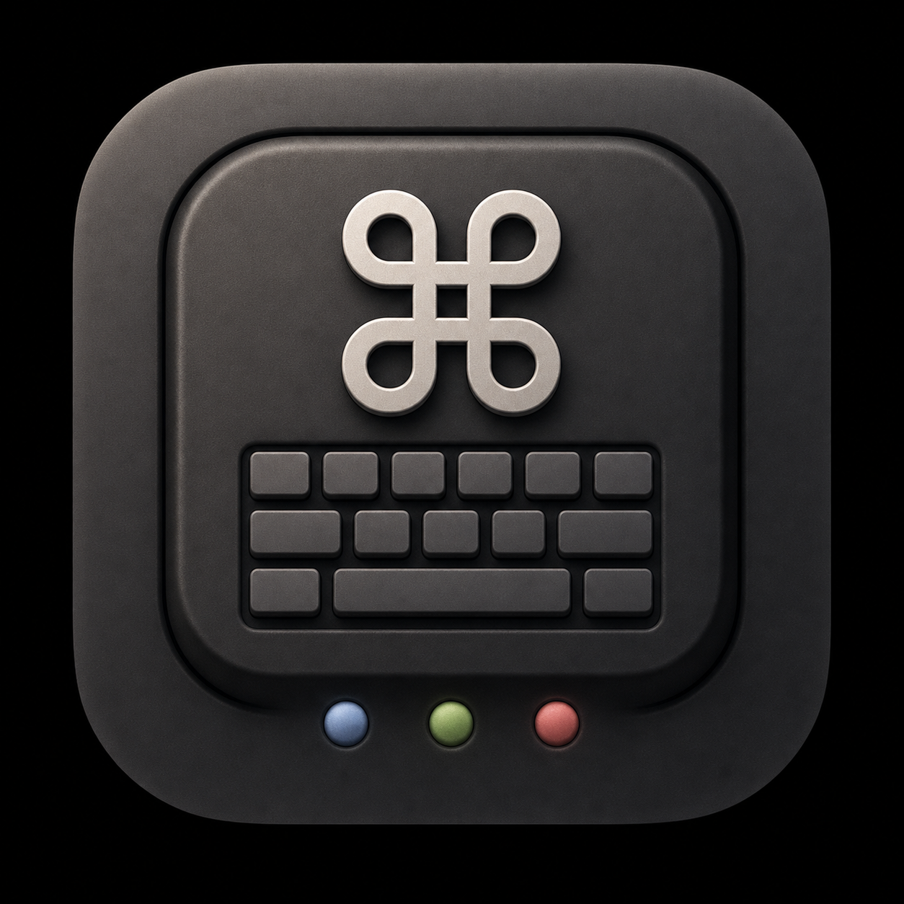

<div align="center">
  
  <h1>CmdIME</h1>
  <p><strong>Deterministic macOS input-source switching for multilingual typing.</strong></p>

  <p>
    <a href="https://github.com/ShunmeiCho/cmd-ime/actions/workflows/swift.yml"></a>
    <a href="https://github.com/ShunmeiCho/cmd-ime/releases"></a>
    <a href="LICENSE"></a>
  </p>
</div>

CmdIME is a macOS input-source switcher inspired by `cmd-eikana`, but built for
configurable switch slots. It replaces cycling through input sources with direct
target switching: press the slot you want, and CmdIME selects the matching macOS
input source.

## What It Does

CmdIME scans the input sources already installed in macOS instead of hardcoding
one keyboard layout. The default setup targets English, Chinese, and Japanese,
and the bindings are configurable.

| Slot | Default trigger | Action |
| --- | --- | --- |
| English | Left Command | Switch to the matched English input source |
| Chinese | Right Command | Switch to the matched Chinese input source |
| Japanese | Option+J | Switch to the matched Japanese input source |

Demo video planning lives in [demo-videos](demo-videos/). Rendered videos will
be linked here once the visual direction is finalized.

## Distribution Status

CmdIME is currently distributed as an **unnotarized preview build**.

It is not distributed through the Mac App Store, and current preview builds are
not signed with a Developer ID certificate unless a release explicitly says so.
macOS may block the app on first launch or ask you to approve it manually in
System Settings.

After you approve CmdIME and grant the required permissions, it runs normally.
This preview distribution path is intended for technical users and early
adopters.

Apple's Gatekeeper documentation explains that apps downloaded from outside the
App Store are checked for identified developer signing, notarization, and
modification status. Developer ID signing and notarization are the smoother path
for broader public distribution:

- [Gatekeeper and runtime protection in macOS](https://support.apple.com/guide/security/gatekeeper-and-runtime-protection-sec5599b66df/web)
- [Signing Mac Software with Developer ID](https://developer.apple.com/developer-id/)

## Install

### Recommended Preview Install: Homebrew

```sh
brew install --cask https://raw.githubusercontent.com/ShunmeiCho/cmd-ime/main/Casks/cmd-ime.rb
```

After installation, open CmdIME and grant both **Accessibility** and
**Input Monitoring** permissions in System Settings > Privacy & Security.

### Verified One-Line Install

Each release publishes a SHA-256 checksum. For the safest installer path, pin
both the version and checksum from the GitHub Release notes:

```sh
CMDIME_VERSION=0.1.13 CMDIME_SHA256=86fb954cb15ef56ad6b9ef53347ca8a50f89cb7a72069c9251b1ad09e3331bc0 \
  /bin/bash -c "$(curl -fsSL https://raw.githubusercontent.com/ShunmeiCho/cmd-ime/main/script/install.sh)"
```

The installer downloads the release zip, checks the archive when
`CMDIME_SHA256` is set, installs `CmdIME.app`, links `keyboardctl`, and opens the
app so macOS can request permissions.

Without `CMDIME_SHA256`, the installer still prints the downloaded archive's
SHA-256 so you can compare it manually with the release notes.

### Build From Source

```sh
git clone https://github.com/ShunmeiCho/cmd-ime.git
cd cmd-ime
swift test
./script/build_and_run.sh
```

The local app still needs Accessibility and Input Monitoring permissions before
global keyboard listening can work.

## First Launch And Permissions

CmdIME needs both macOS permissions:

- Accessibility
- Input Monitoring

Use one stable app location when granting permissions. macOS stores approval
against the app's code identity, so approving one rebuilt `CmdIME.app` and then
running another copy from `dist/`, `dist/release/`, or `/Applications` can make
macOS ask again.

Recommended permission reset flow:

1. Quit CmdIME.
2. Remove old `CmdIME.app` entries from System Settings > Privacy & Security >
   Accessibility and Input Monitoring.
3. Install or copy the app to the location you actually use, such as
   `/Applications/CmdIME.app`.
4. Open that exact app and grant both permissions.
5. Quit and reopen CmdIME.

## Gatekeeper Troubleshooting

Because current preview builds are not notarized, macOS may show a warning such
as "CmdIME is damaged" or "Apple cannot check it for malicious software" when
you open a browser-downloaded zip.

If you trust the release you downloaded, try opening CmdIME once, then go to
System Settings > Privacy & Security and choose **Open Anyway**.

If needed, you can also remove the browser quarantine attribute:

```sh
xattr -dr com.apple.quarantine /Applications/CmdIME.app
```

Prefer the Homebrew or pinned installer path when possible. Those paths avoid
the browser quarantine flow.

## App Behavior

CmdIME is a background input-source agent. The settings window is only a control
panel: closing the window does not stop keyboard listening. Release builds are
packaged with `LSUIElement`, so the app does not appear in the Dock or app
switcher.

If `Show menu bar icon` is turned off, CmdIME keeps running in the background.
Open `CmdIME.app` again to bring the settings window back.

On macOS 26 and later, CmdIME disables the menu bar icon automatically to avoid
a system status-item layout issue that can freeze the settings window and drive
CPU usage very high. Open `CmdIME.app` again whenever you need Settings.

If you need to stop a hidden background instance, use:

```sh
keyboardctl quit
```

If the CLI is not linked yet, use:

```sh
pkill -x CmdIME
```

## Bindings

Each switch slot can use one of three trigger types:

- `Shortcut`: click the recorder field, then press a real keyboard shortcut
  such as `option+j`.
- `Single tap`: choose a side-specific modifier from the list.
- `Double tap`: choose a side-specific modifier from the list.

Single-key modifier bindings and keyboard shortcuts are intentionally separate
so common shortcuts such as `Command+C`, `Command+V`, `Command+Tab`, and
multi-modifier chords are not treated as one-shot Command taps. Single-tap
modifier bindings switch immediately; CmdIME waits briefly only when the same
modifier also has a CmdIME double-tap binding.

The settings UI rejects macOS input-source shortcuts such as `control+space`
and `control+option+space` so CmdIME does not steal the system input-source
chooser by accident.

CmdIME switches input sources programmatically, so it does not invoke the
private macOS input-source chooser. Enable `Show switch indicator` to show
CmdIME's own lightweight confirmation bubble after a switch. The indicator can
be disabled, resized with presets and a scale slider, switched between
icon/text display modes, or recolored with slot colors, the system accent color,
monochrome, or a custom color in Settings.

If Japanese opens a kana palette instead of switching to Hiragana, refresh input
sources or update to CmdIME 0.1.10 or later. macOS exposes
`com.apple.50onPaletteIM` as a selectable Japanese source, but it is an
auxiliary kana palette, not the normal Hiragana input method.

## CLI

```sh
swift run keyboardctl scan
swift run keyboardctl init
swift run keyboardctl switch english
swift run keyboardctl bind left-command english
swift run keyboardctl bind right-command chinese
swift run keyboardctl bind option+j japanese
swift run keyboardctl bind double-left-command english
swift run keyboardctl remap right-control escape
swift run keyboardctl quit
swift run keyboardctl listen
```

Config lives at:

```text
~/.config/cmd-ime/config.json
```

## Build

```sh
swift test
./script/build_and_run.sh
```

For local development, `script/build_and_run.sh` signs the generated app bundle
after staging it. It uses the first local Apple Development or Developer ID
signing identity it can find, then falls back to ad-hoc signing. You can set
`CODESIGN_IDENTITY` to choose a specific identity:

```sh
CODESIGN_IDENTITY="Apple Development: Your Name (TEAMID)" ./script/build_and_run.sh
```

The shipped app stays native SwiftUI/AppKit. React is useful for web prototypes
or a future optional settings surface, but it does not replace the macOS APIs
CmdIME depends on for global keyboard listening, Accessibility/Input Monitoring
permissions, login items, or input-source switching.

Mac App Store distribution needs a separate sandboxed App Store build. See
[docs/app-store.md](docs/app-store.md).

## Package And Release

```sh
CMDIME_ALLOW_UNNOTARIZED=1 ./script/package_app.sh 0.1.13
shasum -a 256 dist/CmdIME-0.1.13.zip
```

Notarized release packaging requires a `Developer ID Application` signing
identity. For an explicitly labelled unnotarized preview, set
`CMDIME_ALLOW_UNNOTARIZED=1`.

One-time notarization setup:

```sh
security find-identity -p codesigning -v
xcrun notarytool store-credentials "cmd-ime-notary" \
  --apple-id "YOUR_APPLE_ID" \
  --team-id "YOUR_TEAM_ID" \
  --password "APP_SPECIFIC_PASSWORD"
```

The package script signs with Developer ID, submits the zip to Apple notary
service, staples the ticket to `CmdIME.app`, rebuilds the distributable zip, and
prints the SHA-256. Use `CMDIME_NOTARY_PROFILE` if your keychain profile is not
named `cmd-ime-notary`.

Update `Casks/cmd-ime.rb` with the release zip SHA-256 before publishing a
Homebrew cask. The cask links `keyboardctl` through `Contents/Resources`, which
is a compatibility symlink to the signed helper in `Contents/MacOS`.

CmdIME 0.1.11 and later can check recent GitHub Releases from Settings >
Runtime > Updates, including explicitly labelled preview releases. When a new
version is available, open the release page and reinstall with the one-line
installer or update through Homebrew. Fully automatic in-app replacement is left
to a future Sparkle-based updater so signing and macOS permission behavior stay
predictable.

## Homebrew

Install from this repository cask:

```sh
brew install --cask https://raw.githubusercontent.com/ShunmeiCho/cmd-ime/main/Casks/cmd-ime.rb
```

Local cask test from a checkout:

```sh
brew install --cask ./Casks/cmd-ime.rb
```

The cask includes Homebrew's `unsigned_accessibility` caveat because preview
builds are not Developer ID signed. Homebrew documents that this caveat tells
users they may need to re-enable Accessibility after updates.

After a GitHub release is published, the cask can also live in a Homebrew tap.

## Project Shape

- `Sources/KeyboardSwitcherCore`: config, shortcut parsing, input-source scan,
  matching, switching, and global event tap logic
- `Sources/CmdIME`: AppKit background app with a SwiftUI settings window
- `Sources/keyboardctl`: CLI for scan, config, switching, and listener mode
- `script`: local run and release package scripts
- `Casks`: Homebrew cask template

## Support

If CmdIME saves you a little keyboard friction, you can support the project at
[buymeacoffee.com/shunmeicor7](https://buymeacoffee.com/shunmeicor7).

You can also star the repository:
[github.com/ShunmeiCho/cmd-ime](https://github.com/ShunmeiCho/cmd-ime).
