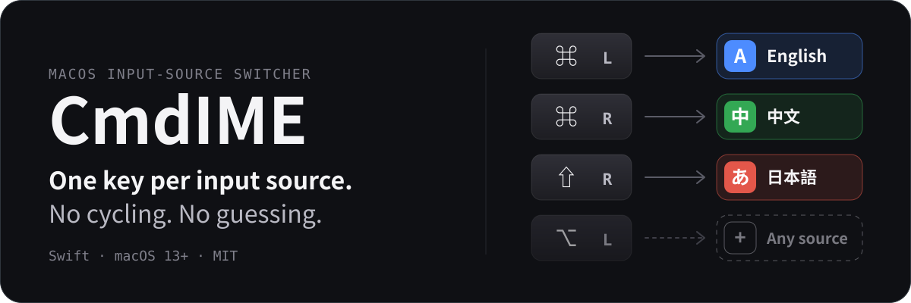
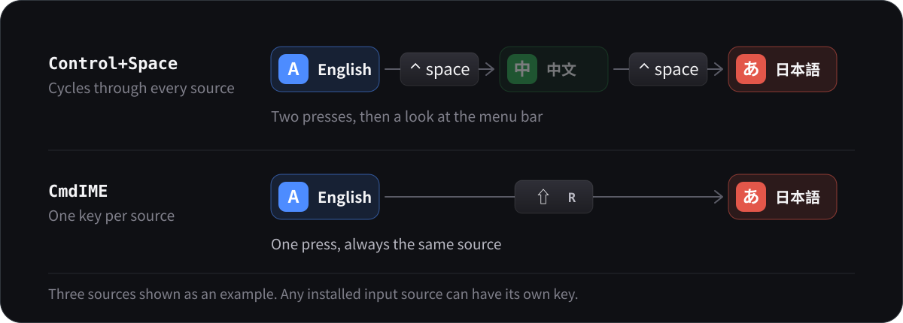
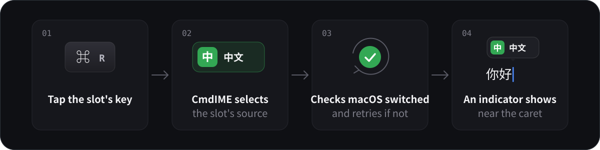

<p align="center">
  
</p>

<p align="center">
  
</p>

<p align="center">
  <strong>English</strong> · <a href="README.zh-CN.md">简体中文</a> · <a href="README.ja.md">日本語</a>
  <br>
  <a href="https://shunmeicho.github.io/cmd-ime/">Website and live demo</a>
</p>

<p align="center">
  <a href="https://github.com/ShunmeiCho/cmd-ime/actions/workflows/swift.yml"></a>
  <a href="https://github.com/ShunmeiCho/cmd-ime/releases"></a>
  <a href="LICENSE"></a>
</p>

CmdIME gives every input source on your Mac its own key. Tap Left Command for
English, Right Command for Chinese, Right Shift for Japanese: CmdIME selects that
source directly, checks that macOS really switched, and shows a small indicator near
the caret. The keys are yours to choose; the slots follow the input sources installed
on your Mac.

[](demo-videos/renders/cmdime-promo.mp4)

The demo shows the Switcher, Glass and Liquid Glass indicator themes.
[Open the full video](demo-videos/renders/cmdime-promo.mp4).

## Why not Control+Space

<p align="center">
  
</p>

- **It cycles.** With three or more input sources you look at the menu bar to see
  where you landed. With CmdIME each key always lands on the same source.
- **Even with two input sources, it toggles.** Control+Space flips to the other source,
  so you have to know which one you are in before you press. A CmdIME key always means
  the same source: press Left Command and you are in English, wherever you were before.
- **One thumb instead of a chord.** Left and Right Command sit under your thumbs and take
  one tap; Control+Space is two keys pressed together.
- **A press sometimes seems to do nothing.** CmdIME checks that macOS applied the
  switch and retries when it did not.
- **Taps and shortcuts stay apart.** Command+C, Command+Tab and other chords never
  count as a Command tap, so the keys you already use keep working.

## How a switch works

<p align="center">
  
</p>

## Install

```sh
curl -fsSL https://raw.githubusercontent.com/ShunmeiCho/cmd-ime/main/script/install.sh | bash
```

The installer downloads the latest release, verifies it against the published
SHA-256, installs `CmdIME.app` in `/Applications`, links `keyboardctl` and opens the
app. Then allow **Accessibility** and **Input Monitoring** in System Settings >
Privacy & Security; the in-app Setup guide walks you through both and a first switch.

Requires macOS 13 or later. Later updates install from inside the app with
**Update Now**.

> [!NOTE]
> CmdIME is a preview build: signed, not notarized. The one-line installer is the
> smooth path. A zip downloaded in a browser is stopped by Gatekeeper with an "is damaged"
> message; see [Troubleshooting](#troubleshooting).

[](demo-videos/renders/cmdime-install-permissions-demo.mp4)

<details>
<summary><strong>Pin a version, or build from source</strong></summary>

To pin an exact version and checksum (copy both from the release notes):

```sh
curl -fsSL https://raw.githubusercontent.com/ShunmeiCho/cmd-ime/main/script/install.sh | \
  CMDIME_VERSION=0.8.0 CMDIME_SHA256=85923f4f534be8411b67de352f7dae308afbf621ae870d936a7e11aaccf817f8 bash
```

To build from source:

```sh
git clone https://github.com/ShunmeiCho/cmd-ime.git
cd cmd-ime
swift test
./script/build_and_run.sh
```

A local build needs the same two permissions before global keyboard listening works.

</details>

## What you get

- **A slot board.** Installed input sources on the left, your slots on the right.
  Drag a source in to add a slot, drag a handle to reorder, rename, color or remove a
  slot, and undo a removal. The list follows System Settings as you add or remove
  input sources.
- **Three optional triggers per slot.** A single tap or a double tap of one of the
  eight modifier keys, and a shortcut such as Option+J. Set any of them; any one you
  set switches to that slot.

<p align="center">
  
</p>

<p align="center"><sub>The slot board in the dark appearance. Three slots here; add one for every input source you use.</sub></p>

- **A switch indicator near the caret.** Fourteen built-in themes, including Glass,
  Liquid Glass on macOS 26 and later, paper styles, a switcher that shows every slot and
  a badge that shrinks it to the glyphs, plus your own themes and fonts.

<p align="center">
  
</p>

<p align="center"><sub>Ten of the built-in themes, as they appear in Settings.</sub></p>

- **Updates from inside the app.** A check every six hours by default, a summary of
  what changed beside **Update Now**, and an in-place install that keeps your
  permissions.
- **A settings window that follows light and dark,** or stays on the one you pick.

<p align="center">
  
</p>

<p align="center"><sub>General in the light appearance: appearance, update checks and notifications.</sub></p>

- **`keyboardctl`,** a command-line tool for scanning, binding, switching and
  diagnosing.

## Reference

<details>
<summary><strong>Slots and default triggers</strong></summary>

CmdIME scans the input sources already installed in macOS instead of hardcoding one
keyboard layout. On a fresh setup it creates one slot per primary language, using the
first selectable source for that language in system order; sources without a primary
language are skipped. Each slot can point at any installed input source from its card,
including a slot that shows "Not matched".

| Detected slot | Default trigger |
| --- | --- |
| First | Left Command |
| Second | Right Command |
| Third | Left Option |
| Fourth | Right Option |
| Fifth | Left Control |
| Sixth and later | No trigger (assign manually) |

Existing configurations and their triggers are unchanged. If no selectable source has
a usable primary language, initialization uses the legacy defaults: English on Left
Command, Chinese on Right Command, Japanese on **Option+J**.

On the board:

- The "..." menu has Move Up, Move Down, Rename, Color and Remove Slot, and the same
  actions work from the keyboard and VoiceOver. Esc cancels a drag. A removed slot can
  be restored with **Undo** until the next slot change.
- Click a slot's badge to give it one color. The source list, Live keys and the switch
  indicator follow that color.
- "Current" marks the input source macOS has selected, however it was selected.
  **Switch** selects a slot's source directly; it does not test the trigger.
- "Duplicate" marks two slots that name the same input source. "Source missing" marks
  a slot whose input source is no longer installed and has fallen back to another one.
- Live keys, below the board, is a small keyboard that lights up the keys bound to the
  current slot.

</details>

<details>
<summary><strong>Triggers in detail</strong></summary>

- `Single tap`: one of the eight physical modifier keys (left or right Command, Option,
  Control, Shift).
- `Double tap`: the same keys, tapped twice.
- `Shortcut`: click **Record…**, press a modifier together with a key such as
  `option+j`, then Save. Esc cancels; tap triggers are paused while recording.

A key already used for the same gesture by another slot, or by a key remap, is shown as
used and cannot be picked. The same key can be a single tap for one slot and a double
tap for another. Many Chinese input methods use Shift to toggle Chinese and English, so
CmdIME never assigns Shift automatically.

Single-key modifier bindings and keyboard shortcuts are intentionally separate, so
`Command+C`, `Command+V`, `Command+Tab` and multi-modifier chords are not treated as
one-shot Command taps. A single tap switches immediately; CmdIME waits briefly only
when the same modifier also has a double-tap binding.

The settings window rejects macOS input-source shortcuts such as `control+space` and
`control+option+space`, so CmdIME does not take over the system input-source chooser
by accident.

</details>

<details>
<summary><strong>Switch indicator and themes</strong></summary>

CmdIME switches input sources programmatically, so it does not invoke the private macOS
input-source chooser. With `Show switch indicator` on, it shows its own lightweight
confirmation bubble after a switch.

In Settings the indicator can be turned off, given one of the built-in themes (glass,
Liquid Glass on macOS 26 and later, paper with one or two inks, text only, tile only, a
single line, a switcher that shows every slot, or a badge that shrinks the switcher to
its glyphs), resized with one slider whose percentage is the size it draws at, switched
between icon and text display, and colored from each slot's own color, the system accent
color or monochrome. Font family, weight and text size belong to the
theme; editing a built-in theme makes a copy.

Custom themes are JSON files in `~/.config/cmd-ime/themes` and imported fonts live in
`~/.config/cmd-ime/fonts`, both beside the config file. Fonts are registered for CmdIME
only; nothing is installed system-wide. A theme file may have any name; removing a
theme in Settings moves its file to the Trash.

The indicator appears over other apps, so its themes follow the macOS appearance, not
the settings window's, unless a theme's tone is fixed.

</details>

<details>
<summary><strong>Input methods that stay in Latin after a switch</strong></summary>

Selecting a source from the background can leave an input method detached from the
focused app: the menu bar shows the new source, but Latin letters keep coming out.
Google Japanese Input does this after you have typed under ABC. For it, CmdIME presses
the Kana key first, which enters Japanese through the system's own path, and selects
the slot's source 60 ms later. Other input methods keep the plain select with no added
delay.

If another Japanese input method shows the same symptom, add an activation recipe to
`~/.config/cmd-ime/activation-recipes.json` and press Refresh in Settings:

```json
{ "recipes": [
  { "sourceIDPrefix": "com.example.inputmethod", "strategy": "kanaThenSelect", "delayMs": 60 }
] }
```

`keyboardctl scan` lists the source ids. Your recipes win over the built-in one, so
`"strategy": "select"` switches the built-in recipe off. `kanaThenSelect` only applies to
Japanese sources, `delayMs` is limited to 0-500, and an entry that cannot be read is
skipped and named in the status bar. Please report what worked in an issue so it can
become built in.

If Japanese opens a kana palette instead of Hiragana, refresh input sources or update to
CmdIME 0.1.10 or later. macOS exposes `com.apple.50onPaletteIM` as a selectable Japanese
source, but it is an auxiliary kana palette, not the normal Hiragana input method.

</details>

<details>
<summary><strong>Settings window, appearance and quitting</strong></summary>

CmdIME is a background agent. The settings window is only a control panel: closing it
does not stop keyboard listening. Release builds are packaged with `LSUIElement`, so the
app does not appear in the Dock or the app switcher. Open `CmdIME.app` again whenever
you need Settings.

A new install opens with a three-step **Setup guide** at the top of Settings: allow
keyboard access, check the detected slots, then try a switch. It can be skipped, and
**General > Show Setup Guide** brings it back. Users updating from an earlier version
see a one-line notice about what is new instead.

The settings window follows the macOS appearance. **General > Appearance** pins it to
**Light** or **Dark**, or returns it to **System**. It sits on a system material, its
status and update bars use Liquid Glass on macOS 26 and later, and everything turns
opaque when Reduce Transparency is on.

To stop the background agent, use **General > Quit CmdIME**, or run:

```sh
keyboardctl quit
```

If the CLI is not linked yet, use `pkill -x CmdIME`.

</details>

<details>
<summary><strong>Updates</strong></summary>

CmdIME has no window most of the time, so it looks for new releases itself: by default
every six hours it asks GitHub for the newest release (nothing else is sent), and when
there is one it posts a single system notification for that version. The settings
window shows the same update at the top, together with the release's opening sentence
and the title of each change.

**General** has **Check** for a manual check, a **Check automatically** switch, an
**Every 6 hours / Daily / Weekly** choice, and **Notify me about updates**, which turns
the notification off while the update still shows in the window. Notification
permission is requested when there is an update to announce or when you turn that
switch on, never at first launch. macOS does not let an app change its own notification
permission: if notifications are blocked, General says so and offers
**Open Notification Settings…**.

**Update Now** installs the update in place: it downloads the release zip, checks it
against the published `.sha256`, verifies that the new app carries a valid code
signature from the same developer team as the running one, replaces the app bundle and
reopens CmdIME. Because the signing identity is unchanged, the Accessibility and Input
Monitoring approvals carry over. **Release Notes** opens the GitHub release page and
**Skip** silences that version. If CmdIME was installed with Homebrew, `brew upgrade`
works as before; an in-place update leaves Homebrew's recorded version behind until the
next `brew upgrade`.

</details>

<details>
<summary><strong>Command line: keyboardctl</strong></summary>

Slot IDs depend on your detected sources. These examples assume slots named `english`,
`chinese` and `japanese`; run `keyboardctl slots` for your actual IDs.

```sh
swift run keyboardctl scan
swift run keyboardctl init
swift run keyboardctl slots
swift run keyboardctl slot add
swift run keyboardctl slot add 1 --name Korean
swift run keyboardctl slot remove japanese
swift run keyboardctl switch english
swift run keyboardctl source
swift run keyboardctl source com.apple.keylayout.ABC
swift run keyboardctl lab
swift run keyboardctl diagnose
swift run keyboardctl diagnose --json
swift run keyboardctl bind left-command english
swift run keyboardctl bind right-command chinese
swift run keyboardctl bind option+j japanese
swift run keyboardctl bind double-left-command english
swift run keyboardctl remap right-control escape
swift run keyboardctl quit
swift run keyboardctl listen
```

- `keyboardctl init`: creates source-detected defaults using the same detection as the
  GUI's first launch. An existing config is left untouched unless you pass `--force`,
  which replaces the entire configuration with detected defaults. Back up custom
  settings before forcing a reset; it does not create the GUI's before-reset backup (the
  legacy migration backup below still applies).
- `keyboardctl switch <slot>`: selects the matched input source for a slot and confirms
  that macOS applied the switch. If macOS does not apply the selection, it prints an
  error message to `stderr` and exits non-zero.
- `keyboardctl source [<input-source-id>] [<wait-ms>] [--quiet] [--json]`: with no argument,
  prints the id of the current input source; with an id, selects it and waits until macOS
  reports the change (60 ms by default, `0` to skip the wait). It reports separately when an
  id is unknown, installed but not enabled, or not a keyboard source at all, so a typo and a
  disabled source do not produce the same message. A bare id works too:
  `keyboardctl com.apple.keylayout.ABC`. This is the replacement for `im-select` and `macism`
  in editor integrations; see [Editors and scripts](#editors-and-scripts).
- `keyboardctl lab [--slots a,b] [--attempts N] [--json]`: the reliability lab. It switches to
  each slot for real, types into TextEdit, reads the text back through the accessibility API,
  and judges by what was produced rather than by what macOS reported. Needs Accessibility
  permission for the terminal running it, and it takes over the keyboard while it runs.
- `keyboardctl diagnose [--json]`: prints each slot's configured preferences
  (`preferredIDs`, `languagePrefixes`, `nameContains`), the matched input source, and the
  match reason (`preferredID`, `fallbackLanguage`, `languagePrefix`, `nameContains`, or
  `none`). Pass `--json` for structured JSON output: `slots` entries retain `slot` IDs,
  and include `name` and `duplicateSlots` (an empty array when there are none).
- `keyboardctl slots`: lists ordered slot IDs, names, triggers and matches, marking
  fallback matches.
- `keyboardctl slot add [<number|source-id>] [--name N]`: without a source, lists
  numbered unassigned input sources; with one, adds a slot and assigns the first free
  trigger from Left Command, Right Command, Left Option, Right Option, Left Control. When
  all are occupied, the slot has no trigger; use `bind` to assign one. Shift is never
  assigned automatically because many Chinese input sources use a Shift tap to toggle
  English/Chinese. Right Control is also manual-only because laptop keyboards lack it.
- `keyboardctl slot remove <slot>`: removes its bindings, preferences and custom color.
  The last slot cannot be removed.
- Slot queries accept an exact ID first, then a unique case-insensitive ID or name.
  Deleted or unknown slots fail with exit code 1; they are never redirected.
  `bind <trigger> <slot>` retains trigger-stealing behavior and reports when the
  previous slot is left without a trigger.

New slots prefer the chosen source and fall back by its **primary** language. An input
source cannot be assigned as two slots' first preferred source, but fallbacks and legacy
rules may resolve multiple slots to it: both still work, and `diagnose` reports
`duplicate with: <ids>`. Existing matching rules remain unchanged. First launch detects
slots only when the config is missing; refreshing sources does not replace existing
slots or triggers.

</details>

<details>
<summary><strong>Configuration file, reset, upgrade and downgrade</strong></summary>

Config lives at `~/.config/cmd-ime/config.json`. Quit the GUI before editing it with the
CLI, then reopen it: the running GUI does not watch the file and could overwrite CLI
changes.

In Settings, **Reset to Detected** asks for confirmation before replacing all slots and
triggers with detected defaults. Unrelated settings, including general indicator
preferences, are preserved. Before saving, the GUI backs up the original file to
`config.json.before-reset.bak` beside the config; subsequent resets use unique backup
names rather than overwriting earlier ones. If backup or save fails, the reset is not
applied.

Version 2 stores an ordered `slots` collection with stable IDs, names and tints. Old
configurations migrate in memory on load. `show`, `slots`, `diagnose`, `switch` and
`listen` do not save the migration or print an upgrade notice. Each successful write
(`bind`, `remap`, `slot add`, `slot remove`, or `init --force`) backs up a file lacking
`slots` to `config.json.v1.bak` alongside it, then prints a note to stderr. This also
covers version-2 files whose `slots` key was dropped by an older binary. If the backup
already exists, a fresh `config.json.v1.bak.<uuid>` is created; earlier backups are
never reused or overwritten. The note reports the new backup path. Backup failure
prevents saving. Legacy IDs and bindings are preserved on migration.

Before downgrading, quit CmdIME and restore the backup named in the latest migration
note to `config.json` (keep a separate copy of your version-2 settings). After repeated
upgrades, that backup may have a UUID suffix; the original `config.json.v1.bak` still
holds the first migration's settings. Old binaries cannot decode custom slot IDs and may
move that config to `.corrupt.<uuid>` and reset it. Even with only legacy IDs, an old
binary drops `slots` on save, losing names and tints and potentially restoring removed
legacy slots on the next upgrade.

</details>

## Editors and scripts

Vim, Neovim, Emacs and Helix users usually switch input sources with `im-select` or `macism`, so
that leaving insert mode goes back to English. `keyboardctl source` is a drop-in replacement, and
it is the same code the app itself switches with.

```vim
" Neovim: back to English when you leave insert mode, and restore on the way back in.
let g:cmdime = '/Applications/CmdIME.app/Contents/Resources/keyboardctl'
augroup cmdime
  autocmd!
  autocmd InsertLeave * let b:cmdime_source = trim(system(g:cmdime . ' source'))
        \ | call system(g:cmdime . ' source com.apple.keylayout.ABC')
  autocmd InsertEnter * if exists('b:cmdime_source')
        \ | call system(g:cmdime . ' source ' . b:cmdime_source) | endif
augroup END
```

Run `keyboardctl scan` for the ids on your Mac.

**What this does and does not promise.** `keyboardctl source` exits non-zero and explains itself on
stderr when a selection does not take, but none of the editor plugins in common use read either, so
your editor will not know. What it will know is nothing at all — which is the honest state of the
art here, and the reason for `keyboardctl lab`: the only way to find out whether a switch really
works on your Mac, with your input sources, is to type something and read it back.

```sh
keyboardctl lab --attempts 30
```

It takes over the keyboard while it runs, types into TextEdit, and prints one character per attempt
so you can see whether failures are spread out or arrive in blocks.

## Recovery (beta)

You meant to type Chinese, the switch had not taken, and `nihao` is sitting in your document. One
key takes those letters back out and replays them into your Chinese input source, so you can pick
the word you meant; one Command+Z undoes the whole thing.

It is measured in TextEdit with 微信输入法 and refuses everywhere else, it is configured by hand,
and it is off unless you add the binding yourself. See [docs/recovery-beta.md](docs/recovery-beta.md).

## Troubleshooting

<details>
<summary><strong>"CmdIME is damaged" or "Apple cannot check it for malicious software"</strong></summary>

The app is not damaged. Preview builds are signed but not notarized, and a zip downloaded
in a browser carries a quarantine flag, so Gatekeeper blocks the first launch. The "is
damaged" message usually offers no **Open Anyway**. Either of these works:

1. Delete the downloaded zip and app, then install with the one-line installer, which
   does not go through the browser quarantine:

   ```sh
   curl -fsSL https://raw.githubusercontent.com/ShunmeiCho/cmd-ime/main/script/install.sh | bash
   ```

2. Or keep the downloaded app: move `CmdIME.app` to `/Applications`, then remove the
   quarantine flag:

   ```sh
   xattr -dr com.apple.quarantine /Applications/CmdIME.app
   ```

If macOS shows "Apple cannot check it for malicious software" instead, System Settings >
Privacy & Security may offer **Open Anyway**; removing the flag as above also works.
Apple's documentation on [Gatekeeper](https://support.apple.com/guide/security/gatekeeper-and-runtime-protection-sec5599b66df/web) and [Developer ID](https://developer.apple.com/developer-id/) explains the checks.

</details>

<details>
<summary><strong>macOS keeps asking for permissions</strong></summary>

macOS stores the Accessibility and Input Monitoring approvals against the app's code
identity, so approving one rebuilt `CmdIME.app` and then running another copy from
`dist/`, `dist/release/` or `/Applications` can make macOS ask again. Use one stable app
location. To reset:

1. Quit CmdIME.
2. Remove old `CmdIME.app` entries from System Settings > Privacy & Security >
   Accessibility and Input Monitoring.
3. Install or copy the app to the location you actually use, such as
   `/Applications/CmdIME.app`.
4. Open that exact app and grant both permissions.
5. Quit and reopen CmdIME.

</details>

## Development

<details>
<summary><strong>Build, package and release</strong></summary>

```sh
swift test
./script/build_and_run.sh
```

`script/build_and_run.sh` signs the generated app bundle after staging it. It uses the
first local Apple Development or Developer ID signing identity it can find, then falls
back to ad-hoc signing. Set `CODESIGN_IDENTITY` to choose one:

```sh
CODESIGN_IDENTITY="Apple Development: Your Name (TEAMID)" ./script/build_and_run.sh
```

Package a release:

```sh
CMDIME_ALLOW_UNNOTARIZED=1 ./script/package_app.sh 0.8.0
shasum -a 256 dist/CmdIME-0.8.0.zip
```

Notarized packaging requires a `Developer ID Application` signing identity; for an
explicitly labelled unnotarized preview, set `CMDIME_ALLOW_UNNOTARIZED=1`. One-time
notarization setup:

```sh
security find-identity -p codesigning -v
xcrun notarytool store-credentials "cmd-ime-notary" \
  --apple-id "YOUR_APPLE_ID" \
  --team-id "YOUR_TEAM_ID" \
  --password "APP_SPECIFIC_PASSWORD"
```

The package script signs with Developer ID, submits the zip to Apple's notary service,
staples the ticket to `CmdIME.app`, rebuilds the distributable zip and prints the
SHA-256. Use `CMDIME_NOTARY_PROFILE` if your keychain profile is not named
`cmd-ime-notary`.

Update `Casks/cmd-ime.rb` with the release zip SHA-256 before publishing a Homebrew
cask. The cask links `keyboardctl` through `Contents/Resources`, which is a
compatibility symlink to the signed helper in `Contents/MacOS`.

The shipped app stays native SwiftUI and AppKit: global keyboard listening,
Accessibility and Input Monitoring, login items and input-source switching all depend
on macOS APIs. Mac App Store distribution needs a separate sandboxed build; see
[docs/app-store.md](docs/app-store.md).

</details>

<details>
<summary><strong>Project layout</strong></summary>

- `Sources/KeyboardSwitcherCore`: config, shortcut parsing, input-source scan, matching,
  switching and the global event tap
- `Sources/CmdIME`: the AppKit background app with a SwiftUI settings window
- `Sources/keyboardctl`: CLI for scan, config, switching and listener mode
- `script`: local run, install and release scripts
- `Casks`: Homebrew cask template

</details>

## Contributing

Pull requests are welcome; see [CONTRIBUTING.md](CONTRIBUTING.md). Your first one needs a one-line
agreement to [CLA.md](CLA.md) — you keep your copyright, and it lets the project change its licence
later without having to find every past contributor.

**Windows:** people ask, and it does not exist. Before anyone writes one, there is a question worth
answering — does Windows have the failure this project is built around, where a switch reports
success and typing still produces the previous language? Nobody has measured it.
[Issue #5](https://github.com/ShunmeiCho/cmd-ime/issues/5) explains what would help.

## Support

If CmdIME saves you a little keyboard friction, you can
[buy me a coffee](https://buymeacoffee.com/shunmeicor7) or
[star the repository](https://github.com/ShunmeiCho/cmd-ime).
