<p align="center">
  
</p>

<p align="center">
  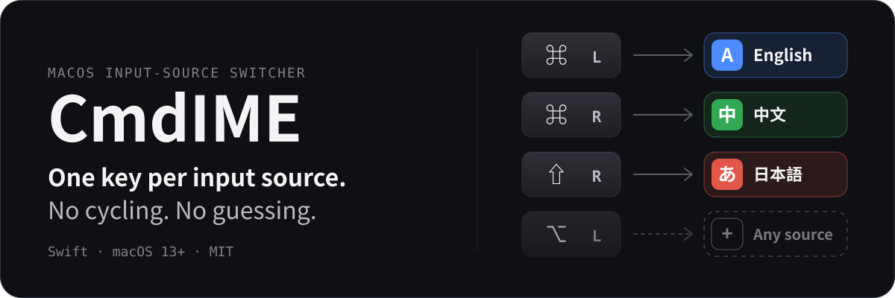
</p>

<p align="center">
  <strong>English</strong> · <a href="README.zh-CN.md">简体中文</a> · <a href="README.ja.md">日本語</a>
  <br>
  <a href="https://shunmeicho.github.io/cmd-ime/">Website and live demo</a>
</p>

<p align="center">
  <a href="https://github.com/ShunmeiCho/cmd-ime/actions/workflows/swift.yml"></a>
  <a href="https://github.com/ShunmeiCho/cmd-ime/releases"></a>
  <a href="LICENSE"></a>
</p>

CmdIME gives every input source on your Mac its own key. Tap Left Command for
English, Right Command for Chinese, Right Shift for Japanese: CmdIME selects that
source directly, checks that macOS really switched, and shows a small indicator near
the caret. The keys are yours to choose; the slots follow the input sources installed
on your Mac.

[](demo-videos/renders/cmdime-promo.mp4)

The demo shows the Switcher, Glass and Liquid Glass indicator themes.
[Open the full video](demo-videos/renders/cmdime-promo.mp4).

## Why not Control+Space

<p align="center">
  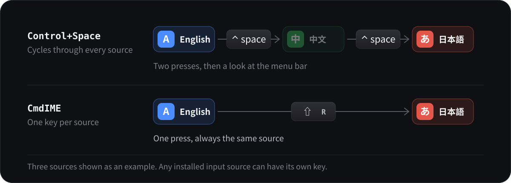
</p>

- **It cycles.** With three or more input sources you look at the menu bar to see
  where you landed. With CmdIME each key always lands on the same source.
- **Even with two input sources, it toggles.** Control+Space flips to the other source,
  so you have to know which one you are in before you press. A CmdIME key always means
  the same source: press Left Command and you are in English, wherever you were before.
- **One thumb instead of a chord.** Left and Right Command sit under your thumbs and take
  one tap; Control+Space is two keys pressed together.
- **A press sometimes seems to do nothing.** CmdIME checks that macOS applied the
  switch and retries when it did not.
- **Taps and shortcuts stay apart.** Command+C, Command+Tab and other chords never
  count as a Command tap, so the keys you already use keep working.

## How a switch works

<p align="center">
  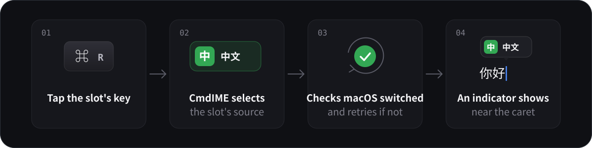
</p>

## Install

```sh
curl -fsSL https://raw.githubusercontent.com/ShunmeiCho/cmd-ime/main/script/install.sh | bash
```

The installer downloads the latest release, verifies it against the published
SHA-256, installs `CmdIME.app` in `/Applications`, links `keyboardctl` and opens the
app. Then allow **Accessibility** and **Input Monitoring** in System Settings >
Privacy & Security; the in-app Setup guide walks you through both and a first switch.

Requires macOS 13 or later on an Apple silicon Mac (Intel Macs are not supported yet). Later updates install from inside the app with
**Update Now**.

> [!NOTE]
> CmdIME is a preview build: signed, not notarized. The one-line installer is the
> smooth path. A zip downloaded in a browser is stopped by Gatekeeper with an "is damaged"
> message; see [Troubleshooting](#troubleshooting).

[](demo-videos/renders/cmdime-install-permissions-demo.mp4)

<details>
<summary><strong>Pin a version, or build from source</strong></summary>

To pin an exact version and checksum (copy both from the release notes):

```sh
curl -fsSL https://raw.githubusercontent.com/ShunmeiCho/cmd-ime/main/script/install.sh | \
  CMDIME_VERSION=0.15.0 CMDIME_SHA256=0fc1a228c1e8104fb6a3e58cb40fa9c3a9375e1f52f2aa2f27409735792eb321 bash
```

To build from source:

```sh
git clone https://github.com/ShunmeiCho/cmd-ime.git
cd cmd-ime
swift test
./script/build_and_run.sh
```

`build_and_run.sh` first quits any running CmdIME, including the copy in `/Applications`, so
afterwards only the local build runs, or none if the build fails. A local build needs the
same two permissions before global keyboard listening works.

</details>

## What you get

- **A slot board** on the Slots page. Installed input sources on the left, your slots on
  the right. Drag a source in to add a slot, drag a handle to reorder, rename, color or
  remove a slot, and undo a removal. The list follows System Settings as you add or
  remove input sources, and shows an input source that macOS lists twice only once.
- **Three optional triggers per slot.** A single tap or a double tap of one of the
  eight modifier keys, and a shortcut such as Option+J. Set any of them; any one you
  set switches to that slot.

<p align="center">
  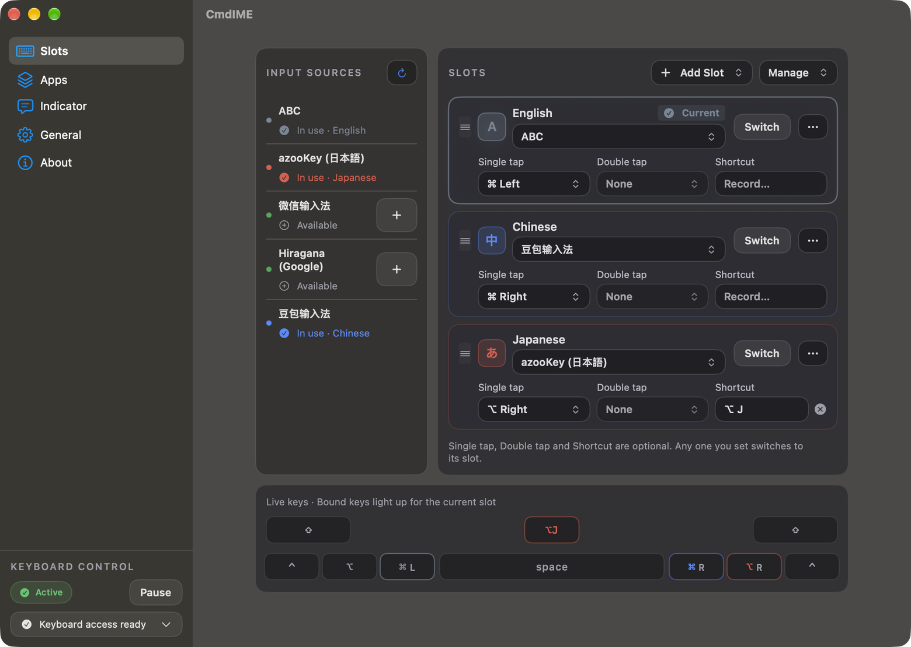
</p>

<p align="center"><sub>The Slots page. Three slots here; add one for every input source you use.</sub></p>

- **A switch indicator near the caret.** Eighteen built-in themes, including Glass,
  Liquid Glass on macOS 26 and later, paper styles, a switcher that shows every slot, a
  badge that shrinks it to the glyphs, a mark that keeps only the source you switched
  to, and two Adaptive themes that show the mark for a single switch and widen into the
  badge row when you switch again while it is up or when you Peek, plus your own themes
  and fonts.

<p align="center">
  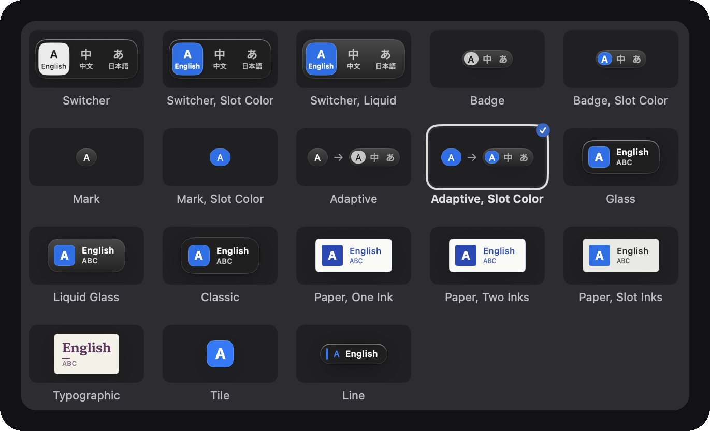
</p>

<p align="center"><sub>All eighteen built-in themes, as they appear in Settings.</sub></p>

<p align="center">
  
</p>

<p align="center"><sub>Adaptive: one switch shows the mark; switch again while it is up and it widens into the row.</sub></p>

- **Your own color for every slot.** Pick any color for a slot: a preset, or any color
  from the system color picker. Set the indicator's Color to Slot and it fills with
  that color, so you know where you are before you read the glyph.

<p align="center">
  
</p>

<p align="center"><sub>Three slots, three colors of your choosing.</sub></p>

- **Input sources per app.** On the Apps page, drag an app from the list, Finder or the
  Dock onto a slot and it gets that slot every time it comes to the front, or onto **Keep
  as is** and CmdIME leaves it alone; let CmdIME remember the input source you last used
  in each app (off by default, kept in memory only); pick a slot for every other app; and
  switch back after a password field, where macOS leaves ABC selected (on by default). A
  trigger you press still wins.
- **Input sources per program in the terminal.** English at the `zsh` prompt, Chinese inside
  `claude` or `codex`, by itself. **It works best in [Herdr](https://herdr.dev):** there CmdIME
  follows every pane, also when you come back to one that is already running its program. In
  other terminals it switches only when a program starts or exits.
- **Input sources per website.** Give a website its own slot: while a page on `github.com`
  is in front, in Safari or Chrome, you are on English, and the tab next to it can be on
  Chinese. CmdIME reads only the site address of the page in front and keeps none of it.

<p align="center">
  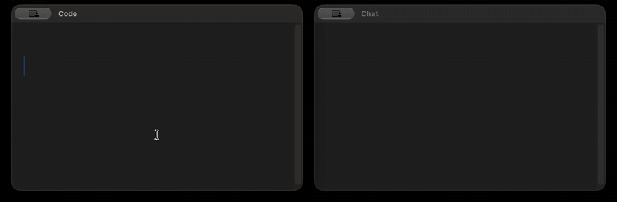
</p>

<p align="center"><sub>App Rules: Code gets English, Chat gets Chinese. Clicking between them is all it takes.</sub></p>

<p align="center">
  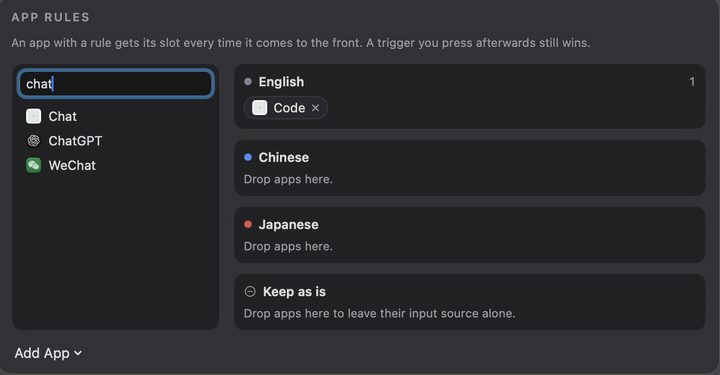
</p>

<p align="center"><sub>Drag an app onto a slot to give it that slot.</sub></p>

<p align="center">
  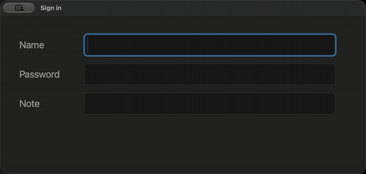
</p>

<p align="center"><sub>After a password field, the input source you had comes back.</sub></p>

- **An indicator for every switch, not only CmdIME's.** It also shows when the input
  source changes through Control+Space, the Globe key or the menu bar, and optionally
  after an app switch. Hide it in chosen apps and set how long it stays. A **Peek**
  trigger shows the current input source without switching, and an optional Caps Lock
  bubble shows when Caps Lock turns on or off.

<p align="center">
  
</p>

<p align="center"><sub>Control+Space is not CmdIME, and the bubble still shows.</sub></p>

- **Settings you can move.** Export your slots, triggers, App Rules, themes, fonts and
  activation recipes to a folder and import them on another Mac. Edits that `keyboardctl`
  or an editor makes to the config apply while CmdIME runs. **Copy Diagnostics** on About
  gathers what a bug report needs.
- **Updates from inside the app.** A check every six hours by default, a summary of
  what changed beside **Update Now**, and an in-place install that keeps your
  permissions.
- **A settings window that follows light and dark,** or stays on the one you pick. It is in
  English, Simplified Chinese and Japanese and follows the macOS language; to give CmdIME a
  language of its own, pick one in General > Language, or use System Settings > General >
  Language & Region > Applications.

<p align="center">
  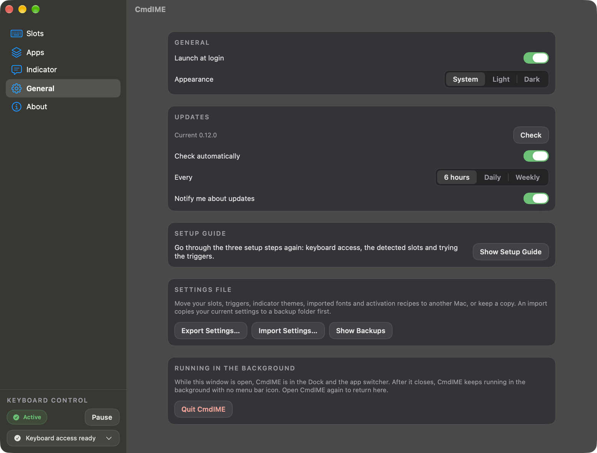
</p>

<p align="center"><sub>General: appearance, updates, and exporting or importing your settings.</sub></p>

- **`keyboardctl`,** a command-line tool for scanning, binding, switching, App Rules,
  moving settings and diagnosing, plus the on-device reliability lab.

## Reference

<details>
<summary><strong>Slots and default triggers</strong></summary>

CmdIME scans the input sources already installed in macOS instead of hardcoding one
keyboard layout. On a fresh setup it creates one slot per primary language, using the
first selectable source for that language in system order; sources without a primary
language are skipped. Each slot can point at any installed input source from its card,
including a slot that shows "Not matched".

| Detected slot | Default trigger |
| --- | --- |
| First | Left Command |
| Second | Right Command |
| Third | Left Option |
| Fourth | Right Option |
| Fifth | Left Control |
| Sixth and later | No trigger (assign manually) |

Existing configurations and their triggers are unchanged. If no selectable source has
a usable primary language, initialization uses the legacy defaults: English on Left
Command, Chinese on Right Command, Japanese on **Option+J**.

On the board:

- The "..." menu has Move Up, Move Down, Rename, Color and Remove Slot, and the same
  actions work from the keyboard and VoiceOver. Esc cancels a drag. A removed slot can
  be restored with **Undo** until the next slot change.
- Click a slot's badge to give it one color. The source list, Live keys and the switch
  indicator follow that color.
- "Current" marks the input source macOS has selected, however it was selected.
  **Switch** selects a slot's source directly; it does not test the trigger.
- "Duplicate" marks two slots that name the same input source. "Source missing" marks
  a slot whose input source is no longer installed and has fallen back to another one.
- Live keys, below the board, is a small keyboard that lights up the keys bound to the
  current slot.

</details>

<details>
<summary><strong>Triggers in detail</strong></summary>

- `Single tap`: one of the eight physical modifier keys (left or right Command, Option,
  Control, Shift).
- `Double tap`: the same keys, tapped twice.
- `Shortcut`: click **Record…**, press a modifier together with a key such as
  `option+j`, then Save. Esc cancels; tap triggers are paused while recording. Tick
  **Only the left or right key I pressed** to make the shortcut answer to that side of the
  modifier alone; `left-option+j` and `right-option+j` can then go to different slots.

A key already used for the same gesture by another slot, by a key remap or by the Peek
trigger ("Show Current Input Source") is shown as used and cannot be picked. The same key
can be a single tap for one slot and a double tap for another. Many Chinese input methods
use Shift to toggle Chinese and English, so CmdIME never assigns Shift automatically.

**Toggle**, the row under the slot list, is one key for two slots: pick the two slots,
then a single or double tap of a modifier key. Pressed in one of the two slots, it switches
to the other; pressed anywhere else, it switches to the one of the two CmdIME switched to
last (the first slot until then). To use a key a slot already has, set that slot's tap to
**None** first. For a shortcut, run `keyboardctl bind option+t toggle english chinese`.

Single-key modifier bindings and keyboard shortcuts are intentionally separate, so
`Command+C`, `Command+V`, `Command+Tab` and multi-modifier chords are not treated as
one-shot Command taps. A single tap switches immediately; CmdIME waits briefly only
when the same modifier also has a double-tap binding.

A modifier held down for more than 0.8 s is not a tap, and clicking or scrolling while
it is down cancels the tap, so holding Command to click or scroll does not switch. A key
bound only to a double tap waits up to 0.35 s for the second tap; a key that also has a
single tap waits 0.22 s, so its single tap stays quick.

The settings window rejects macOS input-source shortcuts such as `control+space` and
`control+option+space`, so CmdIME does not take over the system input-source chooser
by accident.

</details>

<details>
<summary><strong>Switch indicator and themes</strong></summary>

CmdIME switches input sources programmatically, so it does not invoke the private macOS
input-source chooser. With the switch indicator on (**Indicator > Switch indicator >
Enabled**), it shows its own lightweight confirmation bubble after a switch.

macOS 14 and later also draw their own small badge under the text cursor on every input source
change, CmdIME's switches included. While the switch indicator is on, CmdIME hides that badge for
your user account, so a switch shows one bubble; turning the indicator off, or **General > Quit
CmdIME**, brings it back. Apps pick the change up as they relaunch, and logging out applies it
everywhere. With the badge hidden, Control+Space shows the older list in the middle of the screen.
CmdIME only undoes what it set itself: a badge you had already hidden with `defaults write` stays hidden. If you
remove CmdIME without quitting it from General first, run
`defaults delete kCFPreferencesAnyApplication TSMLanguageIndicatorEnabled` to get the badge back.

On the Indicator page the indicator can be turned off, given one of the eighteen built-in
themes (a switcher that shows every slot, a badge that shrinks the switcher to its glyphs,
a mark that shows only the slot you switched to, two adaptive themes, glass, Liquid Glass
on macOS 26 and later, classic, paper with one ink, two inks or slot inks, text only, tile
only, or a single line), resized with one slider whose percentage is the size it draws at,
set to show icon and text, icon only or text only where the theme allows it, and colored
from each slot's own color, the system accent color or monochrome. Font family, weight
and text size belong to the theme; editing a built-in theme makes a copy.

**Adaptive** and **Adaptive, Slot Color** change shape with what you are doing. A single
switch shows the Mark, only the slot you switched to. A switch that arrives while the
bubble is still up widens it in place into the Badge row with every slot, much like the
list macOS shows while you hold Control and press Space. Peek always shows the Badge row.
Every other theme keeps one shape; in the theme editor, **Expand while switching** gives a
Mark theme of your own the same behavior.

Custom themes are JSON files in `~/.config/cmd-ime/themes` and imported fonts live in
`~/.config/cmd-ime/fonts`, both beside the config file. Fonts are registered for CmdIME
only; nothing is installed system-wide. A theme file may have any name; removing a
theme in Settings moves its file to the Trash.

The indicator appears over other apps, so its themes follow the macOS appearance, not
the settings window's, unless a theme's tone is fixed.

**When it shows**, on the Indicator page:

- **Other switches** (on by default): the bubble also shows when the input source changes
  without CmdIME, through Control+Space, the Globe key, the menu bar or another app,
  including `keyboardctl switch` and `keyboardctl source` run from a terminal or an editor.
- **App switch** (off by default): after you switch apps, once the new app has settled,
  if the input source differs from before and nothing else showed the change.
- **Hidden in**: apps where no switch bubble and no Caps Lock bubble shows, CmdIME's own
  switches included. Peek still shows there, since you asked for it.
- **Stays**: how long every bubble stays, Peek and Caps Lock included: **Automatic** (the
  theme's own timing) or 0.5, 1, 1.5, 2, 3 or 5 seconds. A value typed into config.json is
  kept between 0.3 and 10 seconds.

The Other switches and App switch bubbles appear only while keyboard control is running,
and only for an input source that belongs to a slot. The rows above are grayed out while the switch
indicator is off.

**More bubbles**:

- **Peek**: a single or double tap of a modifier key that shows the bubble for the current
  input source without switching, even with the switch indicator turned off and in apps
  listed under **Hidden in**. With an adaptive theme it always shows the full row. A key
  that a slot or a key remap already uses is shown as used. For a shortcut such as
  Option+P, run `keyboardctl bind option+p peek`; **None** removes the Peek trigger,
  including a shortcut set from the command line. An input source that is in no slot shows
  no bubble.
- **Caps Lock** (off by default): a bubble with "A" or "a" when Caps Lock turns on or off,
  drawn in your theme for the slot in use (the first slot when the current input source is
  in none), so it takes that slot's color only when the theme colors by slot and the color
  setting is the slot's own; a Switcher shows it as a single tile and a Badge as a mark. It
  shows even with the switch indicator turned off.

Peek and the Caps Lock bubble also need keyboard control to be running.

</details>

<details>
<summary><strong>Per-app input sources</strong></summary>

<p align="center">
  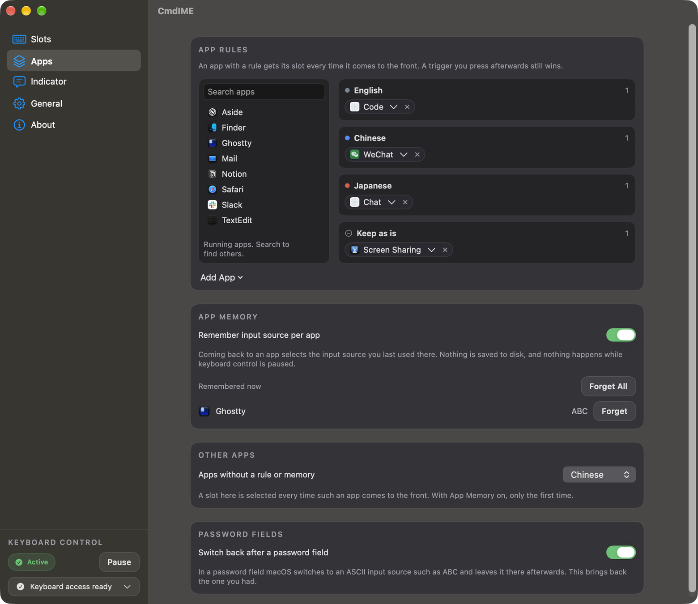
</p>

<p align="center"><sub>The Apps page: App Rules, App Memory, a slot for other apps and the password-field switch.</sub></p>

<p align="center">
  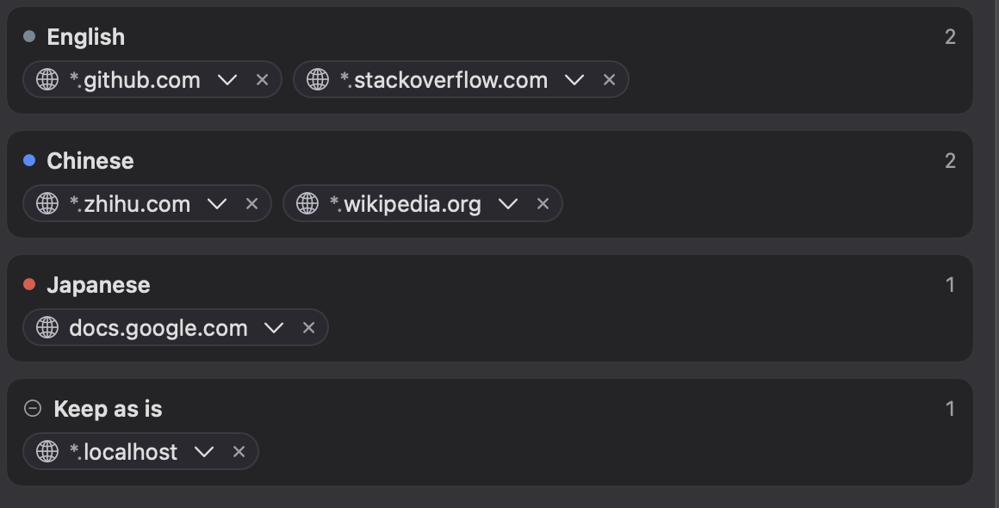
</p>

<p align="center"><sub>Website rules: sites sit on the same lanes as apps.</sub></p>

The Apps page decides what happens when an app comes to the front. Each switch it makes
goes through the same path as a trigger, so a trigger you press right after switching
apps always wins.

- **App Rules**: a board like the slot board. The list on the left shows the apps that are
  running; type in its search field to find an installed app by name or bundle id. On the
  right is a lane for each slot and one for **Keep as is**. Drag an app from the list, or
  an app from Finder or the Dock, onto a lane to give it that rule; drag its chip to
  another lane to change the rule, or back onto the list to remove it. Without dragging,
  an app's right-click menu has **Add to** each lane; a chip's menu (its arrow button or a
  right-click) has **Move To**, **Remember** and **Remove Rule**, and its × removes the
  rule; **Add App** below the board (a running app, or **Choose App…**) puts an app on the
  first slot. A line under the board says what each change did, or why a drop was refused.

  A slot rule selects that slot every time the app comes to the front. **Keep as is**
  never switches and keeps the app out of App Memory, which suits remote desktops, virtual
  machines and games. **Remember** (slot rules only, marked with a clock) restores the
  input source you last used in that app and uses the rule's slot only the first time,
  even with App Memory off; it stays when the chip moves to another slot and is dropped on
  **Keep as is**. When you remove a slot, its apps stay in a **Slot deleted** lane that
  takes no new apps, and those rules select no slot until you move them. The board refuses
  CmdIME itself, and a rule for it written from the command line never applies. An app
  that is no longer installed keeps its rule, marked **Not installed**.
- **Website rules**: **Add Website…** below the board gives a website its own slot, or
  **Keep as is**. Type a domain such as `github.com`; the rule covers its subdomains
  unless you turn that off, and the longest matching domain wins. The rule appears as a
  globe chip on the same lanes as the apps and moves and is removed the same way. While a
  page on that domain is in front, in any browser CmdIME knows, its rule beats the
  browser's own App Rule, App Memory and the Other apps slot; a trigger you press
  afterwards still wins, and focus in the address bar changes nothing. For this CmdIME
  reads only the site address of the page in front, through Accessibility, and keeps none
  of it; a browser set to **Keep as is** is never read. A browser is any app in
  CmdIME's own list or any app that registers to open web links, so a browser it has never
  heard of is read too. Tested in Safari and Chrome; the address read was also checked in
  Aside. A page that changes address without changing its title
  (some single-page apps) is noticed only at the next tab or window change.
- **Program rules** (best in [Herdr](https://herdr.dev), see below): **Add Program…** gives a program in the terminal its own slot, or
  **Keep as is**: English at the `zsh` prompt, Chinese inside `claude`. Type the command the
  program is started with (exact, upper and lower case count). While that program runs in
  the terminal pane in focus, its rule beats the terminal's own App Rule, App Memory and
  the Other apps slot, and it is applied again every time the pane comes into focus; a
  trigger you press afterwards still wins, and a program without a rule changes nothing.
  One switch pauses all program rules. For this CmdIME reads only the name of the program
  running in the terminal, never what is on the screen. It follows panes of a
  [Herdr](https://herdr.dev) server on this Mac; in other terminals zsh can report the
  program instead, through one line in `.zshrc` (**Shell Integration…**, or
  `keyboardctl shell-integration install`, which copies the file first). With shell
  integration a tab that was already running its program says nothing when you return to
  it, and a command that ends in a tab you are not looking at can still switch the source.
- **App Memory** (off by default): coming back to an app selects the input source you last
  used there, however you chose it: a trigger, Control+Space, the menu bar or the Globe
  key. It is kept in memory only: it is empty after CmdIME quits, and pausing keyboard
  control empties it too. The page lists the apps it remembers and the input source for
  each, with **Forget** for one and **Forget All**. A source macOS forces in a password
  field is never remembered, and neither is CmdIME's own settings window.
- **Other apps**: a slot for apps with no rule and nothing remembered, or **Keep as is**
  (the default). With App Memory on, the slot is used only on an app's first visit.
- **Password fields** (on by default): in a password field macOS switches to an ASCII
  input source such as ABC and leaves it there afterwards. When the field is done and the
  same app is still in front, CmdIME puts back the input source you had. Switching apps
  first cancels it. An app with a **Keep as is** rule is left alone here too.

Order: a rule wins over App Memory unless the rule says **Remember**; the Other apps slot
covers only apps with neither. An app that arrives already on the right input source is
left alone. Switches made here, including the password put-back, show the switch indicator
the way a trigger does, for an input source in a slot. Nothing happens while keyboard
control is paused.

If macOS's own "Automatically switch to a document's input source" (Keyboard > Input
Sources) is on, App Memory warns about it: macOS then selects its remembered source on
every window change, which fights the per-app switching. Launchers such as Spotlight,
Raycast and Alfred are not seen as apps, and neither are menu bar apps or system alerts: a
switch made in one counts for the app underneath, and a rule for one never applies.

From the command line:

```sh
keyboardctl app-rule list
keyboardctl app-rule set com.microsoft.VSCode english
keyboardctl app-rule set --frontmost keep
keyboardctl app-rule set com.tinyspeck.slackmacgap chinese --remember
keyboardctl app-rule remove com.microsoft.VSCode
keyboardctl website-rule list
keyboardctl website-rule set github.com english
keyboardctl website-rule set docs.google.com japanese --exact
keyboardctl website-rule set localhost keep
keyboardctl website-rule test https://gist.github.com/
keyboardctl website-rule remove github.com
keyboardctl program-rule list
keyboardctl program-rule set claude chinese
keyboardctl program-rule set vim keep
keyboardctl program-rule remove claude
keyboardctl shell-integration install     # one line in ~/.zshrc; uninstall removes it
```

</details>

<details>
<summary><strong>Input methods that stay in Latin after a switch</strong></summary>

Selecting a source from the background can leave an input method detached from the
focused app: the menu bar shows the new source, but Latin letters keep coming out.
Google Japanese Input does this after you have typed under ABC, and azooKey when it was
left in its alphanumeric mode. For both, CmdIME presses the Kana key first, which enters
Japanese through the system's own path, and selects the slot's source 60 ms later. Other input methods keep the plain select with no added
delay.

If another Japanese input method shows the same symptom, add an activation recipe to
`~/.config/cmd-ime/activation-recipes.json` and press the Refresh button above the input
sources on the Slots page:

```json
{ "recipes": [
  { "sourceIDPrefix": "com.example.inputmethod", "strategy": "kanaThenSelect", "delayMs": 60 }
] }
```

`keyboardctl scan` lists the source ids. Your recipes win over the built-in ones, so
`"strategy": "select"` switches a built-in recipe off. `kanaThenSelect` only applies to
Japanese sources, `delayMs` is limited to 0-500, and an entry that cannot be read is
skipped. Please report what worked in an issue so it can become built in.

**Chinese input methods.** A pinyin input method can show the same symptom now and then:
the menu bar shows it, and the letters come out as Latin. This is not caused by CmdIME:
with CmdIME out of the path, a plain selection through the system API fails at least as
often. Measured on macOS 27.0 with Doubao (豆包输入法), typing Latin immediately before the
switch, which is the worst case: 9 of 210 switches in a Chromium browser, 3 of 60 in
TextEdit, and 6 of 60 with CmdIME not involved. Whether the cause sits in the input method
or in macOS is not known yet. Nothing tried from outside the input method has helped:
re-activating the app for Doubao; selecting twice, re-activating and warm-up keys for Rime,
which is reported upstream in [rime/squirrel#1179](https://github.com/rime/squirrel/issues/1179).

If it happens, switch once more or click into the text field; neither has been measured.
To measure it in the app you type in:

```sh
keyboardctl lab --client <app bundle id> --slots <slot id> --attempts 30
```

If Japanese opens a kana palette instead of Hiragana, refresh input sources or update to
CmdIME 0.1.10 or later. macOS exposes `com.apple.50onPaletteIM` as a selectable Japanese
source, but it is an auxiliary kana palette, not the normal Hiragana input method.

</details>

<details>
<summary><strong>Settings window, appearance and quitting</strong></summary>

CmdIME is a background agent. The settings window is only a control panel: closing it
does not stop keyboard listening. While Settings is open, CmdIME appears in the Dock and
the app switcher. After the window closes, it stays in the background with no menu bar
icon. Open `CmdIME.app` again whenever you need Settings.

The window has a sidebar with **Slots**, **Apps**, **Indicator**, **General** and
**About** (and **Setup** while the guide is pending). The keyboard-control status sits at
its foot with **Pause** or **Resume**, and it expands into the steps to fix Accessibility
or Input Monitoring when one is missing.

A new install opens Settings on the **Setup** page, first in the sidebar, with a three-step
guide: allow keyboard access, check the detected slots, then try a switch. Finishing or skipping
removes the page, and **General > Show Setup Guide** brings it back. Users updating from an earlier version
see a one-line notice about what is new instead.

The settings window follows the macOS appearance. **General > Appearance** pins it to
**Light** or **Dark**, or returns it to **System**. It sits on a system material, its
update bar uses Liquid Glass on macOS 26 and later, and everything turns opaque when
Reduce Transparency is on.

To stop the background agent, use **General > Quit CmdIME**, or run:

```sh
keyboardctl quit
```

If the CLI is not linked yet, use `pkill -x CmdIME`.

</details>

<details>
<summary><strong>Updates</strong></summary>

CmdIME has no window most of the time, so it looks for new releases itself: by default
every six hours it asks GitHub for the newest release (nothing else is sent). GitHub's API
answers only 60 such requests an hour per network without an account, so on a shared office or
school network CmdIME falls back to the release page, which gives the version without the summary
of changes. When
there is one it posts a single system notification for that version, with the release's
opening sentence when there is one, a **Release Notes** button and, where CmdIME can update itself in place,
**Update Now**. If macOS does not let
CmdIME post notifications, it shows the same update as a card in the top-right corner of the
screen instead; the card does not take keyboard focus, and **Later** closes it. The settings
window shows the same update at the top, together with the release's opening sentence
and the title of each change.

**General > Updates** has **Check** for a manual check (About has the same button as
**Check for Updates**), a **Check automatically** switch and, while it is on, an
**Every 6 hours / Daily / Weekly** choice and **Notify me about updates**, which turns
the notification and the card off while the update still shows in the window. Notification
permission is requested when there is an update to announce or when you turn that
switch on, never at first launch. macOS does not let an app change its own notification
permission: if notifications are blocked, General says so and offers
**Open Notification Settings…**.

**Update Now** installs the update in place: it downloads the release zip, checks it
against the published `.sha256`, verifies that the new app carries a valid code
signature from the same developer team as the running one, replaces the app bundle and
reopens CmdIME. Because the signing identity is unchanged, the Accessibility and Input
Monitoring approvals carry over. **Release Notes** opens the GitHub release page and
**Skip** silences that version. If CmdIME was installed with Homebrew, `brew upgrade`
works as before; an in-place update leaves Homebrew's recorded version behind until the
next `brew upgrade`.

</details>

<details>
<summary><strong>Command line: keyboardctl</strong></summary>

Slot IDs depend on your detected sources. These examples assume slots named `english`,
`chinese` and `japanese`; run `keyboardctl slots` for your actual IDs.

```sh
swift run keyboardctl scan
swift run keyboardctl init
swift run keyboardctl slots
swift run keyboardctl slot add
swift run keyboardctl slot add 1 --name Korean
swift run keyboardctl slot remove japanese
swift run keyboardctl switch english
swift run keyboardctl source
swift run keyboardctl source com.apple.keylayout.ABC
swift run keyboardctl lab
swift run keyboardctl diagnose
swift run keyboardctl diagnose --json
swift run keyboardctl bind left-command english
swift run keyboardctl bind right-command chinese
swift run keyboardctl bind option+j japanese
swift run keyboardctl bind left-option+k english     # only the left Option key
swift run keyboardctl bind double-left-command english
swift run keyboardctl bind double-right-option peek
swift run keyboardctl remap right-control escape
swift run keyboardctl app-rule list
swift run keyboardctl app-rule set --frontmost english
swift run keyboardctl export ~/Desktop/CmdIME-settings
swift run keyboardctl import ~/Desktop/CmdIME-settings
swift run keyboardctl quit
swift run keyboardctl listen
```

- `keyboardctl init`: creates source-detected defaults using the same detection as the
  GUI's first launch. An existing config is left untouched unless you pass `--force`,
  which replaces the entire configuration with detected defaults. Back up custom
  settings before forcing a reset; it does not create the GUI's before-reset backup (the
  legacy migration backup below still applies).
- `keyboardctl switch <slot>`: selects the matched input source for a slot and confirms
  that macOS applied the switch. If macOS does not apply the selection, it prints an
  error message to `stderr` and exits non-zero.
- `keyboardctl source [<input-source-id>] [<wait-ms>] [--quiet] [--json]`: with no argument,
  prints the id of the current input source; with an id, selects it and waits until macOS
  reports the change (60 ms by default, `0` to skip the wait). It reports separately when an
  id is unknown, installed but not enabled, or not a keyboard source at all, so a typo and a
  disabled source do not produce the same message. A bare id works too:
  `keyboardctl com.apple.keylayout.ABC`. This is the replacement for `im-select` and `macism`
  in editor integrations; see [Editors and scripts](#editors-and-scripts).
- `keyboardctl lab [--slots a,b] [--attempts N] [--client <bundle id>] [--away <bundle id>] [--json]`:
  the reliability lab. It switches to each slot for real, types into TextEdit (or the app
  given with `--client`), reads the text back through the accessibility API, and judges by
  what was produced rather than by what macOS reported. `--away` checks App Memory: after
  each switch it brings that app to the front, selects ABC there and comes back, so the
  running CmdIME has to put the slot's input source back before anything is typed; turn on
  "Remember input source per app" first. Needs Accessibility permission for the terminal
  running it, and it takes over the keyboard while it runs. `keyboardctl help` lists three
  more options: `--settle`, `--rest` and `--latin-first`.
- `keyboardctl diagnose [--json]`: prints the current input source; a summary of the per-app
  settings (App Memory on or off, the number of App Rules, the Other apps slot, password
  put-back, and a warning when macOS's "Automatically switch to a document's input source"
  is on); then each slot's configured preferences (`preferredIDs`, `fallbackLanguage`,
  `languagePrefixes`, `nameContains`), the matched input source, and the match reason
  (`preferredID`, `fallbackLanguage`, `languagePrefix`, `nameContains`, or `none`). Pass
  `--json` for the same report as structured JSON (`currentInputSourceID`,
  `currentInputSourceName`, `rememberInputSourcePerApp`, `appRuleCount`, `appDefaultSlot`,
  `restoreAfterPasswordField`, `systemPerDocumentSwitching`, `slots`): `slots` entries
  retain `slot` IDs, and include `name` and `duplicateSlots` (an empty array when there are
  none).
- `keyboardctl bind <trigger> peek`: makes the trigger a Peek, which shows the bubble for
  the current input source without switching. There is one Peek trigger, so this replaces
  the previous one; if a slot or a remap had the trigger, it takes it over and says so on
  stderr. macOS input-source shortcuts such as
  `control+space` are refused. `peek` (any case) wins over a slot named "peek". Remove it
  with **Indicator > More bubbles > Peek > None**.
- `keyboardctl bind <trigger> toggle <slot> <slot>`: makes the trigger the Toggle between
  two different slots (see **Triggers in detail**). There is one Toggle, so this replaces
  the previous one; if a slot or a remap had the trigger, it takes it over and says so on
  stderr. `toggle` (any case) wins over a slot named "toggle". Remove it with **Slots >
  Toggle > None**. `keyboardctl slots` lists the Toggle trigger beside both slots.
- `keyboardctl app-rule list|set|remove`: the App Rules from the Apps page. `set` takes a
  bundle id or `--frontmost` (the app in front when you run it), then a slot or `keep`,
  and `--remember` for a rule that restores the last input source instead (refused with
  `keep`). `list` prints each rule, marks one whose slot was deleted, and ends with the
  Other apps slot. `remove` takes a bundle id. A running CmdIME applies the change at
  once. See **Per-app input sources** above.
- `keyboardctl export <new-folder>` / `keyboardctl import <folder>`: see Moving settings
  below.
- `keyboardctl slots`: lists ordered slot IDs, names, triggers and matches, marking
  fallback matches.
- `keyboardctl slot add [<number|source-id>] [--name N]`: without a source, lists
  numbered unassigned input sources; with one, adds a slot and assigns the first free
  trigger from Left Command, Right Command, Left Option, Right Option, Left Control. When
  all are occupied, the slot has no trigger; use `bind` to assign one. Shift is never
  assigned automatically because many Chinese input sources use a Shift tap to toggle
  English/Chinese. Right Control is also manual-only because laptop keyboards lack it.
- `keyboardctl slot remove <slot>`: removes its bindings, preferences and custom color.
  The last slot cannot be removed.
- Slot queries accept an exact ID first, then a unique case-insensitive ID or name.
  Deleted or unknown slots fail with exit code 1; they are never redirected.
  `bind <trigger> <slot>` retains trigger-stealing behavior and reports when the
  previous slot is left without a trigger.

New slots prefer the chosen source and fall back by its **primary** language. An input
source cannot be assigned as two slots' first preferred source, but fallbacks and legacy
rules may resolve multiple slots to it: both still work, and `diagnose` reports
`duplicate with: <ids>`. Existing matching rules remain unchanged. First launch detects
slots only when the config is missing; refreshing sources does not replace existing
slots or triggers.

</details>

<details>
<summary><strong>Configuration file, reset, upgrade and downgrade</strong></summary>

Config lives at `~/.config/cmd-ime/config.json`. A running CmdIME watches the file: a
change made by `keyboardctl` or an editor applies within a moment, with no relaunch, and
themes, fonts and activation recipes are read again with it. While the file cannot be
read (an editor halfway through a save, a typo), CmdIME keeps its current settings; if it
has to save before the file is fixed, it first copies the file to
`config.json.unreadable.<uuid>.bak` beside it.

On the Slots page, **Manage > Reset to Detected** asks for confirmation before replacing
all slots and triggers with detected defaults. Unrelated settings, including general
indicator preferences, are preserved. Before saving, the GUI backs up the original file
to `config.json.before-reset.bak` beside the config; subsequent resets use unique backup
names rather than overwriting earlier ones. If backup or save fails, the reset is not
applied.

Version 2 stores an ordered `slots` collection with stable IDs, names and tints. Old
configurations migrate in memory on load. `show`, `slots`, `diagnose`, `switch` and
`listen` do not save the migration or print an upgrade notice. Each successful write
(`bind`, `remap`, `slot add`, `slot remove`, `app-rule set`, `app-rule remove` or
`init --force`) backs up a file lacking `slots` to `config.json.v1.bak` alongside it,
then prints a note to stderr. This also covers version-2 files whose `slots` key was
dropped by an older binary. If the backup already exists, a fresh
`config.json.v1.bak.<uuid>` is created; earlier backups are never reused or overwritten.
The note reports the new backup path. Backup failure prevents saving. Legacy IDs and
bindings are preserved on migration.

Before downgrading, quit CmdIME and restore the backup named in the latest migration
note to `config.json` (keep a separate copy of your current settings). After repeated
upgrades, that backup may have a UUID suffix; the original `config.json.v1.bak` still
holds the first migration's settings. Old binaries cannot decode custom slot IDs and may
move that config to `.corrupt.<uuid>` and reset it. Even with only legacy IDs, an old
binary drops `slots` on save, losing names and tints and potentially restoring removed
legacy slots on the next upgrade.

</details>

<details>
<summary><strong>Moving settings, and Copy Diagnostics</strong></summary>

**General > Settings file** has **Export Settings…**, **Import Settings…** and **Show
Backups**. An export is a new folder with `config.json` (slots, triggers, App Rules, the
indicator and every other setting stored there), your `themes/`, imported `fonts/` and
`activation-recipes.json`; CmdIME will not write into a folder that already exists. What
App Memory remembers, the settings window's appearance, the update-check choices and
Launch at login are not in `config.json` and do not travel. In Settings, Import shows how
many slots, themes and fonts the folder holds and asks before replacing anything.

An import first copies your current settings to
`~/.config/cmd-ime/backups/before-import-<time>/`, so importing that folder undoes it. It
refuses a folder without a readable `config.json` and a config from a newer CmdIME.
Imported files replace local files of the same name; local themes and fonts that are not
in the export stay. The new settings apply without a relaunch, and an import never
brings back the setup guide. A font replaced by a file of the same name keeps its old
look until CmdIME relaunches.

The same from the command line, for example to set up a second Mac from a script:

```sh
keyboardctl export ~/Desktop/CmdIME-settings
keyboardctl import ~/Desktop/CmdIME-settings
```

**About > Copy Diagnostics** copies the CmdIME and macOS versions, whether keyboard
control is running, both permissions, and the `keyboardctl diagnose` report. It names
settings and input sources only; nothing you typed is in it. Paste it into an issue.

</details>

## Editors and scripts

Vim, Neovim, Emacs and Helix users usually switch input sources with `im-select` or `macism`, so
that leaving insert mode goes back to English. `keyboardctl source` is a drop-in replacement, and
it is the same code the app itself switches with.

```vim
" Neovim: back to English when you leave insert mode, and restore on the way back in.
let g:cmdime = '/Applications/CmdIME.app/Contents/Resources/keyboardctl'
augroup cmdime
  autocmd!
  autocmd InsertLeave * let b:cmdime_source = trim(system(g:cmdime . ' source'))
        \ | call system(g:cmdime . ' source com.apple.keylayout.ABC')
  autocmd InsertEnter * if exists('b:cmdime_source')
        \ | call system(g:cmdime . ' source ' . b:cmdime_source) | endif
augroup END
```

Run `keyboardctl scan` for the ids on your Mac.

CmdIME sees these selections as changes made outside it, so with **Indicator > Other
switches** on (the default), a selection that changes the input source shows the bubble
when that source belongs to a slot and keyboard control is running. Add your terminal or
editor under **Indicator > Hidden in** to keep it quiet there.

**What this does and does not promise.** `keyboardctl source` exits non-zero and explains itself on
stderr when a selection does not take, but none of the editor plugins in common use read either, so
your editor will not know. What it will know is nothing at all — which is the honest state of the
art here, and the reason for `keyboardctl lab`: the only way to find out whether a switch really
works on your Mac, with your input sources, is to type something and read it back.

```sh
keyboardctl lab --attempts 30
```

It takes over the keyboard while it runs, types into TextEdit, and prints one character per attempt
so you can see whether failures are spread out or arrive in blocks.

## Troubleshooting

<details>
<summary><strong>"CmdIME is damaged" or "Apple cannot check it for malicious software"</strong></summary>

The app is not damaged. Preview builds are signed but not notarized, and a zip downloaded
in a browser carries a quarantine flag, so Gatekeeper blocks the first launch. The "is
damaged" message usually offers no **Open Anyway**. Either of these works:

1. Delete the downloaded zip and app, then install with the one-line installer, which
   does not go through the browser quarantine:

   ```sh
   curl -fsSL https://raw.githubusercontent.com/ShunmeiCho/cmd-ime/main/script/install.sh | bash
   ```

2. Or keep the downloaded app: move `CmdIME.app` to `/Applications`, then remove the
   quarantine flag:

   ```sh
   xattr -dr com.apple.quarantine /Applications/CmdIME.app
   ```

If macOS shows "Apple cannot check it for malicious software" instead, System Settings >
Privacy & Security may offer **Open Anyway**; removing the flag as above also works.
Apple's documentation on [Gatekeeper](https://support.apple.com/guide/security/gatekeeper-and-runtime-protection-sec5599b66df/web) and [Developer ID](https://developer.apple.com/developer-id/) explains the checks.

</details>

<details>
<summary><strong>macOS keeps asking for permissions</strong></summary>

macOS stores the Accessibility and Input Monitoring approvals against the app's code
identity, so approving one rebuilt `CmdIME.app` and then running another copy from
`dist/`, `dist/release/` or `/Applications` can make macOS ask again. Use one stable app
location. To reset:

1. Quit CmdIME.
2. Remove old `CmdIME.app` entries from System Settings > Privacy & Security >
   Accessibility and Input Monitoring.
3. Install or copy the app to the location you actually use, such as
   `/Applications/CmdIME.app`.
4. Open that exact app and grant both permissions.
5. Quit and reopen CmdIME.

</details>

## Development

<details>
<summary><strong>Build, package and release</strong></summary>

```sh
swift test
./script/build_and_run.sh
```

`script/build_and_run.sh` signs the generated app bundle after staging it. It uses the
first local Apple Development or Developer ID signing identity it can find, then falls
back to ad-hoc signing. Set `CODESIGN_IDENTITY` to choose one:

```sh
CODESIGN_IDENTITY="Apple Development: Your Name (TEAMID)" ./script/build_and_run.sh
```

Package a release:

```sh
CMDIME_ALLOW_UNNOTARIZED=1 ./script/package_app.sh
```

The version comes from `./VERSION` unless you pass one. The script prints the SHA-256 and
writes `dist/CmdIME-<version>.zip`, `dist/CmdIME-<version>.zip.sha256` and a fixed-name
`dist/CmdIME.zip`; upload all three with a release, since **Update Now** needs the
`.sha256` and the website links to `CmdIME.zip`.

Notarized packaging requires a `Developer ID Application` signing identity; for an
explicitly labelled unnotarized preview, set `CMDIME_ALLOW_UNNOTARIZED=1`. One-time
notarization setup:

```sh
security find-identity -p codesigning -v
xcrun notarytool store-credentials "cmd-ime-notary" \
  --apple-id "YOUR_APPLE_ID" \
  --team-id "YOUR_TEAM_ID" \
  --password "APP_SPECIFIC_PASSWORD"
```

The package script signs with Developer ID, submits the zip to Apple's notary service,
staples the ticket to `CmdIME.app`, rebuilds the distributable zip and prints the
SHA-256. Use `CMDIME_NOTARY_PROFILE` if your keychain profile is not named
`cmd-ime-notary`.

Update `Casks/cmd-ime.rb` with the release zip SHA-256 before publishing a Homebrew
cask. The cask links `keyboardctl` through `Contents/Resources`, which is a
compatibility symlink to the signed helper in `Contents/MacOS`.

The shipped app stays native SwiftUI and AppKit: global keyboard listening,
Accessibility and Input Monitoring, login items and input-source switching all depend
on macOS APIs. Mac App Store distribution needs a separate sandboxed build; see
[docs/app-store.md](docs/app-store.md).

</details>

<details>
<summary><strong>Project layout</strong></summary>

- `Sources/KeyboardSwitcherCore`: config and slots, trigger parsing, input-source scan and
  matching, switching and the global event tap, App Rules and App Memory, indicator themes,
  settings export and import, lab judging and update parsing
- `Sources/CmdIME`: the AppKit background app with a SwiftUI settings window
- `Sources/keyboardctl`: CLI for scan, config, switching, diagnosis, App Rules, settings
  export and import, the reliability lab and listener mode; the app also runs it to scan
  input sources
- `script`: local run, install and release scripts
- `Casks`: Homebrew cask template

</details>

## Contributing

Pull requests are welcome; see [CONTRIBUTING.md](CONTRIBUTING.md). Your first one needs a one-line
agreement to [CLA.md](CLA.md) — you keep your copyright, and it lets the project change its licence
later without having to find every past contributor.

**Windows:** WinIME, a Windows counterpart, is in planning. The first step is a measurement, not
code: does Windows have the failure this project is built around, where a switch reports success and
typing still produces the previous language?
[Issue #5](https://github.com/ShunmeiCho/cmd-ime/issues/5) tracks it and explains what would help.

## Support

If CmdIME saves you a little keyboard friction, you can
[buy me a coffee](https://buymeacoffee.com/shunmeicor7) or
[star the repository](https://github.com/ShunmeiCho/cmd-ime).
