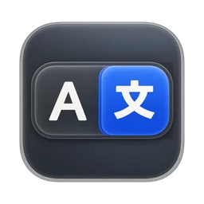
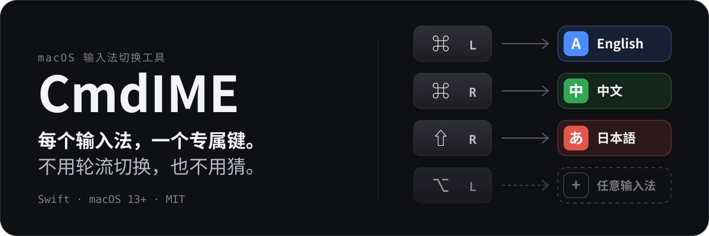
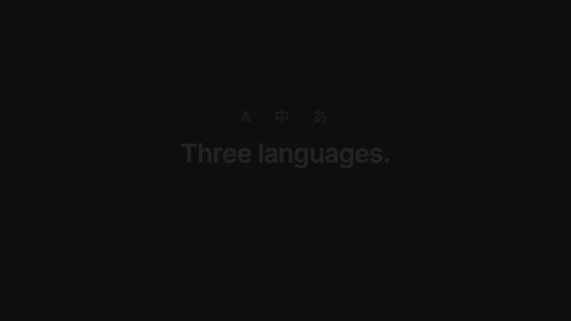
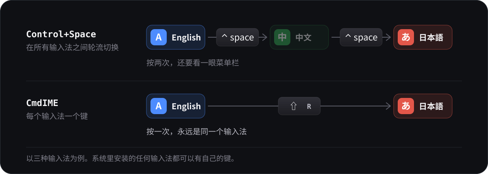
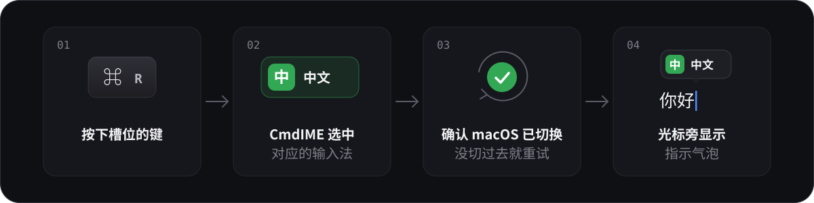
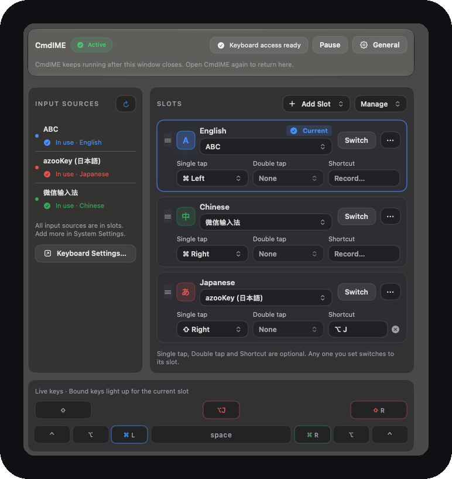
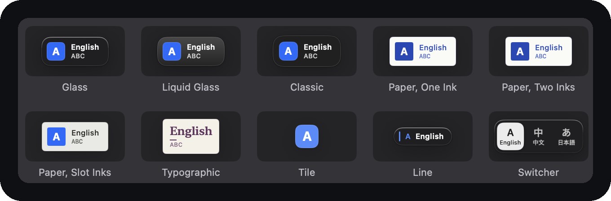
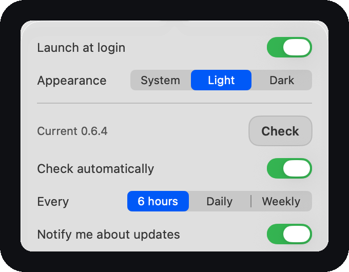

<p align="center">
  
</p>

<p align="center">
  
</p>

<p align="center">
  <a href="README.md">English</a> · <strong>简体中文</strong> · <a href="README.ja.md">日本語</a>
  <br>
  <a href="https://shunmeicho.github.io/cmd-ime/?lang=zh-CN">官网与在线演示</a>
</p>

<p align="center">
  <a href="https://github.com/ShunmeiCho/cmd-ime/actions/workflows/swift.yml"></a>
  <a href="https://github.com/ShunmeiCho/cmd-ime/releases"></a>
  <a href="LICENSE"></a>
</p>

CmdIME 让你 Mac 上的每个输入源都有自己的按键。单击左 Command 切到英文，右 Command
切到中文，右 Shift 切到日文：CmdIME 直接选中那个输入源，确认 macOS 确实完成了切换，
并在光标附近显示一个小的指示气泡。按键由你来定；槽位跟随你 Mac 上安装的输入源。

[](demo-videos/renders/cmdime-promo.mp4)

演示里出现的是 Switcher、Glass 和 Liquid Glass 三种指示气泡主题。
[打开完整视频](demo-videos/renders/cmdime-promo.mp4)。

## 为什么不用 Control+Space

<p align="center">
  
</p>

- **它是循环切换的。** 输入源达到三个或更多时，你得看一眼菜单栏才知道切到了哪里。
  用 CmdIME，每个键总是切到同一个输入源。
- **只有两个输入法，它也是来回切换。** Control+Space 切到的是“另一个”，所以按之前你得先
  知道自己现在在哪个。CmdIME 的每个键永远对应同一个输入法：按左 Command 就是英文，
  不管之前在哪个。
- **一根拇指，而不是组合键。** 左右 Command 就在拇指下面，轻点一下即可；Control+Space
  要同时按两个键。
- **按下去有时像是没有反应。** CmdIME 会确认 macOS 已经完成切换，没有完成时会重试。
- **单击和快捷键互不干扰。** Command+C、Command+Tab 等组合键永远不会被当成一次
  Command 单击，你已经在用的按键照常工作。

## 一次切换的过程

<p align="center">
  
</p>

## 安装

```sh
curl -fsSL https://raw.githubusercontent.com/ShunmeiCho/cmd-ime/main/script/install.sh | bash
```

安装脚本会下载最新的发布版本，对照公布的 SHA-256 进行校验，把 `CmdIME.app` 安装到
`/Applications`，链接 `keyboardctl`，然后打开应用。之后在系统设置 > 隐私与安全性中允许
**Accessibility**（辅助功能）和 **Input Monitoring**（输入监控）；应用内的设置向导会带你
完成这两项授权和第一次切换。

需要 macOS 13 或更高版本。之后的更新可以在应用内通过 **Update Now**（立即更新）安装。

> [!NOTE]
> CmdIME 目前是预览版本：已签名，但未经公证。一行命令的安装脚本是最顺畅的方式。
> 通过浏览器下载的 zip 在首次打开时会被 Gatekeeper 拦下，提示“已损坏”；
> 参见[故障排除](#故障排除)。

[](demo-videos/renders/cmdime-install-permissions-demo.mp4)

<details>
<summary><strong>固定版本，或从源码构建</strong></summary>

固定确切的版本和校验和（两者都从发布说明中复制）：

```sh
curl -fsSL https://raw.githubusercontent.com/ShunmeiCho/cmd-ime/main/script/install.sh | \
  CMDIME_VERSION=0.8.0 CMDIME_SHA256=85923f4f534be8411b67de352f7dae308afbf621ae870d936a7e11aaccf817f8 bash
```

从源码构建：

```sh
git clone https://github.com/ShunmeiCho/cmd-ime.git
cd cmd-ime
swift test
./script/build_and_run.sh
```

本地构建同样需要这两项权限，全局键盘监听才能工作。

</details>

## 功能一览

- **槽位面板。** 左侧是已安装的输入源，右侧是你的槽位。把输入源拖进来即可添加槽位，
  拖动拖动柄调整顺序，可以重命名、设置颜色或移除槽位，移除后还能撤销。添加或移除输入源时，
  列表会跟随系统设置同步更新。
- **每个槽位三种可选触发方式。** 八个修饰键之一的单击或双击，以及一个 Option+J 这样的
  快捷键。任选其中几种设置；设置了的任意一种都会切换到该槽位。

<p align="center">
  
</p>

<p align="center"><sub>深色外观下的槽位面板。这里是三个槽位，你用几个输入法就可以加几个。</sub></p>

- **光标附近的切换指示气泡。** 十六种内置主题，包括 Glass、macOS 26 及以上的
  Liquid Glass、纸张风格、显示所有槽位的切换器、把切换器缩到只剩图标的徽章，以及
  只保留刚切到的那一个输入源的标记，另外还支持你自己的主题和字体。

<p align="center">
  
</p>

<p align="center"><sub>设置里内置主题中的 10 个。</sub></p>

- **应用内更新。** 默认每六小时检查一次，在 **Update Now** 旁边附上改动摘要，
  原地安装并保留你的权限。
- **跟随浅色和深色的设置窗口，** 也可以固定为你选的那一种。

<p align="center">
  
</p>

<p align="center"><sub>浅色外观下的 General：外观、检查更新和通知。</sub></p>

- **`keyboardctl`，** 一个用于扫描、绑定、切换和诊断的命令行工具。

## 参考

<details>
<summary><strong>槽位与默认触发键</strong></summary>

CmdIME 会扫描 macOS 中已经安装的输入源，而不是写死某一种键盘布局。首次设置时，
它为每种主要语言创建一个槽位，并按系统顺序取该语言下第一个可选的输入源；没有主要语言的
输入源会被跳过。每个槽位都可以在它的卡片上指向任意一个已安装的输入源，显示
"Not matched"（未匹配）的槽位也一样。

| 检测到的槽位 | 默认触发键 |
| --- | --- |
| 第一个 | 左 Command |
| 第二个 | 右 Command |
| 第三个 | 左 Option |
| 第四个 | 右 Option |
| 第五个 | 左 Control |
| 第六个及之后 | 无触发键（需手动指定） |

已有的配置及其触发键保持不变。如果没有任何可选输入源具有可用的主要语言，
初始化时会使用旧版默认值：英文对应左 Command，中文对应右 Command，日文对应 **Option+J**。

在面板上：

- "..." 菜单里有 Move Up、Move Down、Rename、Color 和 Remove Slot，这些操作同样可以通过
  键盘和 VoiceOver 完成。按 Esc 取消拖动。被移除的槽位可以用 **Undo**（撤销）恢复，
  直到下一次槽位变更为止。
- 点击槽位的徽标可以为它指定一种颜色。输入源列表、Live keys 和切换指示气泡都会跟随
  这个颜色。
- "Current"（当前）标记的是 macOS 当前选中的输入源，不论它是通过什么方式选中的。
  **Switch**（切换）会直接选中该槽位的输入源；它不会测试触发键。
- "Duplicate"（重复）标记指向同一个输入源的两个槽位。"Source missing"（输入源缺失）
  标记其输入源已不再安装、已回退到另一个输入源的槽位。
- 面板下方的 Live keys（实时按键）是一个小键盘，会点亮绑定到当前槽位的按键。

</details>

<details>
<summary><strong>触发方式详解</strong></summary>

- `Single tap`（单击）：八个物理修饰键之一（左或右的 Command、Option、Control、Shift）。
- `Double tap`（双击）：同样这些键，按两次。
- `Shortcut`（快捷键）：点击 **Record…**（录制），同时按下一个修饰键和一个按键，例如
  `option+j`，然后点 Save。按 Esc 取消；录制期间单击和双击触发会暂停。

如果某个按键已经被另一个槽位用于同一种手势，或者已被某个按键重映射占用，它会显示为
已占用并且无法选择。同一个按键可以是一个槽位的单击触发键，同时是另一个槽位的双击触发键。
许多中文输入法使用 Shift 来切换中英文，因此 CmdIME 从不自动分配 Shift。

单个修饰键的绑定与键盘快捷键被有意分开处理，这样 `Command+C`、`Command+V`、
`Command+Tab` 以及多修饰键组合就不会被当成一次 Command 单击。单击会立即切换；
只有当同一个修饰键还绑定了双击时，CmdIME 才会短暂等待。

设置窗口会拒绝 `control+space` 和 `control+option+space` 这类 macOS 输入源快捷键，
以免 CmdIME 意外抢占系统的输入源选择器。

</details>

<details>
<summary><strong>切换指示气泡与主题</strong></summary>

CmdIME 通过编程方式切换输入源，因此不会调出 macOS 私有的输入源选择器。启用
`Show switch indicator` 后，它会在切换后显示自己的轻量确认气泡。

在设置中，切换指示气泡可以关闭，可以选用内置主题之一（Glass（玻璃）、适用于 macOS 26
及以上的 Liquid Glass、使用一种或两种油墨的纸张风格、纯文字、纯色块、单行，或者显示所有
槽位的切换器，或者把切换器缩到只剩图标的徽章），用一个滑块调整大小、百分比就是它实际
画出来的尺寸，可以在图标/文字显示之间切换，还可以按
每个槽位自己的颜色、系统强调色或单色来着色。字体族、字重和文字大小属于主题；编辑内置
主题时会生成一份副本。

自定义主题以 JSON 文件的形式存放在 `~/.config/cmd-ime/themes`，导入的字体存放在
`~/.config/cmd-ime/fonts`，两者都在配置文件旁边。字体只为 CmdIME 注册，不会在系统范围内
安装任何内容。主题文件可以使用任意名称；在设置中移除主题会把它的文件移到废纸篓。

切换指示气泡出现在其他应用之上，所以它的主题跟随 macOS 的外观，而不是设置窗口的外观，
除非主题自己把色调固定了。

</details>

<details>
<summary><strong>切换后仍然打出拉丁字母的输入法</strong></summary>

从后台选中输入源，有时输入法并没有接到当前应用上：菜单栏显示的是新输入源，打出来的
却还是拉丁字母。Google 日本語入力在你用 ABC 打过字之后就会这样。对它，CmdIME 会先按一下
かな键，通过系统自己的路径进入日文，60 毫秒后再选中槽位指定的输入源。其他输入法仍然是
直接选中，不增加延迟。

如果别的日文输入法出现同样的症状，可以在 `~/.config/cmd-ime/activation-recipes.json`
里加一条激活配方，然后在设置里点 Refresh：

```json
{ "recipes": [
  { "sourceIDPrefix": "com.example.inputmethod", "strategy": "kanaThenSelect", "delayMs": 60 }
] }
```

输入源 ID 可以用 `keyboardctl scan` 查到。你的配方优先于内置配方，所以写
`"strategy": "select"` 可以关掉内置的那一条。`kanaThenSelect` 只对日文输入源生效，
`delayMs` 限制在 0 到 500 之间，读不出来的条目会被跳过，并在状态栏里指出。有效的配方
欢迎提 issue 告诉我们，好把它收进内置列表。

如果切换到日文时打开的是假名面板而不是平假名输入，请刷新输入源，或者更新到
CmdIME 0.1.10 或更高版本。macOS 把 `com.apple.50onPaletteIM` 暴露为一个可选的日文输入源，
但它是辅助用的假名面板，而不是常规的平假名输入法。

</details>

<details>
<summary><strong>设置窗口、外观与退出</strong></summary>

CmdIME 是一个后台代理程序。设置窗口只是一个控制面板：关闭窗口不会停止键盘监听。
设置窗口开着时，CmdIME 出现在 Dock 和应用切换器里。窗口关掉后，它仍在后台运行，没有菜单栏图标。
需要打开设置时，再次打开 `CmdIME.app` 即可。

全新安装后，设置窗口顶部会显示一个三步的 **Setup guide**（设置向导）：允许键盘访问、
检查检测到的槽位、然后试着切换一次。它可以跳过，之后通过 **General > Show Setup Guide**
可以再次打开。从早期版本更新的用户看到的则是一行新功能提示。

设置窗口跟随 macOS 的外观。**General > Appearance**（通用 > 外观）可以把它固定为
**Light** 或 **Dark**，或者交还给 **System**。窗口建立在系统材质之上，状态条和更新条在
macOS 26 及以上使用 Liquid Glass；开启“减少透明度”时，全部变为不透明。

要停止后台代理程序，请使用 **General > Quit CmdIME**，或者运行：

```sh
keyboardctl quit
```

如果 CLI 还没有链接，请使用 `pkill -x CmdIME`。

</details>

<details>
<summary><strong>更新</strong></summary>

CmdIME 大部分时间没有窗口，所以它会自己检查新版本：默认每六小时向 GitHub 查询一次最新的
Release（除此之外不发送任何内容），发现新版本时，为这个版本发一条系统通知。设置窗口顶部
会显示同一条更新提示，并附上这一版的开头一句话和每项改动的标题。

**General** 里有用于手动检查的 **Check**、**Check automatically** 开关、
**Every 6 hours / Daily / Weekly** 频率选择，以及 **Notify me about updates**：关掉它就不再
发通知，但窗口里的更新提示照常显示。通知权限只在有更新要通知时、或者你打开这个开关时
申请，首次启动时不会申请。macOS 不允许应用自己修改通知权限：如果通知被关掉了，
General 会提示，并提供 **Open Notification Settings…**。

**Update Now** 会原地安装更新：下载发布的 zip，对照发布的 `.sha256` 校验，
验证新应用带有有效的代码签名、并且与正在运行的应用来自同一个开发者团队，
然后替换应用包并重新打开 CmdIME。由于签名身份没有变化，Accessibility 和
Input Monitoring 的授权会保留。**Release Notes** 打开 GitHub 的发布页面，
**Skip** 不再提醒这个版本。如果 CmdIME 是用 Homebrew 安装的，`brew upgrade`
照常可用；原地更新之后，Homebrew 记录的版本号会落后，直到下一次 `brew upgrade`。

</details>

<details>
<summary><strong>命令行：keyboardctl</strong></summary>

槽位 ID 取决于检测到的输入源。下面的示例假设槽位名为 `english`、
`chinese` 和 `japanese`；请运行 `keyboardctl slots` 查看你实际的 ID。

```sh
swift run keyboardctl scan
swift run keyboardctl init
swift run keyboardctl slots
swift run keyboardctl slot add
swift run keyboardctl slot add 1 --name Korean
swift run keyboardctl slot remove japanese
swift run keyboardctl switch english
swift run keyboardctl diagnose
swift run keyboardctl diagnose --json
swift run keyboardctl bind left-command english
swift run keyboardctl bind right-command chinese
swift run keyboardctl bind option+j japanese
swift run keyboardctl bind double-left-command english
swift run keyboardctl remap right-control escape
swift run keyboardctl quit
swift run keyboardctl listen
```

- `keyboardctl init`：使用与 GUI 首次启动相同的检测逻辑，创建根据输入源检测得到的默认值。
  已有的配置不会被改动，除非你传入 `--force`，它会用检测到的默认值替换整个配置。
  强制重置之前请备份自定义设置；它不会创建 GUI 的重置前备份（下文的旧版迁移备份
  仍然适用）。
- `keyboardctl switch <slot>`：选中某个槽位匹配到的输入源，并确认 macOS 已经应用了
  这次切换。如果 macOS 没有应用该选择，它会向 `stderr` 输出错误信息并以非零状态退出。
- `keyboardctl diagnose [--json]`：输出每个槽位配置的偏好
  （`preferredIDs`、`languagePrefixes`、`nameContains`）、匹配到的输入源，
  以及匹配原因（`preferredID`、`fallbackLanguage`、`languagePrefix`、`nameContains` 或
  `none`）。传入 `--json` 可得到结构化的 JSON 输出：`slots` 条目保留 `slot` ID，
  并包含 `name` 和 `duplicateSlots`（没有重复时为空数组）。
- `keyboardctl slots`：按顺序列出槽位 ID、名称、触发键和匹配结果，
  并标出回退匹配。
- `keyboardctl slot add [<number|source-id>] [--name N]`：不带输入源时，
  列出带编号的未分配输入源；带输入源时，添加一个槽位，并从左 Command、右 Command、
  左 Option、右 Option、左 Control 中分配第一个空闲的触发键。全部被占用时，
  该槽位没有触发键；请用 `bind` 指定一个。Shift 从不自动分配，因为许多中文输入源
  使用单击 Shift 来切换中英文。右 Control 也只能手动指定，因为笔记本键盘上没有这个键。
- `keyboardctl slot remove <slot>`：移除它的绑定、偏好和自定义颜色。
  最后一个槽位不能移除。
- 槽位查询先按精确 ID 匹配，然后按唯一的、不区分大小写的 ID 或名称匹配。
  已删除或未知的槽位会以退出码 1 失败；它们绝不会被重定向到别的槽位。
  `bind <trigger> <slot>` 保留抢占触发键的行为，并会在原先的槽位因此失去触发键时给出提示。

新槽位优先使用所选的输入源，并按其**主要**语言回退。一个输入源不能同时作为两个槽位的
首选输入源，但回退规则和旧版规则可能把多个槽位解析到同一个输入源：两者都仍然可用，
`diagnose` 会报告 `duplicate with: <ids>`。已有的匹配规则保持不变。只有在配置文件不存在时，
首次启动才会检测槽位；刷新输入源不会替换已有的槽位或触发键。

</details>

<details>
<summary><strong>配置文件、重置、升级与降级</strong></summary>

配置文件位于 `~/.config/cmd-ime/config.json`。用 CLI 编辑它之前请先退出 GUI，之后再重新
打开：运行中的 GUI 不会监视该文件，可能会覆盖 CLI 所做的更改。

在设置中，**Reset to Detected**（重置为检测结果）会先请求确认，然后才用检测到的默认值
替换所有槽位和触发键。无关的设置会被保留，包括通用的指示气泡偏好。保存之前，
GUI 会把原文件备份为配置文件旁边的 `config.json.before-reset.bak`；之后的重置会使用各不相同
的备份名称，而不是覆盖之前的备份。如果备份或保存失败，重置不会生效。

版本 2 保存一个有序的 `slots` 集合，其中包含稳定的 ID、名称和色调。旧配置在加载时于内存中
迁移。`show`、`slots`、`diagnose`、`switch` 和 `listen` 不会保存迁移结果，也不会输出升级
提示。每次成功的写入（`bind`、`remap`、`slot add`、`slot remove` 或 `init --force`）都会把
缺少 `slots` 的文件备份为同目录下的 `config.json.v1.bak`，然后向 stderr 输出一条说明。
这也涵盖 `slots` 键被旧版二进制丢弃的版本 2 文件。如果该备份已经存在，则会创建一个新的
`config.json.v1.bak.<uuid>`；之前的备份绝不会被复用或覆盖。说明中会给出新备份的路径。
备份失败会阻止保存。迁移时会保留旧版 ID 和绑定。

降级之前，请退出 CmdIME，并把最近一次迁移说明中指出的备份恢复为 `config.json`
（请另外保留一份你的版本 2 设置）。多次升级之后，该备份可能带有 UUID 后缀；
最初的 `config.json.v1.bak` 仍然保存着第一次迁移时的设置。旧版二进制无法解码自定义的
槽位 ID，可能会把该配置移到 `.corrupt.<uuid>` 并将其重置。即使只有旧版 ID，
旧版二进制也会在保存时丢弃 `slots`，导致名称和色调丢失，并可能在下次升级时恢复
已被移除的旧版槽位。

</details>

## 编辑器与脚本

Vim、Neovim、Emacs、Helix 用户通常用 `im-select` 或 `macism` 切换输入源，好在离开插入模式时切回
英文。`keyboardctl source` 可以直接替换它们，而且和 App 自己切换用的是同一份代码。

```vim
" Neovim：离开插入模式切回英文，回到插入模式时恢复。
let g:cmdime = '/Applications/CmdIME.app/Contents/Resources/keyboardctl'
augroup cmdime
  autocmd!
  autocmd InsertLeave * let b:cmdime_source = trim(system(g:cmdime . ' source'))
        \ | call system(g:cmdime . ' source com.apple.keylayout.ABC')
  autocmd InsertEnter * if exists('b:cmdime_source')
        \ | call system(g:cmdime . ' source ' . b:cmdime_source) | endif
augroup END
```

你这台机器上的输入源 id 用 `keyboardctl scan` 查。

**它承诺什么，不承诺什么。** 切换没生效时，`keyboardctl source` 会以非零状态退出并在 stderr 说明
原因，但常用的编辑器插件没有一个会读这两样，**所以你的编辑器不会知道**。它什么都不会知道——
这就是这件事目前的实际状况，也正是 `keyboardctl lab` 存在的理由：要知道切换在你的机器、你的输入
法上到底成不成，只有真打一段字再读回来。

```sh
keyboardctl lab --attempts 30
```

它运行时会接管键盘，往 TextEdit 里打字，每次尝试打印一个字符，这样你能看出失败是散开的还是成片的。

## 打错输入法救回（beta）

你本想打中文，切换没生效，`nihao` 就留在了文档里。按一个键把这串字母取出来、重新送进中文输入法，
候选框弹出来让你选字，按一次 Command+Z 可以撤销整个过程。

它**默认关闭，需要手工配置**，而且在没有实测过的地方一律拒绝。目前实测过的只有 TextEdit 加
微信输入法；Safari、Electron 编辑器、密码框以及其它一切都会被拒绝，并给出原因。配置方法、限制和
实测数据见 [docs/recovery-beta.md](docs/recovery-beta.md)。

## 故障排除

<details>
<summary><strong>"CmdIME is damaged" 或 "Apple cannot check it for malicious software"</strong></summary>

应用并没有损坏。预览版已签名但未公证，而浏览器下载的 zip 会带上隔离标记，所以 Gatekeeper
会拦住第一次启动。“已损坏”这个提示下通常没有 **Open Anyway**（仍要打开）可点。下面两种方法
任选其一：

1. 删掉下载的 zip 和应用，用一行命令重新安装。它不经过浏览器的隔离流程：

   ```sh
   curl -fsSL https://raw.githubusercontent.com/ShunmeiCho/cmd-ime/main/script/install.sh | bash
   ```

2. 或者保留已下载的应用：先把 `CmdIME.app` 移到“应用程序”（`/Applications`），再去掉隔离标记：

   ```sh
   xattr -dr com.apple.quarantine /Applications/CmdIME.app
   ```

如果 macOS 显示的是 "Apple cannot check it for malicious software"（Apple 无法检查其是否包含
恶意软件），系统设置 > 隐私与安全性里可能会有 **Open Anyway**；按上面的方法去掉标记也可以。
Apple 关于 [Gatekeeper](https://support.apple.com/guide/security/gatekeeper-and-runtime-protection-sec5599b66df/web) 和 [Developer ID](https://developer.apple.com/developer-id/) 的文档说明了这些检查。

</details>

<details>
<summary><strong>macOS 反复请求权限</strong></summary>

macOS 是针对应用的代码身份保存 Accessibility 和 Input Monitoring 授权的，所以如果你批准了
某一个重新构建的 `CmdIME.app`，随后又从 `dist/`、`dist/release/` 或 `/Applications` 运行
另一份副本，macOS 可能会再次询问。请使用一个固定的应用位置。重置方法：

1. 退出 CmdIME。
2. 在系统设置 > 隐私与安全性 > Accessibility 和 Input Monitoring 中移除旧的
   `CmdIME.app` 条目。
3. 把应用安装或复制到你实际使用的位置，例如
   `/Applications/CmdIME.app`。
4. 打开这一份应用，并授予两项权限。
5. 退出并重新打开 CmdIME。

</details>

## 开发

<details>
<summary><strong>构建、打包与发布</strong></summary>

```sh
swift test
./script/build_and_run.sh
```

`script/build_and_run.sh` 会在生成应用包之后对其签名。它使用能找到的第一个本地
Apple Development 或 Developer ID 签名身份，找不到时回退到 ad-hoc 签名。可以设置
`CODESIGN_IDENTITY` 来指定身份：

```sh
CODESIGN_IDENTITY="Apple Development: Your Name (TEAMID)" ./script/build_and_run.sh
```

打包发布版本：

```sh
CMDIME_ALLOW_UNNOTARIZED=1 ./script/package_app.sh 0.8.0
shasum -a 256 dist/CmdIME-0.8.0.zip
```

经过公证的打包需要 `Developer ID Application` 签名身份；如果要打包明确标注为未经公证的
预览版，请设置 `CMDIME_ALLOW_UNNOTARIZED=1`。一次性的公证设置：

```sh
security find-identity -p codesigning -v
xcrun notarytool store-credentials "cmd-ime-notary" \
  --apple-id "YOUR_APPLE_ID" \
  --team-id "YOUR_TEAM_ID" \
  --password "APP_SPECIFIC_PASSWORD"
```

打包脚本会使用 Developer ID 签名，把 zip 提交给 Apple 公证服务，把票据装订到
`CmdIME.app` 上，重新生成用于分发的 zip，并输出 SHA-256。如果你的钥匙串配置名称不是
`cmd-ime-notary`，请使用 `CMDIME_NOTARY_PROFILE`。

发布 Homebrew cask 之前，请用发布版 zip 的 SHA-256 更新 `Casks/cmd-ime.rb`。该 cask 通过
`Contents/Resources` 链接 `keyboardctl`，这是一个指向 `Contents/MacOS` 中已签名辅助程序的
兼容性符号链接。

发布的应用保持原生 SwiftUI 和 AppKit 实现：全局键盘监听、Accessibility 和
Input Monitoring、登录项以及输入源切换都依赖 macOS API。通过 Mac App Store 分发需要一个
单独的、启用沙盒的构建；参见 [docs/app-store.md](docs/app-store.md)。

</details>

<details>
<summary><strong>项目结构</strong></summary>

- `Sources/KeyboardSwitcherCore`：配置、快捷键解析、输入源扫描、匹配、切换以及全局
  事件监听（event tap）
- `Sources/CmdIME`：带有 SwiftUI 设置窗口的 AppKit 后台应用
- `Sources/keyboardctl`：用于扫描、配置、切换和监听模式的 CLI
- `script`：本地运行、安装和发布脚本
- `Casks`：Homebrew cask 模板

</details>

## 参与贡献

欢迎提交 PR，请先看 [CONTRIBUTING.md](CONTRIBUTING.md)。第一个 PR 需要加一行表示同意
[CLA.md](CLA.md)——你保留自己的版权，而这份协议让项目将来可以更换许可，不必回头找到每一位
曾经的贡献者。

**Windows：** 有人问，但它还不存在。在有人动手之前，有个问题值得先回答：Windows 上到底有没有
这个项目所针对的故障——切换报告成功，打出来仍是上一种语言？没有人量过。
[Issue #5](https://github.com/ShunmeiCho/cmd-ime/issues/5) 说明了怎样的帮助最有用。

## 支持

如果 CmdIME 帮你减少了一点键盘上的麻烦，你可以
[请我喝杯咖啡](https://buymeacoffee.com/shunmeicor7)，或者
[给仓库点个 star](https://github.com/ShunmeiCho/cmd-ime)。
