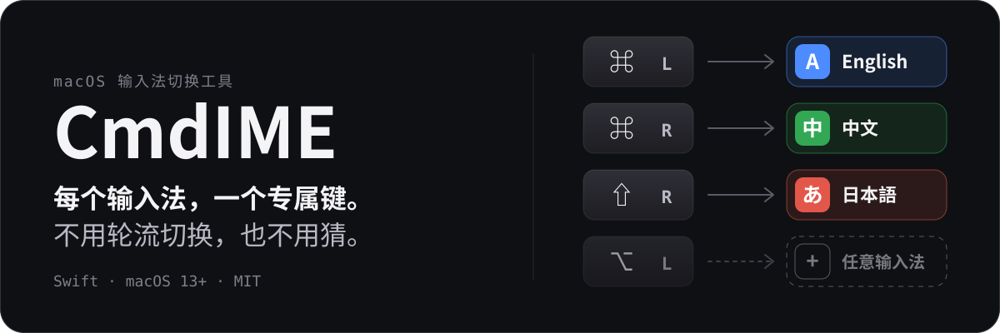
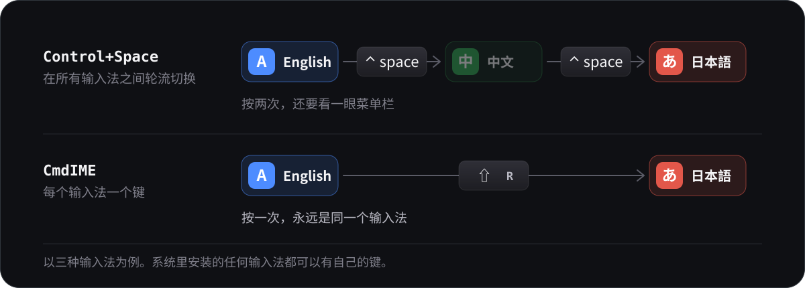
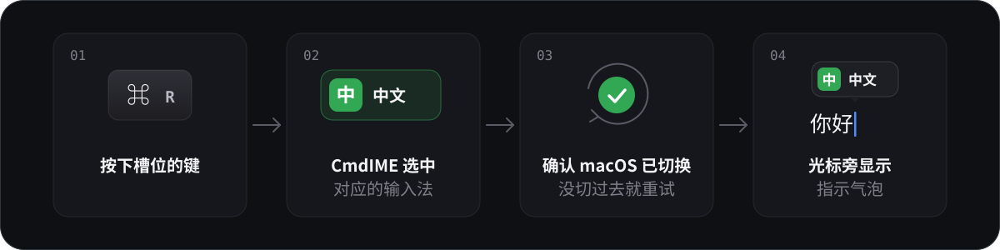

<p align="center">
  
</p>

<p align="center">
  
</p>

<p align="center">
  <a href="README.md">English</a> · <strong>简体中文</strong> · <a href="README.ja.md">日本語</a>
  <br>
  <a href="https://shunmeicho.github.io/cmd-ime/zh-cn/">官网与在线演示</a>
</p>

<p align="center">
  <a href="https://github.com/ShunmeiCho/cmd-ime/actions/workflows/swift.yml"></a>
  <a href="https://github.com/ShunmeiCho/cmd-ime/releases"></a>
  <a href="LICENSE"></a>
</p>

CmdIME 让你 Mac 上的每个输入源都有自己的按键。单击左 Command 切到英文，右 Command
切到中文，右 Shift 切到日文：CmdIME 直接选中那个输入源，确认 macOS 确实完成了切换，
并在光标附近显示一个小的指示气泡。按键由你来定；槽位跟随你 Mac 上安装的输入源。

[](demo-videos/renders/cmdime-promo.mp4)

演示里出现的是切换器、玻璃和液态玻璃三种指示气泡主题。
[打开完整视频](demo-videos/renders/cmdime-promo.mp4)。

## 为什么不用 Control+Space

<p align="center">
  
</p>

- **它是循环切换的。** 输入源达到三个或更多时，你得看一眼菜单栏才知道切到了哪里。
  用 CmdIME，每个键总是切到同一个输入源。
- **只有两个输入源，它也是来回切换。** Control+Space 切到的是“另一个”，所以按之前你得先
  知道自己现在在哪个。CmdIME 的每个键永远对应同一个输入源：按左 Command 就是英文，
  不管之前在哪个。
- **一根拇指，而不是组合键。** 左右 Command 就在拇指下面，轻点一下即可；Control+Space
  要同时按两个键。
- **按下去有时像是没有反应。** CmdIME 会确认 macOS 已经完成切换，没有完成时会重试。
- **单击和快捷键互不干扰。** Command+C、Command+Tab 等组合键永远不会被当成一次
  Command 单击，你已经在用的按键照常工作。

## 一次切换的过程

<p align="center">
  
</p>

## 安装

```sh
curl -fsSL https://raw.githubusercontent.com/ShunmeiCho/cmd-ime/main/script/install.sh | bash
```

安装脚本会下载最新的发布版本，对照公布的 SHA-256 进行校验，把 `CmdIME.app` 安装到
`/Applications`，链接 `keyboardctl`，然后打开应用。之后在系统设置 > 隐私与安全性中允许
**辅助功能**和**输入监控**；应用内的设置向导会带你
完成这两项授权和第一次切换。

需要 macOS 13 或更高版本，且为 Apple 芯片的 Mac（暂不支持 Intel Mac）。之后的更新可以在应用内通过**立即更新**安装。

> [!NOTE]
> CmdIME 目前是预览版本：已签名，但未经公证。一行命令的安装脚本是最顺畅的方式。
> 通过浏览器下载的 zip 在首次打开时会被 Gatekeeper 拦下，提示“已损坏”；
> 参见[故障排除](#故障排除)。

[](demo-videos/renders/cmdime-install-permissions-demo.mp4)

<details>
<summary><strong>固定版本，或从源码构建</strong></summary>

固定确切的版本和校验和（两者都从发布说明中复制）：

```sh
curl -fsSL https://raw.githubusercontent.com/ShunmeiCho/cmd-ime/main/script/install.sh | \
  CMDIME_VERSION=0.13.1 CMDIME_SHA256=67a5c76903bd4114a91fb2023b07a4498f386673ed0b20f1c483142dc66ca7bd bash
```

从源码构建：

```sh
git clone https://github.com/ShunmeiCho/cmd-ime.git
cd cmd-ime
swift test
./script/build_and_run.sh
```

`build_and_run.sh` 会先退出正在运行的 CmdIME，包括 `/Applications` 里的那一份，所以之后
运行的只有本地构建；如果构建失败，就一个都不在运行。本地构建同样需要这两项权限，全局键盘
监听才能工作。

</details>

## 功能一览

- **“槽位”页上的槽位面板。** 左侧是已安装的输入源，右侧是你的槽位。把输入源拖进来即可
  添加槽位，拖动拖动柄调整顺序，可以重命名、设置颜色或移除槽位，移除后还能撤销。添加或
  移除输入源时，列表会跟随系统设置同步更新；macOS 列出两次的同一个输入源只显示一次。
- **每个槽位三种可选触发方式。** 八个修饰键之一的单击或双击，以及一个 Option+J 这样的
  快捷键。任选其中几种设置；设置了的任意一种都会切换到该槽位。

<p align="center">
  
</p>

<p align="center"><sub>“槽位”页。这里是三个槽位，你用几个输入源就可以加几个。</sub></p>

- **光标附近的切换指示气泡。** 十八种内置主题，包括玻璃、macOS 26 及以上的
  液态玻璃、纸张风格、显示所有槽位的切换器、把切换器缩到只剩图标的徽章、只保留刚
  切到的那一个输入源的标记，以及两个自适应主题：单次切换时显示标记，气泡还在
  时再切一次或者用速览，就展开成徽章那样的一整排。另外还支持你自己的主题和字体。

<p align="center">
  
</p>

<p align="center"><sub>设置里的全部 18 个内置主题。</sub></p>

<p align="center">
  
</p>

<p align="center"><sub>自适应：单次切换只显示一个字形，气泡还在时再切换就展开成整排。</sub></p>

- **每个槽位的颜色完全由你决定。** 可以选预设色，也可以用系统取色器挑任意颜色。
  把指示气泡的「颜色」设为「槽位」，气泡就用这个颜色，不用看字也知道自己在哪个输入源。

<p align="center">
  
</p>

<p align="center"><sub>三个槽位，三种你自己选的颜色。</sub></p>

- **按应用设定输入源。** 在“应用”页面，把一个应用从列表、访达或程序坞拖到某个槽位上，
  它每次切到前台时都会用这个槽位；拖到**保持不变**上，CmdIME 就不去动它。
  可以让 CmdIME 记住你在每个应用里最后用的输入源（默认关闭，只保存在内存里）；可以给其余
  所有应用指定一个槽位；还能在离开密码框后切回原来的输入源，否则 macOS 会一直停在 ABC
  （默认开启）。你按下的触发键始终优先。

<p align="center">
  
</p>

<p align="center"><sub>应用规则：Code 用英文，Chat 用中文，点一下就切过去。</sub></p>

<p align="center">
  
</p>

<p align="center"><sub>把应用拖到某个槽位上，它就用这个槽位。</sub></p>

<p align="center">
  
</p>

<p align="center"><sub>离开密码框后，原来的输入源自动回来。</sub></p>

- **不止 CmdIME 自己的切换，任何切换都有提示。** 用 Control+Space、地球仪键或菜单栏
  切换时也会显示气泡，切换应用后也可以显示。可以在指定应用里隐藏气泡，也可以设置它停留
  多久。**速览**触发键在不切换的情况下显示当前输入源；还有一个可选的 Caps Lock 气泡，
  在 Caps Lock 打开或关闭时显示。

<p align="center">
  
</p>

<p align="center"><sub>Control+Space 不是 CmdIME 的触发键，气泡照样出现。</sub></p>

- **可以带走的设置。** 把槽位、触发键、应用规则、主题、字体和激活配方导出到一个文件夹，
  在另一台 Mac 上导入。`keyboardctl` 或编辑器对配置的修改，在 CmdIME 运行时直接生效。
  “关于”页的**复制诊断信息**会整理好报告问题需要的信息。
- **应用内更新。** 默认每六小时检查一次，在**立即更新**旁边附上改动摘要，
  原地安装并保留你的权限。
- **跟随浅色和深色的设置窗口，** 也可以固定为你选的那一种。设置窗口有英文、简体中文和日文界面，
  跟随 macOS 的语言；想单独给 CmdIME 换一种语言，请在“通用”页的“语言”中选择，
  或到系统设置 > 通用 > 语言与地区 > 应用程序。

<p align="center">
  
</p>

<p align="center"><sub>通用：外观、更新，以及设置的导出和导入。</sub></p>

- **`keyboardctl`，** 一个命令行工具，用于扫描、绑定、切换、应用规则、迁移设置和诊断，
  另外还有在本机上实测的可靠性检查（Reliability Lab）。

## 参考

<details>
<summary><strong>槽位与默认触发键</strong></summary>

CmdIME 会扫描 macOS 中已经安装的输入源，而不是写死某一种键盘布局。首次设置时，
它为每种主要语言创建一个槽位，并按系统顺序取该语言下第一个可选的输入源；没有主要语言的
输入源会被跳过。每个槽位都可以在它的卡片上指向任意一个已安装的输入源，显示
“未匹配”的槽位也一样。

| 检测到的槽位 | 默认触发键 |
| --- | --- |
| 第一个 | 左 Command |
| 第二个 | 右 Command |
| 第三个 | 左 Option |
| 第四个 | 右 Option |
| 第五个 | 左 Control |
| 第六个及之后 | 无触发键（需手动指定） |

已有的配置及其触发键保持不变。如果没有任何可选输入源具有可用的主要语言，
初始化时会使用旧版默认值：英文对应左 Command，中文对应右 Command，日文对应 **Option+J**。

在面板上：

- "..." 菜单里有上移、下移、重命名、颜色和移除槽位，这些操作同样可以通过
  键盘和 VoiceOver 完成。按 Esc 取消拖动。被移除的槽位可以用**撤销**恢复，
  直到下一次槽位变更为止。
- 点击槽位的徽标可以为它指定一种颜色。输入源列表、实时按键和切换指示气泡都会跟随
  这个颜色。
- “当前”标记的是 macOS 当前选中的输入源，不论它是通过什么方式选中的。
  **切换**会直接选中该槽位的输入源；它不会测试触发键。
- “重复”标记指向同一个输入源的两个槽位。“输入源缺失”
  标记其输入源已不再安装、已回退到另一个输入源的槽位。
- 面板下方的实时按键是一个小键盘，会点亮绑定到当前槽位的按键。

</details>

<details>
<summary><strong>触发方式详解</strong></summary>

- `单击`：八个物理修饰键之一（左或右的 Command、Option、Control、Shift）。
- `双击`：同样这些键，按两次。
- `快捷键`：点击**录制…**，同时按下一个修饰键和一个按键，例如
  `option+j`，然后点“保存”。按 Esc 取消；录制期间单击和双击触发会暂停。

如果某个按键已经被另一个槽位用于同一种手势，或者已被某个按键重映射或速览触发键
（“显示当前输入源”）占用，它会显示为已占用并且无法选择。同一个按键可以是一个
槽位的单击触发键，同时是另一个槽位的双击触发键。许多中文输入法使用 Shift 来切换中英文，
因此 CmdIME 从不自动分配 Shift。

单个修饰键的绑定与键盘快捷键被有意分开处理，这样 `Command+C`、`Command+V`、
`Command+Tab` 以及多修饰键组合就不会被当成一次 Command 单击。单击会立即切换；
只有当同一个修饰键还绑定了双击时，CmdIME 才会短暂等待。

修饰键按住超过 0.8 秒不算单击；按住期间点击鼠标或滚动也会取消这次单击，所以按住 Command
点击或滚动不会触发切换。只绑了双击的键，最多等 0.35 秒来接第二下；同时绑了单击的键只等
0.22 秒，单击依然很快。

设置窗口会拒绝 `control+space` 和 `control+option+space` 这类 macOS 输入源快捷键，
以免 CmdIME 意外抢占系统的输入源选择器。

</details>

<details>
<summary><strong>切换指示气泡与主题</strong></summary>

CmdIME 通过编程方式切换输入源，因此不会调出 macOS 私有的输入源选择器。打开切换指示气泡
（**指示气泡 > 切换指示气泡 > 启用**）后，它会在切换后显示自己的轻量确认气泡。

macOS 14 及以上每次输入源变化时，还会在光标下方显示系统自己的小图标，CmdIME 的切换也不例外。
切换指示气泡开启时，CmdIME 会为当前用户隐藏这个图标，每次切换只出现一个气泡；关闭切换指示气泡，
或者使用 **通用 > 退出 CmdIME**，图标就会恢复。各个应用重新打开后生效，注销再登录后全部生效。
图标隐藏后，Control+Space 会改为在屏幕中央显示旧式列表。CmdIME 只撤销自己做的设置：在 CmdIME 接手之前你自己用
`defaults write` 隐藏的图标会保持隐藏。如果没有先在“通用”里退出就删除了 CmdIME，运行
`defaults delete kCFPreferencesAnyApplication TSMLanguageIndicatorEnabled` 即可恢复图标。

在“指示气泡”页，切换指示气泡可以关闭，可以选用十八种内置主题之一（显示所有槽位的切换器、
把切换器缩到只剩图标的徽章、只显示刚切到的槽位的标记、两个自适应主题、玻璃、
适用于 macOS 26 及以上的液态玻璃、经典、使用一种油墨、两种油墨或槽位颜色
油墨的纸张风格、纯文字、纯色块，或者单行），用一个滑块调整大小、百分比就是它实际画出来的
尺寸，在主题允许的范围内选择显示图标和文字、只显示图标或只显示文字，还可以按每个槽位自己
的颜色、系统强调色或单色来着色。字体族、字重和文字大小属于主题；编辑内置主题时会生成一份
副本。

**自适应**和**自适应，槽位色**会随你的操作改变形状。单次切换显示标记，
只有你刚切到的那个槽位。气泡还没消失时又来一次切换，它会原地展开成徽章那样的
一整排，列出所有槽位，很像按住 Control 再按空格时 macOS 显示的那个列表。速览总是显示
徽章那一排。其他主题都只有一种形状；在主题编辑器里打开**连续切换时展开**，
你自己的标记主题也会有同样的行为。

自定义主题以 JSON 文件的形式存放在 `~/.config/cmd-ime/themes`，导入的字体存放在
`~/.config/cmd-ime/fonts`，两者都在配置文件旁边。字体只为 CmdIME 注册，不会在系统范围内
安装任何内容。主题文件可以使用任意名称；在设置中移除主题会把它的文件移到废纸篓。

切换指示气泡出现在其他应用之上，所以它的主题跟随 macOS 的外观，而不是设置窗口的外观，
除非主题自己把色调固定了。

“指示气泡”页的**何时显示**：

- **其他切换**（默认开启）：输入源不经 CmdIME 改变时也显示气泡，
  比如 Control+Space、地球仪键、菜单栏或其他应用，也包括在终端或编辑器里运行的
  `keyboardctl switch` 和 `keyboardctl source`。
- **切换应用时**（默认关闭）：切换应用后，等新应用稳定下来，如果输入源和切换前
  不同，且还没有别的气泡显示过这次变化，就显示气泡。
- **隐藏于**：在这些应用里，切换气泡和 Caps Lock 气泡都不显示，CmdIME 自己的
  切换也不例外。速览在这里照样显示，因为那是你主动要看的。
- **停留**：每种气泡停留多久，速览和 Caps Lock 气泡也一样：**自动**（按主题
  自己的时长），或者 0.5、1、1.5、2、3、5 秒。直接写进 config.json 的值会被限制在
  0.3 到 10 秒之间。

这两种新增的气泡只在键盘控制运行时出现，而且只针对属于某个槽位的输入源。切换指示气泡
关闭时，上面这几行会变灰。

**更多气泡**：

- **速览**：用某个修饰键的单击或双击，在不切换的情况下显示当前输入源的气泡，即使切换
  气泡已关闭、或者在**隐藏于**列出的应用里也会显示。用自适应主题时，它总是显示完整
  的一排。已被槽位或按键重映射占用的按键会显示为已占用。想用 Option+P 这样的快捷键，
  请运行 `keyboardctl bind option+p peek`；选**无**会移除速览触发键，从命令行
  设置的快捷键也一样。不属于任何槽位的输入源不显示气泡。
- **Caps Lock**（默认关闭）：Caps Lock 打开或关闭时显示 "A" 或 "a" 的气泡，使用你的主题；
  按槽位着色的主题在「颜色」设为「槽位」时会用当前槽位的颜色（当前输入源不属于任何槽位时
  用第一个槽位）。切换器把它显示成单个色块，徽章显示成标记。即使切换气泡已关闭，
  它也会显示。

速览和 Caps Lock 气泡同样需要键盘控制在运行。

</details>

<details>
<summary><strong>按应用设定输入源</strong></summary>

<p align="center">
  
</p>

<p align="center"><sub>“应用”页：应用规则、应用记忆、其他应用的槽位和密码框切回开关。</sub></p>

“应用”页面决定某个应用切到前台时发生什么。它做的每次切换都和触发键走同一条路径，所以
切换应用后马上按下的触发键始终优先。

- **应用规则**：一块和槽位面板类似的面板。左侧列表显示正在运行的应用；在它的
  搜索框里输入名称或 bundle id，可以找到已安装的应用。右侧每个槽位一栏，另有一栏
  **保持不变**。把应用从列表、访达或程序坞拖到某一栏上，就给了它这条规则；
  把它的标签拖到另一栏可以改规则，拖回列表就移除规则。不想拖动的话：应用的右键菜单里有
  **添加到**各栏；标签的菜单（点它的箭头按钮或右键）里有**移到**、
  **记忆**和**移除规则**，标签上的 × 也能移除规则；面板下方的
  **添加应用**（可选正在运行的应用或**选择应用…**）会把应用放到第一个槽位。
  面板下方有一行文字，说明每次改动做了什么，或者某次拖放为什么被拒绝。

  槽位规则会在应用每次切到前台时选中该槽位。**保持不变**从不切换，并把这个应用排除在
  应用记忆之外，适合远程桌面、虚拟机和游戏。**记忆**（只用于槽位规则，带一个时钟
  标记）会恢复你在该应用里最后用的输入源，规则的槽位只在第一次使用，即使应用记忆关闭
  也是如此；标签移到别的槽位时它会保留，拖到**保持不变**上时则会去掉。移除一个槽位后，
  它的应用会留在一栏**槽位已删除**里，这一栏不接收新应用，其中的规则在你
  把它们移走之前不会选中任何槽位。面板不接受 CmdIME 自己，从命令行给它写的规则也永远不会
  生效；已经卸载的应用会保留规则，并标上**未安装**。
- **应用记忆**（默认关闭）：回到某个应用时，选中你上次在那里用的输入源，
  不管当时是怎么选的：触发键、Control+Space、菜单栏或地球仪键。它只保存在内存里：
  CmdIME 退出后就清空，暂停键盘控制也会清空。页面会列出它记住的应用以及各自的输入源，
  可以用**忘记**忘掉一个，或用**全部忘记**全部忘掉。macOS 在密码框里强制切成的
  输入源不会被记住，CmdIME 自己的设置窗口也不会。
- **其他应用**：给既没有规则、也没有记忆的应用指定一个槽位，或选
  **保持不变**（默认）。应用记忆开启时，这个槽位只在应用第一次切到前台时使用。
- **密码框**（默认开启）：在密码框里 macOS 会切换到 ABC 这类 ASCII
  输入源，之后一直停在那里。密码框结束、且前台仍是同一个应用时，CmdIME 会切回你原来的
  输入源。如果先切换了应用，就不再切回。设了**保持不变**规则的应用也不会切回。

优先顺序：规则优先于应用记忆，除非规则选了**记忆**；其他应用的槽位只覆盖两者
都没有的应用。应用切到前台时如果已经是该用的输入源，就什么也不做。这里做的切换，包括
密码框之后的切回，都会像触发键一样显示切换指示气泡（只针对属于某个槽位的输入源）。键盘
控制暂停时什么都不会发生。

如果 macOS 自带的「自动切换到文稿的输入法」（键盘 > 输入法）处于开启状态，应用记忆
会给出提醒：macOS 会在每次切换窗口时选中它记住的输入源，与按应用切换互相冲突。
Spotlight、Raycast、Alfred 这类启动器不会被识别为应用，菜单栏应用和系统提示框也不会：
在其中做的切换会算在下面那个应用上，给它们设的规则也永远不会生效。

命令行：

```sh
keyboardctl app-rule list
keyboardctl app-rule set com.microsoft.VSCode english
keyboardctl app-rule set --frontmost keep
keyboardctl app-rule set com.tinyspeck.slackmacgap chinese --remember
keyboardctl app-rule remove com.microsoft.VSCode
```

</details>

<details>
<summary><strong>切换后仍然打出拉丁字母的输入法</strong></summary>

从后台选中输入源，有时输入法并没有接到当前应用上：菜单栏显示的是新输入源，打出来的
却还是拉丁字母。Google 日本語入力在你用 ABC 打过字之后就会这样，azooKey 在停留于英数模式时也会这样。对这两个
输入法，CmdIME 会先按一下かな键，通过系统自己的路径进入日文，60 毫秒后再选中槽位指定的输入源。其他输入法仍然是
直接选中，不增加延迟。

如果别的日文输入法出现同样的症状，可以在 `~/.config/cmd-ime/activation-recipes.json`
里加一条激活配方，然后点“槽位”页输入源列表上方的“刷新”按钮：

```json
{ "recipes": [
  { "sourceIDPrefix": "com.example.inputmethod", "strategy": "kanaThenSelect", "delayMs": 60 }
] }
```

输入源 ID 可以用 `keyboardctl scan` 查到。你的配方优先于内置配方，所以写
`"strategy": "select"` 可以关掉某一条内置配方。`kanaThenSelect` 只对日文输入源生效，
`delayMs` 限制在 0 到 500 之间，读不出来的条目会被跳过。有效的配方欢迎提 issue 告诉我们，
好把它收进内置列表。

**中文输入法。** 拼音输入法偶尔也会出现同样的症状：菜单栏显示的是它，打出来的却是拉丁字母。
这不是 CmdIME 造成的：让 CmdIME 完全不参与、直接通过系统接口选中输入法，失败得不比经过
CmdIME 少。在 macOS 27.0 上用豆包输入法实测，每次都在刚打完英文后立刻切换（这是最坏情况）：
Chromium 内核的浏览器里 210 次失败 9 次，TextEdit 里 60 次失败 3 次，CmdIME 不参与时 60 次
失败 6 次。原因在输入法还是在 macOS，目前还不清楚。从输入法外部尝试过的办法都没有效果：
豆包试过切换后重新激活应用；Rime 试过再选一次、重新激活、预热按键，Rime 的问题已提交上游
[rime/squirrel#1179](https://github.com/rime/squirrel/issues/1179)。

遇到时，可以再切换一次，或者用鼠标点一下输入框；这两种办法都还没有测量过。想在你自己打字的
应用里测一测：

```sh
keyboardctl lab --client <应用的 bundle id> --slots <槽位 id> --attempts 30
```

如果切换到日文时打开的是假名面板而不是平假名输入，请刷新输入源，或者更新到
CmdIME 0.1.10 或更高版本。macOS 把 `com.apple.50onPaletteIM` 暴露为一个可选的日文输入源，
但它是辅助用的假名面板，而不是常规的平假名输入法。

</details>

<details>
<summary><strong>设置窗口、外观与退出</strong></summary>

CmdIME 是一个后台代理程序。设置窗口只是一个控制面板：关闭窗口不会停止键盘监听。
设置窗口开着时，CmdIME 出现在程序坞和应用切换器里。窗口关掉后，它仍在后台运行，没有菜单栏图标。
需要打开设置时，再次打开 `CmdIME.app` 即可。

窗口左侧有侧栏，包括**槽位**、**应用**、**指示气泡**、**通用**和**关于**（向导
还没完成时另有**设置向导**）。侧栏底部是键盘控制的状态，带**暂停**或**恢复**
按钮；缺少辅助功能或输入监控权限时，它会展开成修复步骤。

全新安装后，设置窗口会打开侧栏第一项**设置向导**页，里面是三步的设置引导：允许键盘访问、
检查检测到的槽位、然后试着切换一次。完成或跳过后这一页会消失，之后通过
**通用 > 显示设置向导**可以再次打开。从早期版本更新的用户看到的则是一行新功能提示。

设置窗口跟随 macOS 的外观。**通用 > 外观**可以把它固定为
**浅色**或**深色**，或者改回**跟随系统**。窗口建立在系统材质之上，更新条在 macOS 26
及以上使用 Liquid Glass；开启“减少透明度”时，全部变为不透明。

要停止后台代理程序，请使用**通用 > 退出 CmdIME**，或者运行：

```sh
keyboardctl quit
```

如果 CLI 还没有链接，请使用 `pkill -x CmdIME`。

</details>

<details>
<summary><strong>更新</strong></summary>

CmdIME 大部分时间没有窗口，所以它会自己检查新版本：默认每六小时向 GitHub 查询一次最新的
Release（除此之外不发送任何内容），发现新版本时，为这个版本发一条系统通知，正文是这一版的开头一句话，带**发布说明**按钮；能原地更新时还有
**立即更新**。如果 macOS 不允许 CmdIME 发通知，就改在屏幕右上角显示同样的更新卡片：
它不会抢走键盘焦点，点**稍后**即可关闭。设置窗口顶部
会显示同一条更新提示，并附上这一版的开头一句话和每项改动的标题。

**通用 > 更新**里有用于手动检查的**检查**（“关于”页也有同样的按钮，
叫**检查更新**）和**自动检查**开关；这个开关打开时，还有
**频率**选择（**6 小时 / 每天 / 每周**），以及**通知我有更新**：关掉它就不再
发通知或显示卡片，但窗口里的更新提示照常显示。通知权限只在有更新要通知时、或者你打开这个开关时
申请，首次启动时不会申请。macOS 不允许应用自己修改通知权限：如果通知被关掉了，
“通用”页会提示，并提供**打开通知设置…**。

**立即更新**会原地安装更新：下载发布的 zip，对照发布的 `.sha256` 校验，
验证新应用带有有效的代码签名、并且与正在运行的应用来自同一个开发者团队，
然后替换应用包并重新打开 CmdIME。由于签名身份没有变化，辅助功能和
输入监控的授权会保留。**发布说明**打开 GitHub 的发布页面，
**跳过**不再提醒这个版本。如果 CmdIME 是用 Homebrew 安装的，`brew upgrade`
照常可用；原地更新之后，Homebrew 记录的版本号会落后，直到下一次 `brew upgrade`。

</details>

<details>
<summary><strong>命令行：keyboardctl</strong></summary>

槽位 ID 取决于检测到的输入源。下面的示例假设槽位名为 `english`、
`chinese` 和 `japanese`；请运行 `keyboardctl slots` 查看你实际的 ID。

```sh
swift run keyboardctl scan
swift run keyboardctl init
swift run keyboardctl slots
swift run keyboardctl slot add
swift run keyboardctl slot add 1 --name Korean
swift run keyboardctl slot remove japanese
swift run keyboardctl switch english
swift run keyboardctl source
swift run keyboardctl source com.apple.keylayout.ABC
swift run keyboardctl lab
swift run keyboardctl diagnose
swift run keyboardctl diagnose --json
swift run keyboardctl bind left-command english
swift run keyboardctl bind right-command chinese
swift run keyboardctl bind option+j japanese
swift run keyboardctl bind double-left-command english
swift run keyboardctl bind double-right-option peek
swift run keyboardctl remap right-control escape
swift run keyboardctl app-rule list
swift run keyboardctl app-rule set --frontmost english
swift run keyboardctl export ~/Desktop/CmdIME-settings
swift run keyboardctl import ~/Desktop/CmdIME-settings
swift run keyboardctl quit
swift run keyboardctl listen
```

- `keyboardctl init`：使用与 GUI 首次启动相同的检测逻辑，创建根据输入源检测得到的默认值。
  已有的配置不会被改动，除非你传入 `--force`，它会用检测到的默认值替换整个配置。
  强制重置之前请备份自定义设置；它不会创建 GUI 的重置前备份（下文的旧版迁移备份
  仍然适用）。
- `keyboardctl switch <slot>`：选中某个槽位匹配到的输入源，并确认 macOS 已经应用了
  这次切换。如果 macOS 没有应用该选择，它会向 `stderr` 输出错误信息并以非零状态退出。
- `keyboardctl source [<input-source-id>] [<wait-ms>] [--quiet] [--json]`：不带参数时输出当前
  输入源的 id；带 id 时选中它，并等待 macOS 报告切换完成（默认 60 毫秒，传 `0` 跳过等待）。
  id 未知、已安装但未启用、或者根本不是键盘输入源时，会分别给出不同的提示，所以拼错和未启用
  不会得到同一条消息。也可以直接写 id：`keyboardctl com.apple.keylayout.ABC`。它可以替代编辑器
  集成里的 `im-select` 和 `macism`；参见[编辑器与脚本](#编辑器与脚本)。
- `keyboardctl lab [--slots a,b] [--attempts N] [--client <bundle id>] [--away <bundle id>] [--json]`：
  可靠性检查（Reliability Lab）。它真的切换到每个槽位，在 TextEdit（或 `--client` 指定的应用）里
  打字，通过辅助功能 API 读回文字，按实际打出来的内容判断，而不是按 macOS 报告的结果。`--away`
  用来检查应用记忆：每次切换后先把那个应用切到前台、在那里选中 ABC 再切回来，正在运行的
  CmdIME 必须在打字前把槽位的输入源恢复回来；使用前先打开“按应用记忆输入源”。
  运行它的终端需要辅助功能权限，运行期间会接管键盘。`keyboardctl help` 还列出了 `--settle`、
  `--rest` 和 `--latin-first`。
- `keyboardctl diagnose [--json]`：先输出当前输入源；然后是按应用设定的摘要（应用记忆是否
  开启、应用规则的数量、其他应用槽位、密码框切回，以及 macOS 的「自动切换到文稿的输入法」
  开启时的警告）；再输出每个槽位配置的偏好（`preferredIDs`、`fallbackLanguage`、
  `languagePrefixes`、`nameContains`）、匹配到的输入源，以及匹配原因（`preferredID`、
  `fallbackLanguage`、`languagePrefix`、`nameContains` 或 `none`）。传入 `--json` 可得到同一份
  报告的结构化 JSON（`currentInputSourceID`、`currentInputSourceName`、
  `rememberInputSourcePerApp`、`appRuleCount`、`appDefaultSlot`、`restoreAfterPasswordField`、
  `systemPerDocumentSwitching`、`slots`）：`slots` 条目保留 `slot` ID，并包含 `name` 和
  `duplicateSlots`（没有重复时为空数组）。
- `keyboardctl bind <trigger> peek`：把这个触发键设为速览，在不切换的情况下显示当前
  输入源的气泡。速览触发键只有一个，所以它会替换之前的那个；如果槽位或重映射原本占着
  这个触发键，它会把触发键拿过来，并在 stderr 上说明。
  `control+space` 这类 macOS 输入源快捷键会被拒绝。`peek`（不区分大小写）优先于名为
  "peek" 的槽位。要移除它，请用**指示气泡 > 更多气泡 > 速览 > 无**。
- `keyboardctl app-rule list|set|remove`：即“应用”页面上的应用规则。`set` 接受一个
  bundle id 或 `--frontmost`（运行时处于前台的应用），然后是一个槽位或 `keep`；加上
  `--remember` 表示规则改为恢复上次的输入源（和 `keep` 一起用会被拒绝）。`list` 输出每条
  规则，标出槽位已被删除的规则，最后列出其他应用的槽位。`remove` 接受一个 bundle id。
  正在运行的 CmdIME 会立即应用改动。详见上文的**按应用设定输入源**。
- `keyboardctl export <new-folder>` / `keyboardctl import <folder>`：见下文的迁移设置。
- `keyboardctl slots`：按顺序列出槽位 ID、名称、触发键和匹配结果，
  并标出回退匹配。
- `keyboardctl slot add [<number|source-id>] [--name N]`：不带输入源时，
  列出带编号的未分配输入源；带输入源时，添加一个槽位，并从左 Command、右 Command、
  左 Option、右 Option、左 Control 中分配第一个空闲的触发键。全部被占用时，
  该槽位没有触发键；请用 `bind` 指定一个。Shift 从不自动分配，因为许多中文输入源
  使用单击 Shift 来切换中英文。右 Control 也只能手动指定，因为笔记本键盘上没有这个键。
- `keyboardctl slot remove <slot>`：移除它的绑定、偏好和自定义颜色。
  最后一个槽位不能移除。
- 槽位查询先按精确 ID 匹配，然后按唯一的、不区分大小写的 ID 或名称匹配。
  已删除或未知的槽位会以退出码 1 失败；它们绝不会被重定向到别的槽位。
  `bind <trigger> <slot>` 保留抢占触发键的行为，并会在原先的槽位因此失去触发键时给出提示。

新槽位优先使用所选的输入源，并按其**主要**语言回退。一个输入源不能同时作为两个槽位的
首选输入源，但回退规则和旧版规则可能把多个槽位解析到同一个输入源：两者都仍然可用，
`diagnose` 会报告 `duplicate with: <ids>`。已有的匹配规则保持不变。只有在配置文件不存在时，
首次启动才会检测槽位；刷新输入源不会替换已有的槽位或触发键。

</details>

<details>
<summary><strong>配置文件、重置、升级与降级</strong></summary>

配置文件位于 `~/.config/cmd-ime/config.json`。运行中的 CmdIME 会监视这个文件：
`keyboardctl` 或编辑器做的修改片刻之后就会生效，无需重启，主题、字体和激活配方也会随之
重新读取。文件暂时无法读取时（编辑器保存到一半，或有拼写错误），CmdIME 会保留当前设置；
如果在文件修好之前需要保存，它会先把文件复制为旁边的 `config.json.unreadable.<uuid>.bak`。

在“槽位”页，**管理 > 重置为检测结果**会先请求确认，然后才用
检测到的默认值替换所有槽位和触发键。无关的设置会被保留，包括通用的指示气泡偏好。保存之前，
GUI 会把原文件备份为配置文件旁边的 `config.json.before-reset.bak`；之后的重置会使用各不相同
的备份名称，而不是覆盖之前的备份。如果备份或保存失败，重置不会生效。

版本 2 保存一个有序的 `slots` 集合，其中包含稳定的 ID、名称和色调。旧配置在加载时于内存中
迁移。`show`、`slots`、`diagnose`、`switch` 和 `listen` 不会保存迁移结果，也不会输出升级
提示。每次成功的写入（`bind`、`remap`、`slot add`、`slot remove`、`app-rule set`、
`app-rule remove` 或 `init --force`）都会把缺少 `slots` 的文件备份为同目录下的
`config.json.v1.bak`，然后向 stderr 输出一条说明。
这也涵盖 `slots` 键被旧版二进制丢弃的版本 2 文件。如果该备份已经存在，则会创建一个新的
`config.json.v1.bak.<uuid>`；之前的备份绝不会被复用或覆盖。说明中会给出新备份的路径。
备份失败会阻止保存。迁移时会保留旧版 ID 和绑定。

降级之前，请退出 CmdIME，并把最近一次迁移说明中指出的备份恢复为 `config.json`
（请另外保留一份你当前的设置）。多次升级之后，该备份可能带有 UUID 后缀；
最初的 `config.json.v1.bak` 仍然保存着第一次迁移时的设置。旧版二进制无法解码自定义的
槽位 ID，可能会把该配置移到 `.corrupt.<uuid>` 并将其重置。即使只有旧版 ID，
旧版二进制也会在保存时丢弃 `slots`，导致名称和色调丢失，并可能在下次升级时恢复
已被移除的旧版槽位。

</details>

<details>
<summary><strong>迁移设置，以及复制诊断信息</strong></summary>

**通用 > 设置文件**里有**导出设置…**、**导入设置…** 和
**显示备份**。导出的结果是一个新文件夹，包含 `config.json`（槽位、触发键、应用规则、
指示气泡，以及保存在其中的其他所有设置）、你的 `themes/`、导入的 `fonts/` 和
`activation-recipes.json`；CmdIME 不会写入已经存在的文件夹。应用记忆记住的内容、设置
窗口的外观、检查更新的选项和“登录时启动”都不在 `config.json` 里，不会随之
迁移。在设置里导入时，会先显示文件夹里有多少个槽位、主题和字体，替换任何内容之前都会先问你。

导入前会先把当前设置复制到 `~/.config/cmd-ime/backups/before-import-<时间>/`，导入这个
文件夹就能撤销。没有可读 `config.json` 的文件夹，以及来自更新版本 CmdIME 的配置，都会被
拒绝。导入的文件会替换本地同名文件；导出里没有的本地主题和字体会保留。新设置无需重启即可
生效，导入也不会让设置向导重新出现。被同名文件替换的字体，在 CmdIME 重启之前仍显示旧的样子。

命令行也可以做同样的事，比如用脚本配置第二台 Mac：

```sh
keyboardctl export ~/Desktop/CmdIME-settings
keyboardctl import ~/Desktop/CmdIME-settings
```

**关于 > 复制诊断信息**会复制 CmdIME 和 macOS 的版本、键盘控制是否在运行、两项权限，
以及 `keyboardctl diagnose` 的报告。其中只有设置和输入源的名称，不包含你输入的任何内容。
把它粘贴到 issue 里即可。

</details>

## 编辑器与脚本

Vim、Neovim、Emacs、Helix 用户通常用 `im-select` 或 `macism` 切换输入源，好在离开插入模式时切回
英文。`keyboardctl source` 可以直接替换它们，而且和 App 自己切换用的是同一份代码。

```vim
" Neovim：离开插入模式切回英文，回到插入模式时恢复。
let g:cmdime = '/Applications/CmdIME.app/Contents/Resources/keyboardctl'
augroup cmdime
  autocmd!
  autocmd InsertLeave * let b:cmdime_source = trim(system(g:cmdime . ' source'))
        \ | call system(g:cmdime . ' source com.apple.keylayout.ABC')
  autocmd InsertEnter * if exists('b:cmdime_source')
        \ | call system(g:cmdime . ' source ' . b:cmdime_source) | endif
augroup END
```

你这台机器上的输入源 id 用 `keyboardctl scan` 查。

CmdIME 会把这些选择当成它之外发生的切换，所以在切换气泡和**指示气泡 > 其他切换**
都开启时（默认都开启），只要这次选择真的改变了输入源、且该输入源属于某个槽位，就会显示
气泡（需要键盘控制在运行）。把你的终端或编辑器加到**指示气泡 > 隐藏于**里，在那里
就不会再弹出气泡。

**它承诺什么，不承诺什么。** 切换没生效时，`keyboardctl source` 会以非零状态退出并在 stderr 说明
原因，但常用的编辑器插件没有一个会读这两样，**所以你的编辑器不会知道**。它什么都不会知道——
这就是这件事目前的实际状况，也正是 `keyboardctl lab` 存在的理由：要知道切换在你的机器、
你的输入源上到底成不成，只有真打一段字再读回来。

```sh
keyboardctl lab --attempts 30
```

它运行时会接管键盘，往 TextEdit 里打字，每次尝试打印一个字符，这样你能看出失败是散开的还是成片的。

## 故障排除

<details>
<summary><strong>"CmdIME is damaged" 或 "Apple cannot check it for malicious software"</strong></summary>

应用并没有损坏。预览版已签名但未公证，而浏览器下载的 zip 会带上隔离标记，所以 Gatekeeper
会拦住第一次启动。“已损坏”这个提示下通常没有**仍要打开**可点。下面两种方法
任选其一：

1. 删掉下载的 zip 和应用，用一行命令重新安装。它不经过浏览器的隔离流程：

   ```sh
   curl -fsSL https://raw.githubusercontent.com/ShunmeiCho/cmd-ime/main/script/install.sh | bash
   ```

2. 或者保留已下载的应用：先把 `CmdIME.app` 移到“应用程序”（`/Applications`），再去掉隔离标记：

   ```sh
   xattr -dr com.apple.quarantine /Applications/CmdIME.app
   ```

如果 macOS 显示的是 "Apple cannot check it for malicious software"（Apple 无法检查其是否包含
恶意软件），系统设置 > 隐私与安全性里可能会有**仍要打开**；按上面的方法去掉标记也可以。
Apple 关于 [Gatekeeper](https://support.apple.com/guide/security/gatekeeper-and-runtime-protection-sec5599b66df/web) 和 [Developer ID](https://developer.apple.com/developer-id/) 的文档说明了这些检查。

</details>

<details>
<summary><strong>macOS 反复请求权限</strong></summary>

macOS 是针对应用的代码身份保存辅助功能和输入监控授权的，所以如果你批准了
某一个重新构建的 `CmdIME.app`，随后又从 `dist/`、`dist/release/` 或 `/Applications` 运行
另一份副本，macOS 可能会再次询问。请使用一个固定的应用位置。重置方法：

1. 退出 CmdIME。
2. 在系统设置 > 隐私与安全性 > 辅助功能和输入监控中移除旧的
   `CmdIME.app` 条目。
3. 把应用安装或复制到你实际使用的位置，例如
   `/Applications/CmdIME.app`。
4. 打开这一份应用，并授予两项权限。
5. 退出并重新打开 CmdIME。

</details>

## 开发

<details>
<summary><strong>构建、打包与发布</strong></summary>

```sh
swift test
./script/build_and_run.sh
```

`script/build_and_run.sh` 会在生成应用包之后对其签名。它使用能找到的第一个本地
Apple Development 或 Developer ID 签名身份，找不到时回退到 ad-hoc 签名。可以设置
`CODESIGN_IDENTITY` 来指定身份：

```sh
CODESIGN_IDENTITY="Apple Development: Your Name (TEAMID)" ./script/build_and_run.sh
```

打包发布版本：

```sh
CMDIME_ALLOW_UNNOTARIZED=1 ./script/package_app.sh
```

不传版本号时，版本取自 `./VERSION`。脚本会输出 SHA-256，并生成
`dist/CmdIME-<version>.zip`、`dist/CmdIME-<version>.zip.sha256` 和固定名称的 `dist/CmdIME.zip`；
发布时三个文件都要上传，因为**立即更新**需要 `.sha256`，而官网链接的是 `CmdIME.zip`。

经过公证的打包需要 `Developer ID Application` 签名身份；如果要打包明确标注为未经公证的
预览版，请设置 `CMDIME_ALLOW_UNNOTARIZED=1`。一次性的公证设置：

```sh
security find-identity -p codesigning -v
xcrun notarytool store-credentials "cmd-ime-notary" \
  --apple-id "YOUR_APPLE_ID" \
  --team-id "YOUR_TEAM_ID" \
  --password "APP_SPECIFIC_PASSWORD"
```

打包脚本会使用 Developer ID 签名，把 zip 提交给 Apple 公证服务，把票据装订到
`CmdIME.app` 上，重新生成用于分发的 zip，并输出 SHA-256。如果你的钥匙串配置名称不是
`cmd-ime-notary`，请使用 `CMDIME_NOTARY_PROFILE`。

发布 Homebrew cask 之前，请用发布版 zip 的 SHA-256 更新 `Casks/cmd-ime.rb`。该 cask 通过
`Contents/Resources` 链接 `keyboardctl`，这是一个指向 `Contents/MacOS` 中已签名辅助程序的
兼容性符号链接。

发布的应用保持原生 SwiftUI 和 AppKit 实现：全局键盘监听、辅助功能和
输入监控、登录项以及输入源切换都依赖 macOS API。通过 Mac App Store 分发需要一个
单独的、启用沙盒的构建；参见 [docs/app-store.md](docs/app-store.md)。

</details>

<details>
<summary><strong>项目结构</strong></summary>

- `Sources/KeyboardSwitcherCore`：配置与槽位、触发键解析、输入源扫描与匹配、切换以及全局
  事件监听（event tap）、应用规则与应用记忆、指示气泡主题、设置的导出与导入、可靠性
  检查的判定，以及更新信息解析
- `Sources/CmdIME`：带有 SwiftUI 设置窗口的 AppKit 后台应用
- `Sources/keyboardctl`：用于扫描、配置、切换、诊断、应用规则、设置导出与导入、可靠性检查
  和监听模式的 CLI；App 也会调用它来扫描输入源
- `script`：本地运行、安装和发布脚本
- `Casks`：Homebrew cask 模板

</details>

## 参与贡献

欢迎提交 PR，请先看 [CONTRIBUTING.md](CONTRIBUTING.md)。第一个 PR 需要加一行表示同意
[CLA.md](CLA.md)——你保留自己的版权，而这份协议让项目将来可以更换许可，不必回头找到每一位
曾经的贡献者。

**Windows：** Windows 版 WinIME 正在筹划中。第一步是测量而不是写代码：Windows 上有没有这个项目所针对的
故障——切换报告成功，打出来仍是上一种语言？
[Issue #5](https://github.com/ShunmeiCho/cmd-ime/issues/5) 跟踪这件事，也说明了怎样的帮助最有用。

## 支持

如果 CmdIME 帮你减少了一点键盘上的麻烦，你可以
[请我喝杯咖啡](https://buymeacoffee.com/shunmeicor7)，或者
[给仓库点个 star](https://github.com/ShunmeiCho/cmd-ime)。
